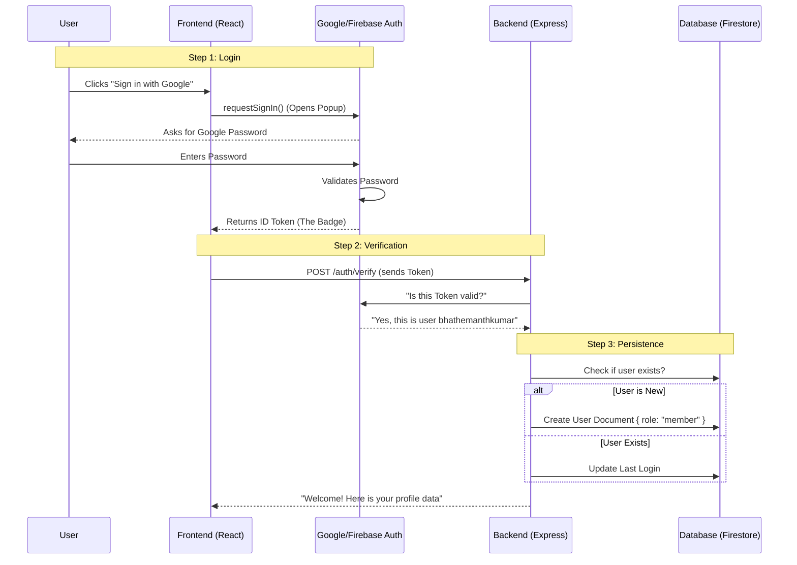

# Authentication Flow Explained

This document explains the "Magic" of signing in, step-by-step.

## The Concept: "The ID Token"
Imagine you are going to a secure office building.
1.  **Reception (Google)** checks your ID card (Password).
2.  **Reception** gives you a temporary **Visitor Badge (ID Token)**.
3.  **Security Guard (Backend)** at the elevator checks your **Visitor Badge** before letting you go up.

You don't give your ID card to the Security Guard. You only show the Badge.

## The Sequence

## Detailed Steps

### 1. Frontend Initiation
*   **File**: `frontend/src/pages/RegisterPage.jsx`
*   **Action**: Calls `signInWithPopup(auth, provider)`.
*   **Result**: Google verified the user and gave us a `user` object containing an **ID Token**.

### 2. Frontend Handoff
*   **File**: `frontend/src/pages/RegisterPage.jsx` (and `authStore.js`)
*   **Action**: We grab that token: `const token = await user.getIdToken()`.
*   **Action**: We send it to the backend: `api.post('/auth/verify', ...)` with `Authorization: Bearer <token>`.

### 3. Backend Verification
*   **File**: `backend/middleware/auth.js`
*   **Action**: It reads the header: `req.headers.authorization`.
*   **Action**: It asks Firebase Admin SDK: `admin.auth().verifyIdToken(token)`.
*   **Result**: If valid, we know the `uid` (User ID) is real. We attach it to `req.user`.

### 4. Database Sync
*   **File**: `backend/routes/auth.routes.js`
*   **Action**: We check `db.collection('users').doc(uid)`.
*   **Logic**:
    *   If the doc doesn't exist, we create it (defaulting role to `'member'`).
    *   If it does exist, we return the data (including the role `'admin'` if they have it).

## Key Takeaway
The **Frontend** handles the *UI* of logging in.
The **Backend** handles the *Trust* (verifying the token) and *Data* (saving the user to the database).
