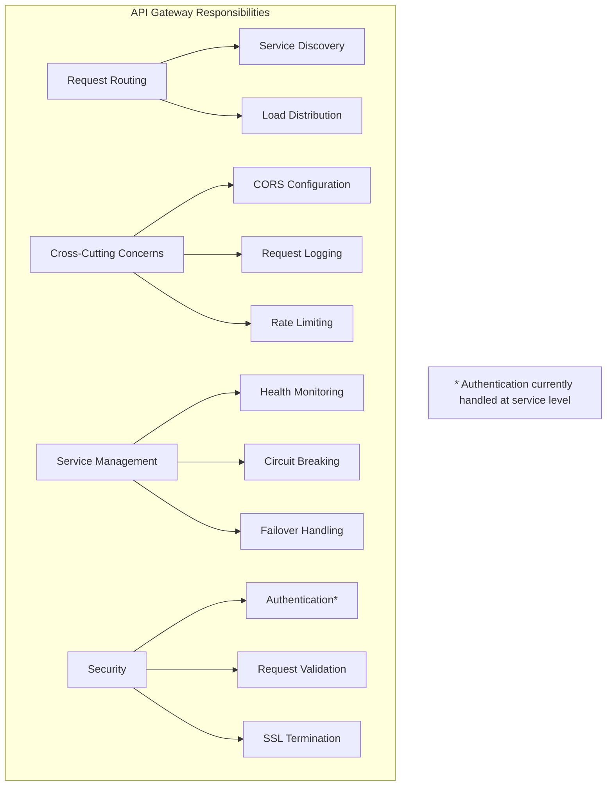
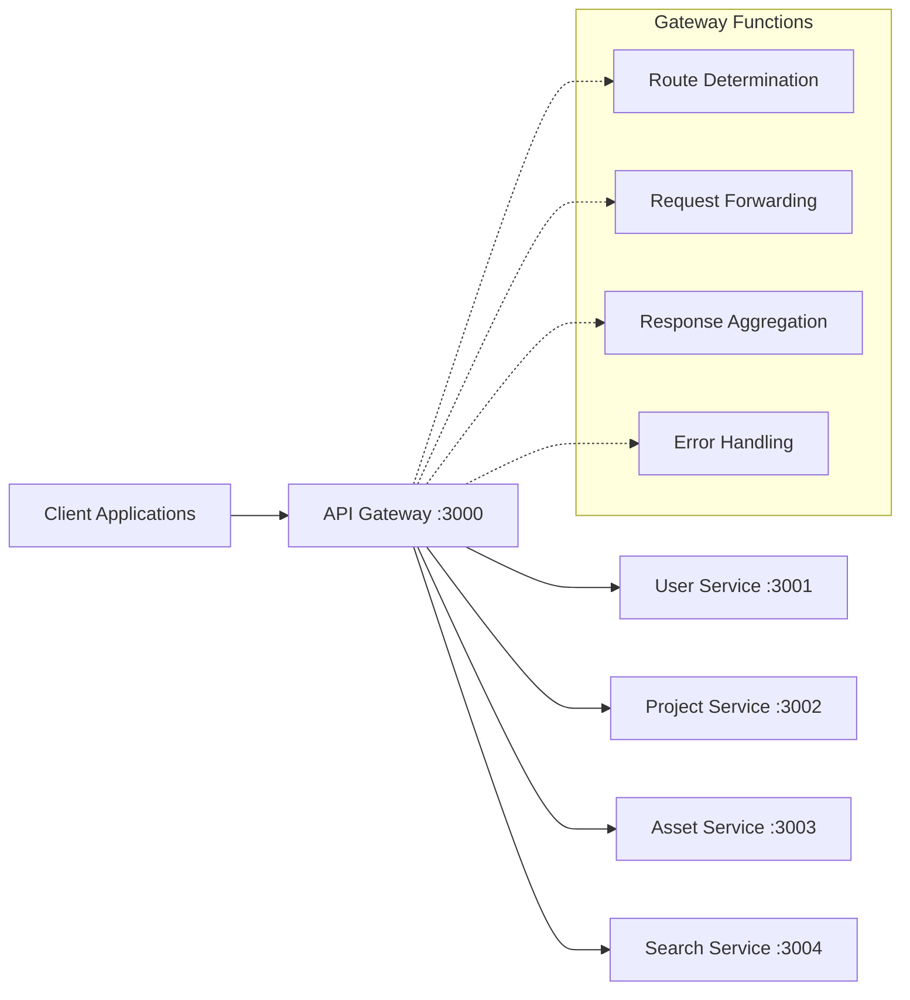
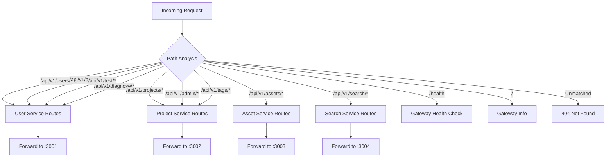
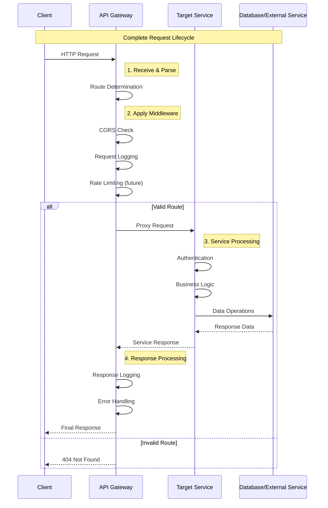
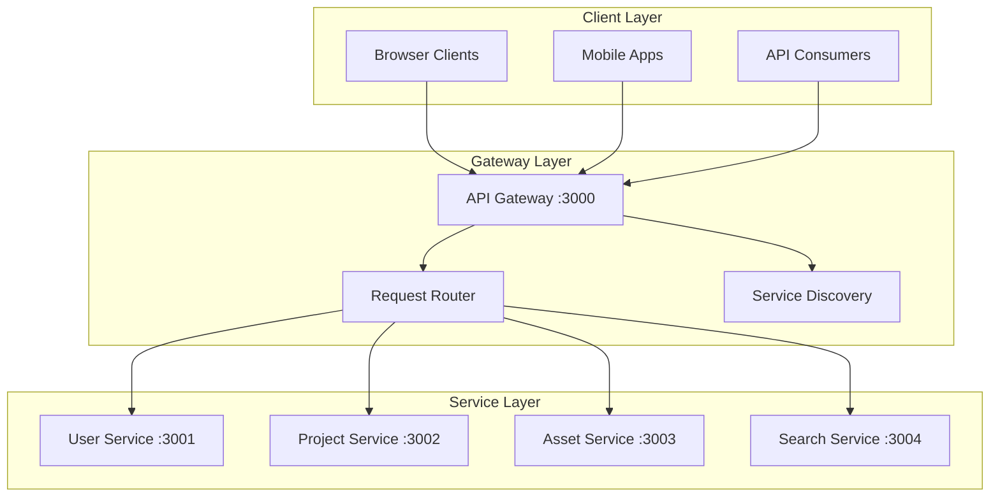

# ACM Digital Project Repository - API Gateway

## Table of Contents
- [Gateway Overview](#gateway-overview)
- [Routing Configuration](#routing-configuration)
- [Request Lifecycle](#request-lifecycle)
- [Proxy Middleware](#proxy-middleware)
- [Cross-Cutting Concerns](#cross-cutting-concerns)
- [Load Balancing & Scaling](#load-balancing--scaling)
- [Monitoring & Health Checks](#monitoring--health-checks)
- [Error Handling](#error-handling)

## Gateway Overview

The API Gateway serves as the **single entry point** for all client requests in the ACM Digital Project Repository. Built with Express.js and http-proxy-middleware, it routes incoming requests to the appropriate microservices while handling cross-cutting concerns like CORS, logging, and health monitoring.

### Purpose & Responsibilities



### Architecture Position



## Routing Configuration

### Service Discovery & Routing Rules

The API Gateway uses **path-based routing** to determine which service should handle each request:

```javascript
// Route mapping configuration
const routingRules = {
  // User & Authentication Service
  '/api/v1/users': 'http://localhost:3001',
  '/api/v1/auth': 'http://localhost:3001',
  '/api/v1/test': 'http://localhost:3001',        // Development only
  '/api/v1/diagnose': 'http://localhost:3001',    // Development only

  // Project Management Service
  '/api/v1/projects': 'http://localhost:3002',
  '/api/v1/admin': 'http://localhost:3002',
  '/api/v1/tags': 'http://localhost:3002',

  // Asset Management Service
  '/api/v1/assets': 'http://localhost:3003',

  // Search & Discovery Service
  '/api/v1/search': 'http://localhost:3004'
};
```

### Dynamic Service Configuration

```javascript
// Environment-based service URLs
const services = {
  user: `http://localhost:${process.env.USER_SERVICE_PORT || 3001}`,
  project: `http://localhost:${process.env.PROJECT_SERVICE_PORT || 3002}`,
  asset: `http://localhost:${process.env.ASSET_SERVICE_PORT || 3003}`,
  search: `http://localhost:${process.env.SEARCH_SERVICE_PORT || 3004}`
};

// Route configuration with environment support
const createProxyConfig = (target, pathFilters) => ({
  target,
  changeOrigin: true,
  pathFilter: pathFilters,
  logLevel: process.env.NODE_ENV === 'development' ? 'debug' : 'warn',
  onError: handleProxyError,
  onProxyReq: logProxyRequest,
  onProxyRes: logProxyResponse
});
```

### Advanced Routing Patterns



## Request Lifecycle

### Complete Request Flow



### Request Transformation

```javascript
// Request preprocessing and transformation
const requestMiddleware = {
  // Add gateway metadata
  addGatewayHeaders: (req, res, next) => {
    req.headers['x-gateway-version'] = '1.0.0';
    req.headers['x-gateway-timestamp'] = new Date().toISOString();
    req.headers['x-request-id'] = generateRequestId();
    next();
  },

  // Request size limiting
  requestSizeLimit: (req, res, next) => {
    const maxSize = 10 * 1024 * 1024; // 10MB
    if (req.headers['content-length'] > maxSize) {
      return res.status(413).json({
        success: false,
        error: 'PayloadTooLarge',
        message: 'Request exceeds maximum size limit'
      });
    }
    next();
  },

  // Request validation
  validateRequest: (req, res, next) => {
    // Validate required headers
    if (!req.headers['content-type'] && ['POST', 'PUT', 'PATCH'].includes(req.method)) {
      return res.status(400).json({
        success: false,
        error: 'MissingContentType',
        message: 'Content-Type header is required'
      });
    }
    next();
  }
};
```

## Proxy Middleware

### HTTP Proxy Configuration

```javascript
// Detailed proxy middleware setup
const createServiceProxy = (serviceName, target, pathFilters) => {
  return createProxyMiddleware({
    target: target,
    changeOrigin: true,
    pathFilter: pathFilters,

    // Proxy options
    timeout: 30000, // 30 second timeout
    proxyTimeout: 30000,
    secure: process.env.NODE_ENV === 'production',

    // Request modification
    onProxyReq: (proxyReq, req, res) => {
      // Add service routing headers
      proxyReq.setHeader('X-Forwarded-Service', serviceName);
      proxyReq.setHeader('X-Gateway-Route', req.originalUrl);

      // Log request forwarding
      console.log(`[${serviceName.toUpperCase()}] ${req.method} ${req.originalUrl} -> ${target}${req.url}`);

      // Handle body forwarding for POST/PUT/PATCH
      if (['POST', 'PUT', 'PATCH'].includes(req.method)) {
        if (req.body) {
          const bodyData = JSON.stringify(req.body);
          proxyReq.setHeader('Content-Type', 'application/json');
          proxyReq.setHeader('Content-Length', Buffer.byteLength(bodyData));
          proxyReq.write(bodyData);
        }
      }
    },

    // Response modification
    onProxyRes: (proxyRes, req, res) => {
      // Add response headers
      proxyRes.headers['X-Served-By'] = serviceName;
      proxyRes.headers['X-Response-Time'] = Date.now() - req.startTime;

      // Log response
      console.log(`[${serviceName.toUpperCase()}] ${proxyRes.statusCode} ${req.originalUrl} (${Date.now() - req.startTime}ms)`);
    },

    // Error handling
    onError: (err, req, res) => {
      console.error(`[${serviceName.toUpperCase()}] Proxy Error:`, err.message);

      res.status(502).json({
        success: false,
        error: 'ServiceUnavailable',
        message: `${serviceName} service is temporarily unavailable`,
        service: serviceName,
        requestId: req.headers['x-request-id']
      });
    }
  });
};
```

### Path Filtering Logic

```javascript
// Advanced path matching for complex routing
const pathFilters = {
  userService: [
    '/api/v1/users',
    '/api/v1/users/**',
    '/api/v1/auth',
    '/api/v1/auth/**',
    ...(process.env.NODE_ENV !== 'production' ? [
      '/api/v1/test',
      '/api/v1/test/**',
      '/api/v1/diagnose',
      '/api/v1/diagnose/**'
    ] : [])
  ],

  projectService: [
    '/api/v1/projects',
    '/api/v1/projects/**',
    '/api/v1/admin',
    '/api/v1/admin/**',
    '/api/v1/tags',
    '/api/v1/tags/**'
  ],

  assetService: [
    '/api/v1/assets',
    '/api/v1/assets/**'
  ],

  searchService: [
    '/api/v1/search',
    '/api/v1/search/**'
  ]
};
```

## Cross-Cutting Concerns

### CORS Configuration

```javascript
// Comprehensive CORS setup
const corsOptions = {
  origin: (origin, callback) => {
    const allowedOrigins = [
      'http://localhost:5173',  // Vite dev server
      'http://localhost:3000',  // Local production
      'https://acm-projects.vercel.app', // Production frontend
      process.env.CORS_ORIGIN   // Environment-specific origins
    ].filter(Boolean);

    // Allow requests with no origin (mobile apps, server-to-server)
    if (!origin || allowedOrigins.includes(origin)) {
      callback(null, true);
    } else {
      callback(new Error('Not allowed by CORS'));
    }
  },

  credentials: true, // Allow cookies and authentication headers
  methods: ['GET', 'POST', 'PUT', 'DELETE', 'PATCH', 'OPTIONS'],
  allowedHeaders: [
    'Content-Type',
    'Authorization',
    'X-Requested-With',
    'Accept',
    'Origin',
    'Cache-Control'
  ],
  exposedHeaders: [
    'X-Total-Count',
    'X-Response-Time',
    'X-Served-By'
  ],
  maxAge: 86400 // 24 hours
};
```

### Request Logging

```javascript
// Structured request logging
const requestLogger = (req, res, next) => {
  const startTime = Date.now();
  req.startTime = startTime;

  // Generate unique request ID
  const requestId = req.headers['x-request-id'] ||
    `req_${Date.now()}_${Math.random().toString(36).substr(2, 9)}`;

  req.requestId = requestId;

  // Log request start
  const logEntry = {
    timestamp: new Date().toISOString(),
    requestId: requestId,
    method: req.method,
    url: req.originalUrl,
    userAgent: req.get('User-Agent'),
    ip: req.ip || req.connection.remoteAddress,
    referer: req.get('Referer'),
    contentLength: req.get('Content-Length') || 0
  };

  console.log(`[GATEWAY] Request Start:`, JSON.stringify(logEntry));

  // Log response
  res.on('finish', () => {
    const duration = Date.now() - startTime;
    const responseLog = {
      ...logEntry,
      statusCode: res.statusCode,
      duration: duration,
      contentLength: res.get('Content-Length') || 0
    };

    console.log(`[GATEWAY] Request Complete:`, JSON.stringify(responseLog));

    // Alert on slow requests or errors
    if (duration > 5000) {
      console.warn(`[GATEWAY] Slow Request: ${duration}ms for ${req.method} ${req.originalUrl}`);
    }

    if (res.statusCode >= 500) {
      console.error(`[GATEWAY] Server Error: ${res.statusCode} for ${req.method} ${req.originalUrl}`);
    }
  });

  next();
};
```

### Rate Limiting (Future Enhancement)

```javascript
// Rate limiting configuration (planned implementation)
const rateLimitConfig = {
  // Global rate limiting
  global: {
    windowMs: 15 * 60 * 1000, // 15 minutes
    max: 1000, // Limit each IP to 1000 requests per windowMs
    message: {
      success: false,
      error: 'TooManyRequests',
      message: 'Too many requests from this IP'
    }
  },

  // Service-specific limits
  services: {
    assets: {
      windowMs: 60 * 1000, // 1 minute
      max: 10, // 10 uploads per minute
      skipSuccessfulRequests: true
    },
    auth: {
      windowMs: 15 * 60 * 1000, // 15 minutes
      max: 50, // 50 auth attempts per 15 minutes
      skipSuccessfulRequests: false
    }
  }
};
```

## Load Balancing & Scaling

### Current Load Distribution



### Scaling Strategies

**Horizontal Scaling Plan**:
```javascript
// Multi-instance service configuration
const scalingConfig = {
  // Service instances with load balancing
  userService: [
    'http://user-service-1:3001',
    'http://user-service-2:3001',
    'http://user-service-3:3001'
  ],

  projectService: [
    'http://project-service-1:3002',
    'http://project-service-2:3002'
  ],

  // Load balancing strategies
  strategies: {
    roundRobin: 'Distribute requests evenly across instances',
    leastConnections: 'Route to instance with fewest active connections',
    weighted: 'Route based on instance capacity weights',
    healthBased: 'Route only to healthy instances'
  }
};
```

**Auto-scaling Triggers**:
- CPU usage > 70% for 5 minutes
- Memory usage > 80% for 3 minutes
- Average response time > 1000ms for 2 minutes
- Active connections > 1000 per instance

## Monitoring & Health Checks

### Health Check System

```javascript
// Comprehensive health checking
const healthChecker = {
  // Gateway self-health
  checkSelf: () => ({
    status: 'ok',
    service: 'api-gateway',
    uptime: process.uptime(),
    memory: process.memoryUsage(),
    timestamp: new Date().toISOString()
  }),

  // Service health monitoring
  checkServices: async () => {
    const services = [
      { name: 'user-service', url: 'http://localhost:3001/health' },
      { name: 'project-service', url: 'http://localhost:3002/health' },
      { name: 'asset-service', url: 'http://localhost:3003/health' },
      { name: 'search-service', url: 'http://localhost:3004/health' }
    ];

    const healthChecks = await Promise.allSettled(
      services.map(async service => {
        const response = await fetch(service.url, { timeout: 5000 });
        const data = await response.json();
        return { name: service.name, ...data };
      })
    );

    return healthChecks.map((result, index) => ({
      service: services[index].name,
      status: result.status === 'fulfilled' ? 'healthy' : 'unhealthy',
      details: result.status === 'fulfilled' ? result.value : result.reason.message
    }));
  },

  // Aggregated health status
  getOverallHealth: async () => {
    const services = await healthChecker.checkServices();
    const allHealthy = services.every(s => s.status === 'healthy');

    return {
      status: allHealthy ? 'healthy' : 'degraded',
      gateway: healthChecker.checkSelf(),
      services: services,
      timestamp: new Date().toISOString()
    };
  }
};
```

### Metrics Collection

```javascript
// Performance metrics collection
const metricsCollector = {
  // Request metrics
  requestMetrics: {
    total: 0,
    byMethod: {},
    byService: {},
    byStatus: {},
    responseTimeHistogram: []
  },

  // Track request
  trackRequest: (req, res, duration) => {
    metricsCollector.requestMetrics.total++;

    // Track by method
    const method = req.method;
    metricsCollector.requestMetrics.byMethod[method] =
      (metricsCollector.requestMetrics.byMethod[method] || 0) + 1;

    // Track by service
    const service = getServiceFromPath(req.path);
    metricsCollector.requestMetrics.byService[service] =
      (metricsCollector.requestMetrics.byService[service] || 0) + 1;

    // Track by status
    const status = Math.floor(res.statusCode / 100) * 100;
    metricsCollector.requestMetrics.byStatus[status] =
      (metricsCollector.requestMetrics.byStatus[status] || 0) + 1;

    // Track response time
    metricsCollector.requestMetrics.responseTimeHistogram.push({
      path: req.path,
      duration: duration,
      timestamp: Date.now()
    });

    // Keep only last 1000 entries
    if (metricsCollector.requestMetrics.responseTimeHistogram.length > 1000) {
      metricsCollector.requestMetrics.responseTimeHistogram =
        metricsCollector.requestMetrics.responseTimeHistogram.slice(-1000);
    }
  },

  // Get metrics summary
  getMetrics: () => {
    const recent = metricsCollector.requestMetrics.responseTimeHistogram
      .filter(entry => Date.now() - entry.timestamp < 60000); // Last minute

    const avgResponseTime = recent.length > 0 ?
      recent.reduce((sum, entry) => sum + entry.duration, 0) / recent.length : 0;

    return {
      ...metricsCollector.requestMetrics,
      recentAvgResponseTime: Math.round(avgResponseTime),
      requestsPerMinute: recent.length,
      timestamp: new Date().toISOString()
    };
  }
};
```

## Error Handling

### Error Response Standardization

```javascript
// Standardized error responses
const errorHandler = {
  // Proxy errors (service unavailable)
  handleProxyError: (err, req, res) => {
    const service = getServiceFromPath(req.path);

    console.error(`[GATEWAY] Proxy Error for ${service}:`, {
      error: err.message,
      code: err.code,
      path: req.originalUrl,
      method: req.method,
      requestId: req.requestId
    });

    const statusCode = err.code === 'ECONNREFUSED' ? 503 : 502;

    res.status(statusCode).json({
      success: false,
      error: 'ServiceUnavailable',
      message: `${service} service is temporarily unavailable`,
      details: {
        service: service,
        errorCode: err.code,
        requestId: req.requestId,
        retryAfter: 30
      }
    });
  },

  // Gateway-level errors
  handleGatewayError: (err, req, res, next) => {
    console.error(`[GATEWAY] Gateway Error:`, {
      error: err.message,
      stack: err.stack,
      path: req.originalUrl,
      method: req.method,
      requestId: req.requestId
    });

    if (res.headersSent) {
      return next(err);
    }

    res.status(500).json({
      success: false,
      error: 'GatewayError',
      message: 'API Gateway encountered an internal error',
      details: {
        requestId: req.requestId,
        timestamp: new Date().toISOString()
      }
    });
  },

  // 404 handler for unmatched routes
  handleNotFound: (req, res) => {
    res.status(404).json({
      success: false,
      error: 'NotFound',
      message: 'API endpoint not found',
      details: {
        path: req.originalUrl,
        method: req.method,
        availableRoutes: [
          '/api/v1/auth/*',
          '/api/v1/users/*',
          '/api/v1/projects/*',
          '/api/v1/admin/*',
          '/api/v1/tags/*',
          '/api/v1/assets/*',
          '/api/v1/search/*'
        ]
      }
    });
  }
};
```

### Circuit Breaker Pattern (Future Enhancement)

```javascript
// Circuit breaker for service resilience
const circuitBreaker = {
  services: new Map(),

  // Initialize circuit breaker for service
  initService: (serviceName, options = {}) => {
    circuitBreaker.services.set(serviceName, {
      state: 'CLOSED', // CLOSED, OPEN, HALF_OPEN
      failureCount: 0,
      lastFailureTime: null,
      successCount: 0,
      options: {
        failureThreshold: options.failureThreshold || 5,
        timeout: options.timeout || 60000, // 1 minute
        retryThreshold: options.retryThreshold || 3,
        ...options
      }
    });
  },

  // Execute request with circuit breaker
  execute: async (serviceName, request) => {
    const circuit = circuitBreaker.services.get(serviceName);

    if (!circuit) {
      throw new Error(`Circuit breaker not initialized for ${serviceName}`);
    }

    // Check circuit state
    if (circuit.state === 'OPEN') {
      if (Date.now() - circuit.lastFailureTime > circuit.options.timeout) {
        circuit.state = 'HALF_OPEN';
        circuit.successCount = 0;
      } else {
        throw new Error(`Circuit breaker is OPEN for ${serviceName}`);
      }
    }

    try {
      const result = await request();

      // Success handling
      if (circuit.state === 'HALF_OPEN') {
        circuit.successCount++;
        if (circuit.successCount >= circuit.options.retryThreshold) {
          circuit.state = 'CLOSED';
          circuit.failureCount = 0;
        }
      } else if (circuit.state === 'CLOSED') {
        circuit.failureCount = 0; // Reset on success
      }

      return result;

    } catch (error) {
      // Failure handling
      circuit.failureCount++;
      circuit.lastFailureTime = Date.now();

      if (circuit.failureCount >= circuit.options.failureThreshold) {
        circuit.state = 'OPEN';
      }

      throw error;
    }
  }
};
```

---

**API Gateway Benefits**:
- ✅ **Single Entry Point**: Simplifies client configuration
- ✅ **Service Discovery**: Centralized routing and load balancing
- ✅ **Cross-Cutting Concerns**: CORS, logging, monitoring in one place
- ✅ **Error Handling**: Consistent error responses and fallback strategies
- ✅ **Scalability**: Independent service scaling behind unified interface
- ✅ **Monitoring**: Centralized metrics and health checking

**Next: See [SERVICE-DETAILS.md](./SERVICE-DETAILS.md) for individual service documentation**