# ACM Digital Project Repository - Application Overview

## Table of Contents
- [Platform Purpose & Vision](#platform-purpose--vision)
- [User Roles & Personas](#user-roles--personas)
- [Core Features](#core-features)
- [User Journey Flows](#user-journey-flows)
- [Technical Features](#technical-features)
- [Content Management](#content-management)
- [Platform Analytics](#platform-analytics)
- [Future Roadmap](#future-roadmap)

## Platform Purpose & Vision

The **ACM Digital Project Repository** is a comprehensive platform designed to showcase, manage, and discover innovative computing projects created by ACM (Association for Computing Machinery) members. It serves as both a portfolio platform for students and a knowledge-sharing hub for the computing community.

### Mission Statement
*"To create a centralized, accessible platform where ACM members can showcase their innovative projects, collaborate with peers, and inspire the next generation of computing professionals."*

### Key Objectives

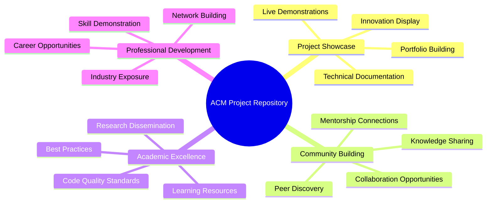

## User Roles & Personas

### 1. Student Contributors (Primary Users)

**Demographics**:
- Computer Science, IT, and related majors
- Undergraduate and graduate students
- Age: 18-26 years
- Tech-savvy, project-oriented learners

**Goals & Motivations**:
- Showcase projects for academic and career purposes
- Build professional portfolios
- Gain visibility in the computing community
- Collaborate with like-minded peers
- Document learning journey

**Key Use Cases**:
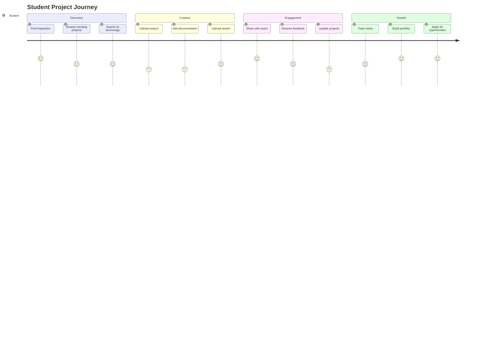

### 2. ACM Administrators (Platform Managers)

**Responsibilities**:
- Content moderation and quality control
- User management and community guidelines
- Platform statistics and analytics
- Feature development coordination

**Goals**:
- Maintain high-quality content standards
- Foster positive community interactions
- Grow platform adoption and engagement
- Ensure platform security and performance

**Administrative Workflows**:
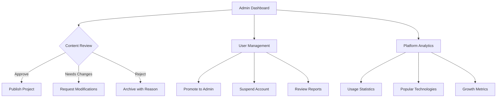

### 3. Public Visitors (Secondary Users)

**Characteristics**:
- Potential students, employers, collaborators
- Industry professionals seeking talent
- Researchers looking for innovative solutions
- General public interested in computing projects

**Expectations**:
- Easy project discovery and browsing
- High-quality project presentations
- Fast, accessible platform experience
- Professional, credible content

## Core Features

### 1. Project Management System

**Project Lifecycle Management**:
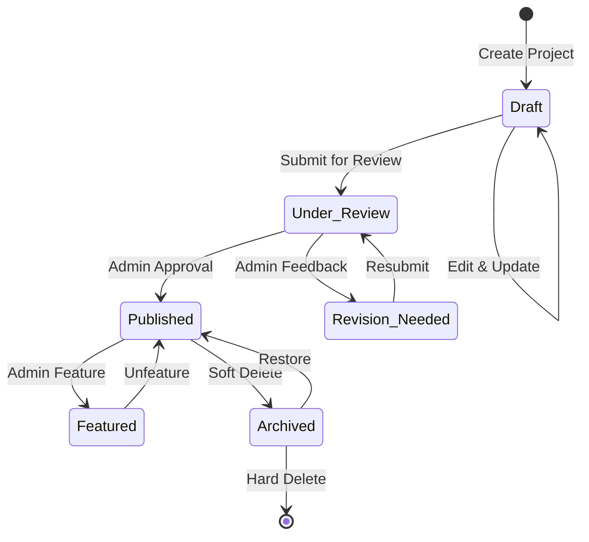

**Project Information Architecture**:
- **Basic Details**: Title, description, category, tags
- **Technical Info**: Tech stack, repository links, live demo URLs
- **Documentation**: README files, setup instructions, usage guides
- **Media Assets**: Screenshots, demo videos, presentations
- **Collaboration**: Contributors list, team information
- **Metadata**: Creation date, last updated, view count

### 2. Asset Management System

**Supported File Types & Use Cases**:
| File Type | Max Size | Use Case | Features |
|-----------|----------|----------|----------|
| Images (JPEG, PNG, GIF, WebP) | 10MB | Screenshots, diagrams, UI mockups | Auto-optimization, responsive delivery |
| Documents (PDF, DOCX, PPTX) | 10MB | Reports, presentations, documentation | Preview generation, secure download |
| Videos (MP4, MOV, WebM) | 50MB | Demo videos, tutorials | Streaming, thumbnail generation |
| Archives (ZIP, TAR.GZ) | 25MB | Source code, project bundles | Secure download, virus scanning |
| Code Files (.js, .py, .json, .md) | 5MB | Configuration, documentation | Syntax highlighting, preview |

**Asset Organization**:
```
Project Assets/
├── screenshots/          # UI captures, result images
├── documentation/        # PDFs, presentations
├── videos/              # Demo videos, tutorials
├── source-code/         # Downloadable code samples
└── diagrams/            # Architecture, flowcharts
```

### 3. Search & Discovery Engine

**Multi-dimensional Search**:
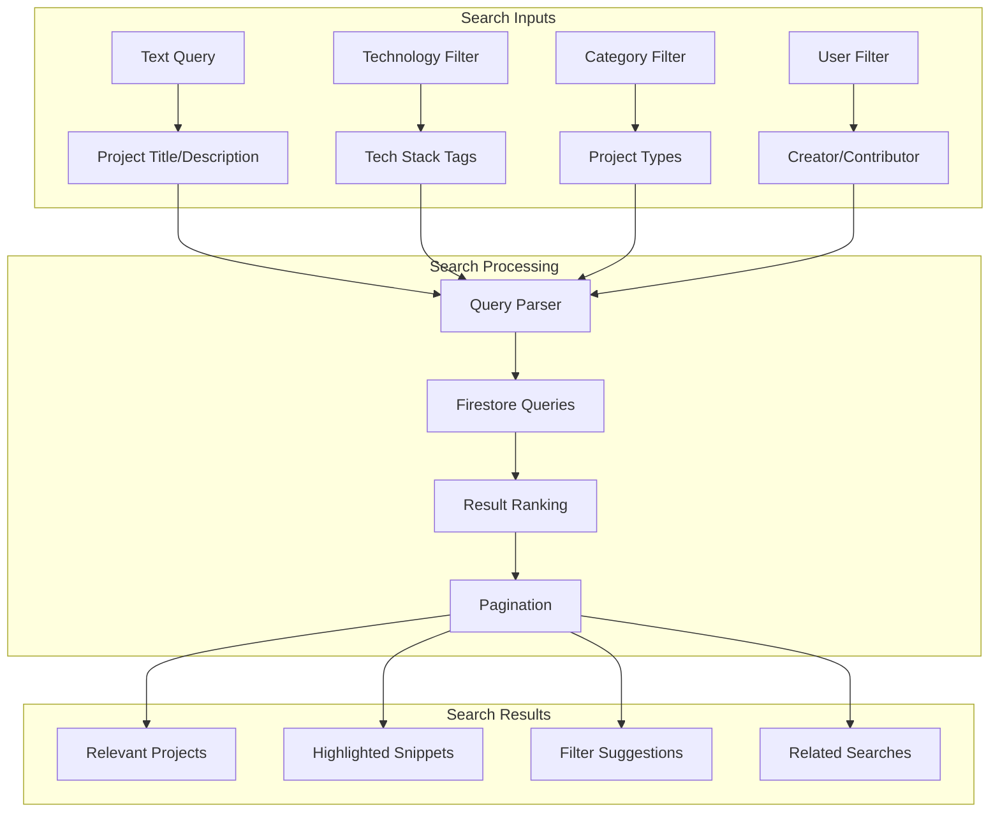

**Search Capabilities**:
- **Full-text Search**: Project titles, descriptions, documentation
- **Technology Filtering**: JavaScript, Python, React, Machine Learning, etc.
- **Category Filtering**: Web Apps, Mobile Apps, AI/ML, Games, etc.
- **Advanced Filters**: Date range, contributor count, asset types
- **Sorting Options**: Relevance, date, popularity, alphabetical

### 4. User Authentication & Profiles

**Authentication System**:
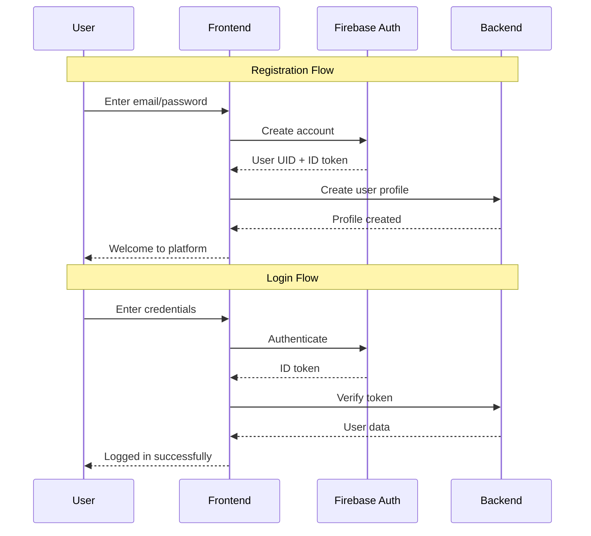

**User Profile Features**:
- **Basic Information**: Name, email, bio, profile picture
- **Academic Details**: University, major, graduation year
- **Project Portfolio**: Owned and contributed projects
- **Skills & Interests**: Technology tags, areas of expertise
- **Social Links**: GitHub, LinkedIn, personal website
- **Activity History**: Recent projects, contributions, views

## User Journey Flows

### 1. New Student Onboarding

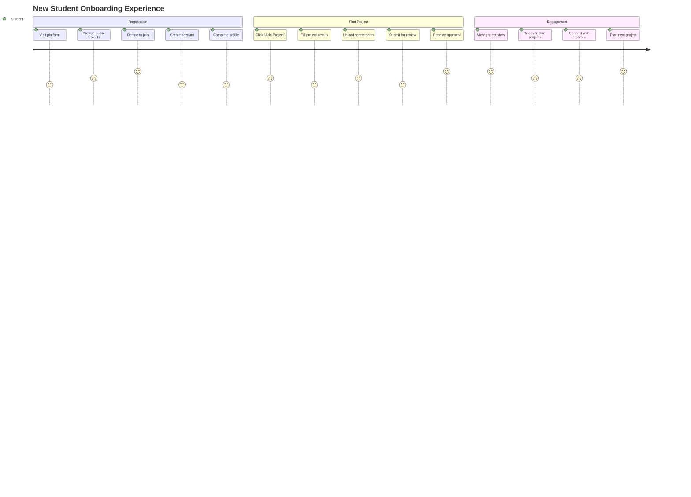

### 2. Project Discovery & Exploration

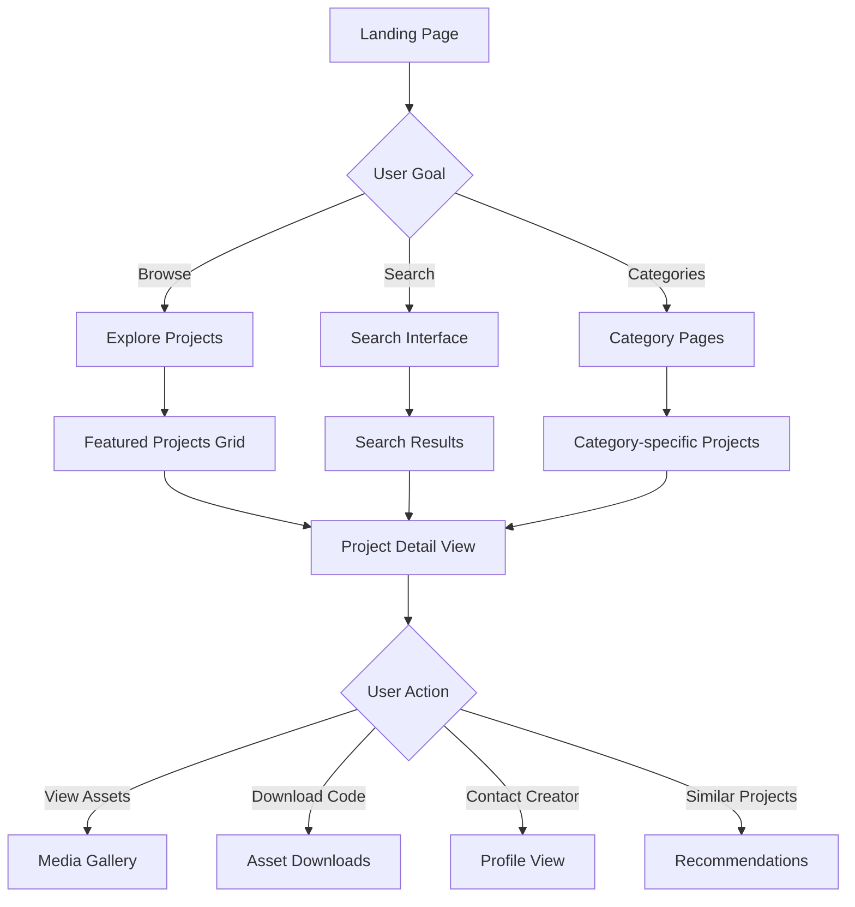

### 3. Content Creation Workflow

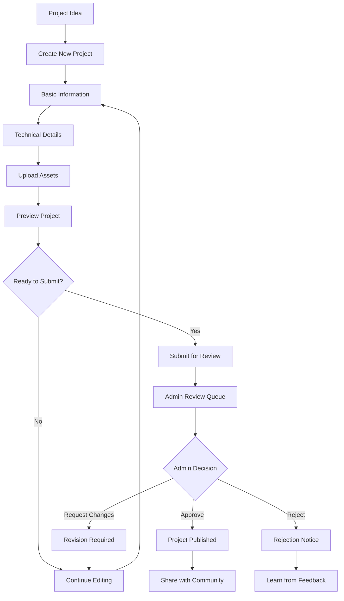

## Technical Features

### 1. Responsive Design System

**Multi-device Compatibility**:
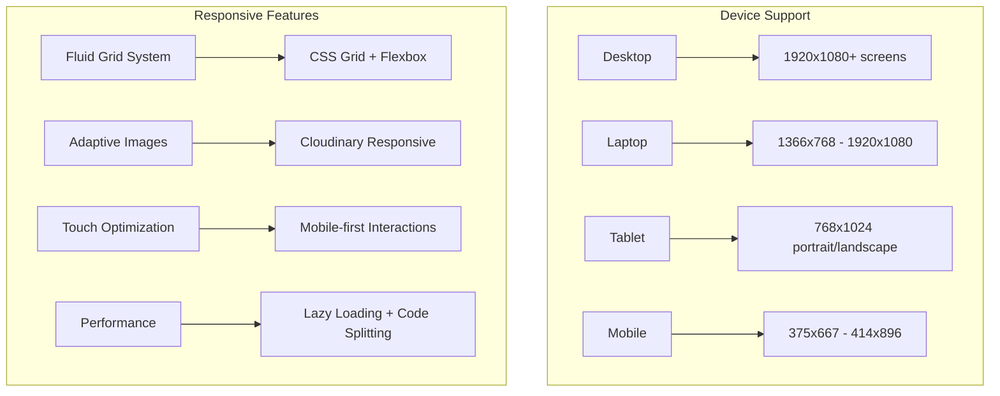

**Accessibility Features**:
- **WCAG 2.1 AA Compliance**: Keyboard navigation, screen reader support
- **Color Contrast**: 4.5:1 minimum ratio for text
- **Focus Management**: Visible focus indicators, logical tab order
- **Alt Text**: Comprehensive image descriptions
- **Semantic HTML**: Proper heading structure, landmarks

### 2. Performance Optimizations

**Frontend Optimizations**:
```javascript
// Performance monitoring and optimization
const performanceMetrics = {
  // Core Web Vitals
  LCP: '< 2.5s',    // Largest Contentful Paint
  FID: '< 100ms',   // First Input Delay
  CLS: '< 0.1',     // Cumulative Layout Shift

  // Application-specific metrics
  TTI: '< 3.5s',    // Time to Interactive
  FCP: '< 1.8s',    // First Contentful Paint
  SI: '< 3.4s',     // Speed Index

  // Resource optimization
  bundleSize: '< 250KB gzipped',
  imageOptimization: 'WebP with JPEG fallback',
  caching: 'Service Worker + Browser Cache'
};
```

**Backend Performance**:
- **Response Time**: < 200ms for API endpoints
- **Database Optimization**: Firestore indexes and query optimization
- **Caching Strategy**: Redis for frequently accessed data (planned)
- **CDN Integration**: Cloudinary global distribution
- **Load Balancing**: API Gateway with service distribution

### 3. SEO & Social Sharing

**Search Engine Optimization**:
```html
<!-- Dynamic meta tags for project pages -->
<head>
  <title>{{projectTitle}} - ACM Digital Projects</title>
  <meta name="description" content="{{projectDescription}}" />
  <meta name="keywords" content="{{techStack}}, ACM, projects, {{category}}" />

  <!-- Open Graph for social sharing -->
  <meta property="og:title" content="{{projectTitle}}" />
  <meta property="og:description" content="{{projectDescription}}" />
  <meta property="og:image" content="{{projectThumbnail}}" />
  <meta property="og:url" content="{{projectUrl}}" />

  <!-- Twitter Cards -->
  <meta name="twitter:card" content="summary_large_image" />
  <meta name="twitter:title" content="{{projectTitle}}" />
  <meta name="twitter:description" content="{{projectDescription}}" />

  <!-- Structured data for rich snippets -->
  <script type="application/ld+json">
  {
    "@context": "https://schema.org",
    "@type": "CreativeWork",
    "name": "{{projectTitle}}",
    "description": "{{projectDescription}}",
    "creator": {
      "@type": "Person",
      "name": "{{creatorName}}"
    },
    "dateCreated": "{{creationDate}}",
    "keywords": "{{techStack}}"
  }
  </script>
</head>
```

## Content Management

### 1. Content Moderation System

**Multi-stage Review Process**:
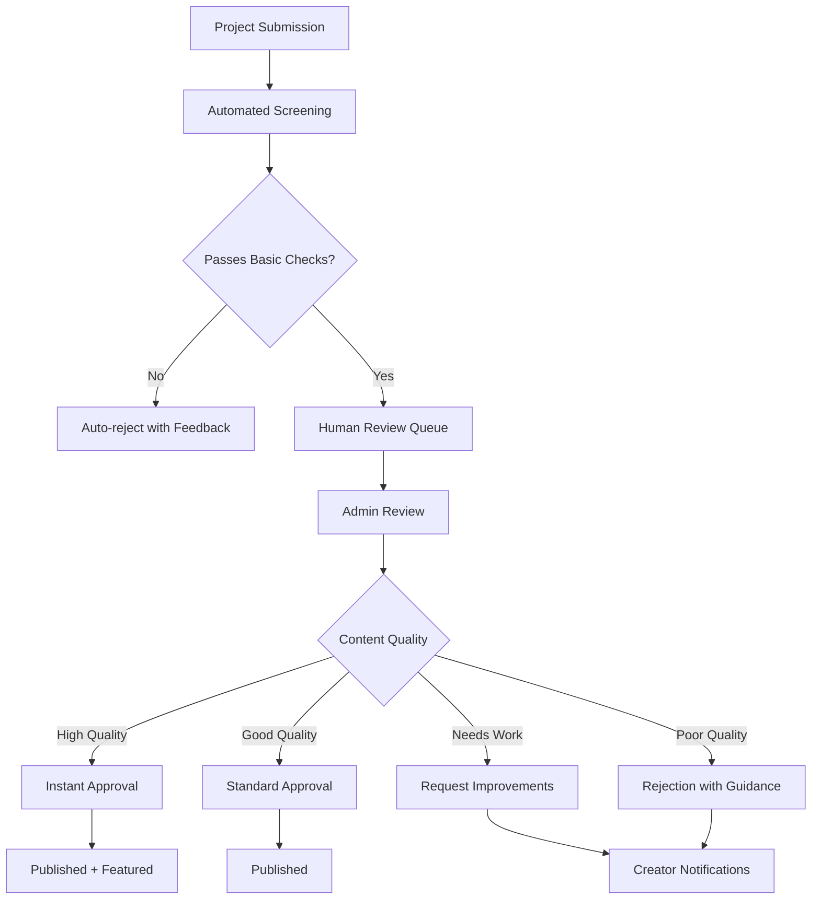

**Quality Guidelines**:
- **Technical Completeness**: Working code, clear documentation
- **Educational Value**: Learning objectives, implementation insights
- **Presentation Quality**: Clear descriptions, good visuals
- **Originality**: Original work or significant contributions
- **Community Standards**: Appropriate content, respectful presentation

### 2. Tag & Category Management

**Taxonomy System**:
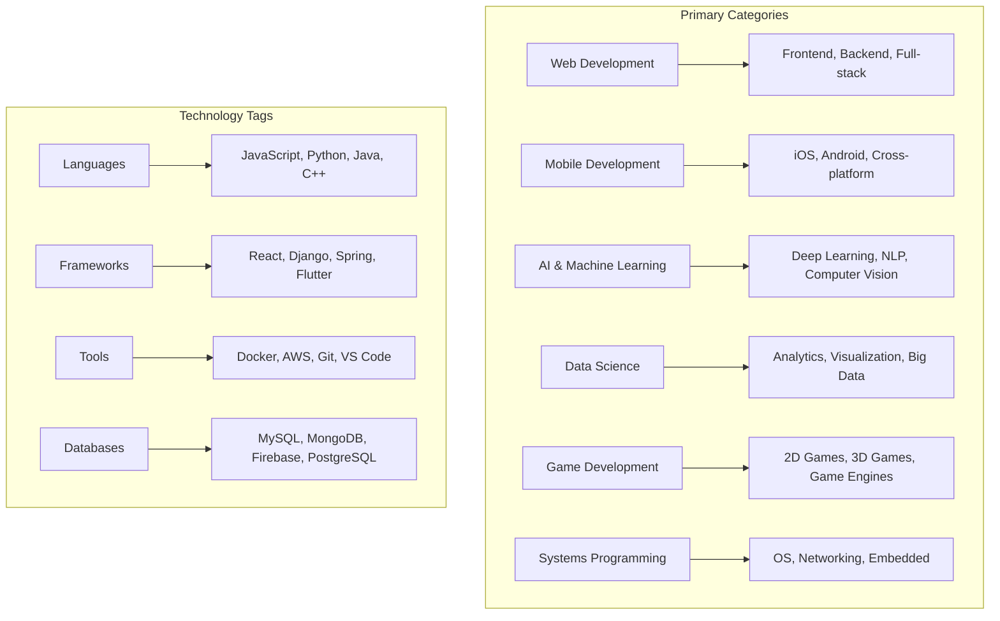

### 3. Content Analytics & Insights

**Platform-wide Metrics**:
- **Project Statistics**: Total projects, categories, growth rate
- **User Engagement**: Active users, session duration, return visits
- **Popular Technologies**: Trending tech stacks, emerging tools
- **Search Patterns**: Popular queries, search success rates
- **Asset Usage**: File types, storage utilization, download patterns

**Creator Analytics**:
- **Project Performance**: Views, likes, shares, downloads
- **Audience Insights**: Viewer demographics, engagement patterns
- **Portfolio Growth**: Project count over time, skill development
- **Collaboration Metrics**: Team projects, contribution frequency

## Platform Analytics

### Real-time Dashboard

```mermaid
dashboard
    title ACM Project Repository - Platform Dashboard

    subgraph "User Metrics"
        A[Active Users: 1,247] --> A1[Daily: 156]
        A --> A2[Weekly: 543]
        A --> A3[Monthly: 1,247]
    end

    subgraph "Content Metrics"
        B[Total Projects: 2,891] --> B1[Published: 2,654]
        B --> B2[Under Review: 183]
        B --> B3[Draft: 54]
    end

    subgraph "Technology Trends"
        C[Top Technologies]
        C --> C1[JavaScript: 45%]
        C --> C2[Python: 32%]
        C --> C3[React: 28%]
        C --> C4[Node.js: 24%]
    end

    subgraph "Engagement Metrics"
        D[Avg. Session: 12m 34s]
        E[Pages per Session: 4.7]
        F[Bounce Rate: 23%]
        G[Return Visitors: 68%]
    end
```

### Growth Analytics

**Monthly Growth Tracking**:
- **User Acquisition**: New registrations, activation rates
- **Content Creation**: Project submissions, approval rates
- **Platform Usage**: Page views, feature adoption
- **Community Engagement**: Comments, shares, collaborations

## Future Roadmap

### Phase 1: Enhanced Collaboration (Next 6 months)

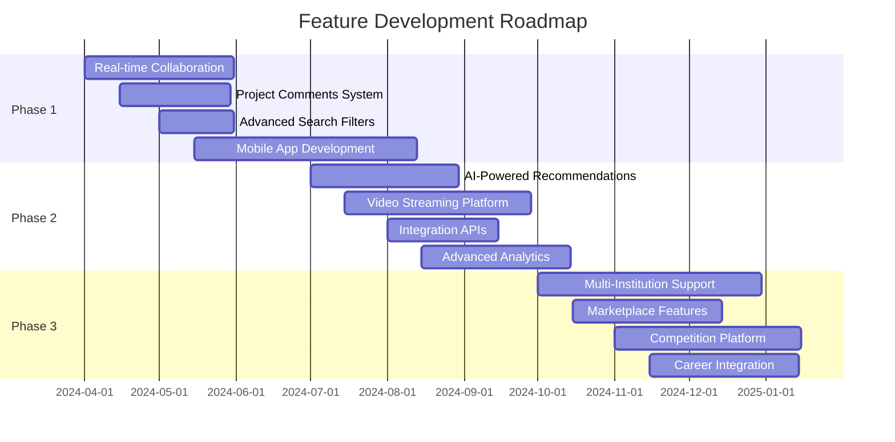

### Phase 2: AI & Intelligence (6-12 months)

**AI-Powered Features**:
- **Smart Recommendations**: Project suggestions based on interests
- **Content Analysis**: Automatic tagging, quality assessment
- **Skill Assessment**: Technology skill inference from projects
- **Collaboration Matching**: Connect complementary skill sets

### Phase 3: Ecosystem Expansion (12+ months)

**Platform Extensions**:
- **ACM Chapter Integration**: Multi-institution support
- **Industry Partnerships**: Employer showcases, internship connections
- **Certification System**: Skill validation, achievement badges
- **Mentorship Platform**: Connect students with industry professionals

### Technical Evolution

**Architecture Improvements**:
- **Microservices Maturity**: Event-driven architecture, service mesh
- **Global Scaling**: Multi-region deployment, edge computing
- **Advanced Security**: Zero-trust architecture, advanced threat detection
- **Performance**: Real-time features, WebRTC integration

---

**Platform Impact Goals**:
- 📈 **10,000+ Active Students** by end of Year 2
- 🏆 **50,000+ Published Projects** showcasing innovation
- 🌐 **100+ University Chapters** across institutions
- 💼 **1,000+ Industry Connections** for career opportunities
- 📚 **95% User Satisfaction** with platform experience

**Next: See [API-GATEWAY.md](./API-GATEWAY.md) for detailed API routing documentation**