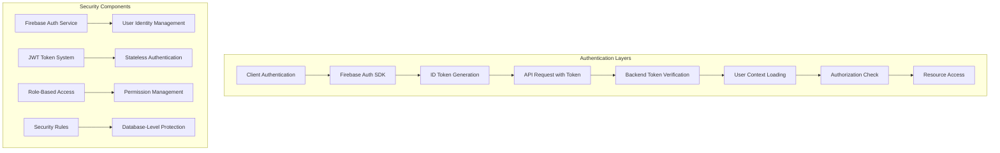
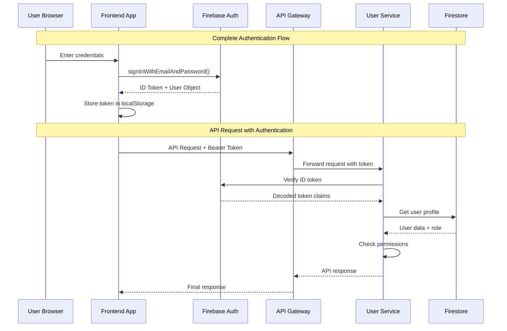
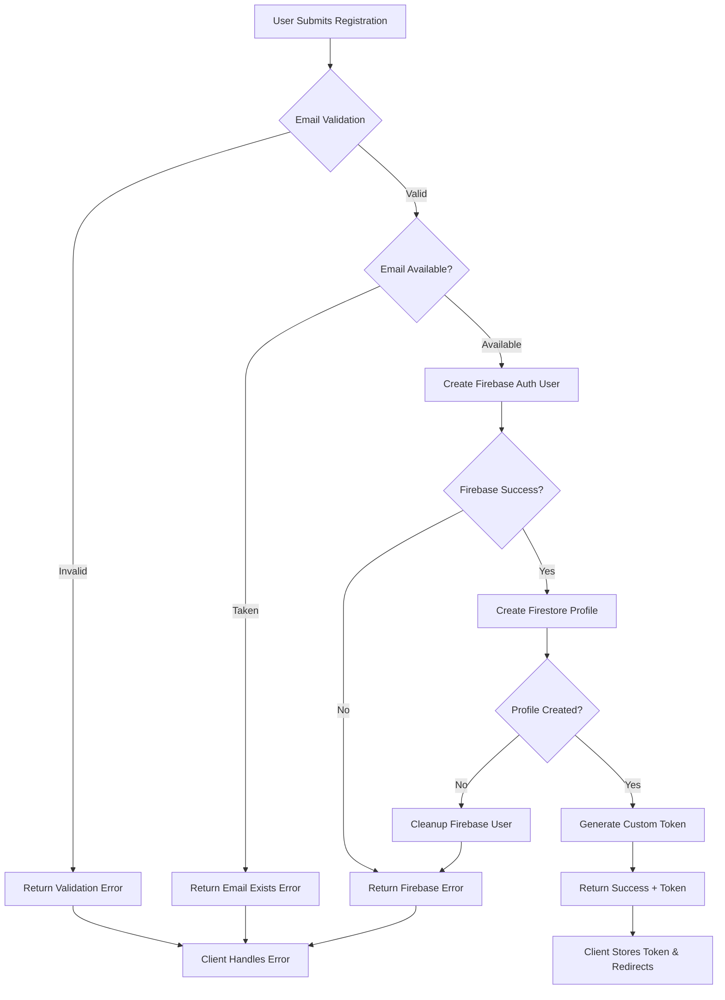
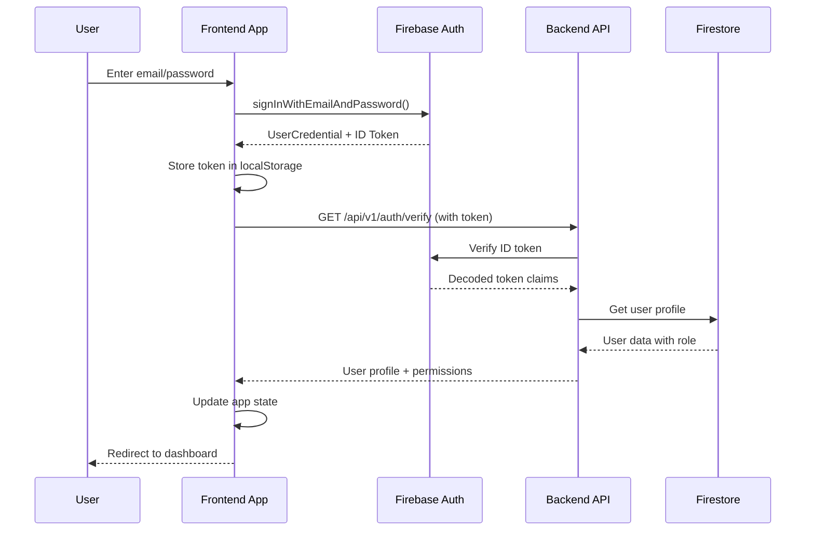
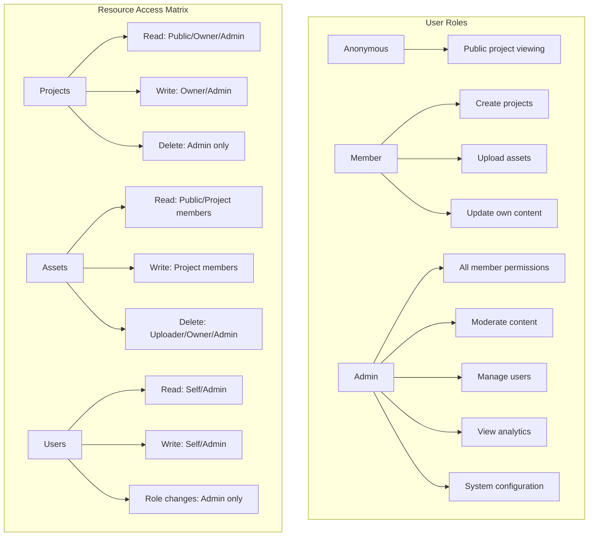

# ACM Digital Project Repository - Authentication & Security

## Table of Contents
- [Authentication Overview](#authentication-overview)
- [Firebase Authentication Integration](#firebase-authentication-integration)
- [User Registration Flow](#user-registration-flow)
- [Login & Session Management](#login--session-management)
- [Token-Based Authentication](#token-based-authentication)
- [Authorization & Access Control](#authorization--access-control)
- [Security Middleware](#security-middleware)
- [Development & Testing Authentication](#development--testing-authentication)

## Authentication Overview

The ACM Digital Project Repository implements a robust authentication and authorization system using **Firebase Authentication** as the identity provider, combined with custom middleware for API access control and role-based permissions.

### Security Architecture



### Authentication Flow Architecture



## Firebase Authentication Integration

### Firebase Configuration

**Project Setup**:
- **Project ID**: `acmdigitalprojectrepository`
- **Authentication Methods**: Email/Password, Google OAuth (future)
- **Token Expiration**: 1 hour (Firebase default)
- **Custom Claims**: Role-based access via custom token claims

### Client-Side Firebase Configuration

```javascript
// Frontend Firebase configuration
const firebaseConfig = {
  apiKey: import.meta.env.VITE_FIREBASE_API_KEY,
  authDomain: "acmdigitalprojectrepository.firebaseapp.com",
  projectId: "acmdigitalprojectrepository",
  storageBucket: "acmdigitalprojectrepository.appspot.com",
  messagingSenderId: import.meta.env.VITE_FIREBASE_MESSAGING_SENDER_ID,
  appId: import.meta.env.VITE_FIREBASE_APP_ID
};

// Initialize Firebase
import { initializeApp } from 'firebase/app';
import { getAuth } from 'firebase/auth';

const app = initializeApp(firebaseConfig);
export const auth = getAuth(app);
```

### Server-Side Firebase Configuration

```javascript
// Backend Firebase Admin SDK
const admin = require('firebase-admin');
const path = require('path');

// Initialize with service account
const serviceAccount = process.env.FIREBASE_SERVICE_ACCOUNT
  ? JSON.parse(process.env.FIREBASE_SERVICE_ACCOUNT)
  : require(path.join(__dirname, '..', 'serviceAccountKey.json'));

admin.initializeApp({
  credential: admin.credential.cert(serviceAccount),
  databaseURL: `https://${serviceAccount.project_id}-default-rtdb.firebaseio.com`,
  storageBucket: `${serviceAccount.project_id}.appspot.com`
});

module.exports = {
  admin,
  db: admin.firestore(),
  auth: admin.auth()
};
```

## User Registration Flow

### Registration Process



### Registration Implementation

```javascript
// Frontend registration function
const registerUser = async (userData) => {
  try {
    const { email, password, name, university } = userData;

    // 1. Create Firebase Authentication user
    const userCredential = await createUserWithEmailAndPassword(auth, email, password);
    const user = userCredential.user;

    // 2. Update Firebase profile
    await updateProfile(user, {
      displayName: name
    });

    // 3. Get ID token for API calls
    const idToken = await user.getIdToken();

    // 4. Create user profile via API
    const response = await fetch('/api/v1/auth/create-profile', {
      method: 'POST',
      headers: {
        'Content-Type': 'application/json',
        'Authorization': `Bearer ${idToken}`
      },
      body: JSON.stringify({
        name,
        university,
        email
      })
    });

    if (!response.ok) {
      throw new Error('Profile creation failed');
    }

    const result = await response.json();

    // Store token and user data
    localStorage.setItem('authToken', idToken);
    localStorage.setItem('userData', JSON.stringify(result.user));

    return { success: true, user: result.user, token: idToken };

  } catch (error) {
    console.error('Registration error:', error);
    throw error;
  }
};
```

### Backend Registration Handler

```javascript
// Backend profile creation endpoint
app.post('/api/v1/auth/create-profile', verifyToken, async (req, res) => {
  try {
    const { name, university } = req.body;
    const uid = req.user.uid;
    const email = req.user.email;

    // Check if profile already exists
    const existingProfile = await db.collection('users').doc(uid).get();
    if (existingProfile.exists) {
      return res.status(400).json({
        success: false,
        error: 'ProfileExists',
        message: 'User profile already exists'
      });
    }

    // Create user profile
    const userProfile = {
      uid: uid,
      email: email,
      name: name || 'ACM Member',
      university: university || null,
      role: 'member',
      profileVisibility: 'public',
      emailVisible: false,
      isActive: true,
      createdAt: new Date(),
      updatedAt: new Date(),
      projectCount: 0,
      contributionCount: 0
    };

    await db.collection('users').doc(uid).set(userProfile);

    res.status(201).json({
      success: true,
      message: 'User profile created successfully',
      user: userProfile
    });

  } catch (error) {
    console.error('Profile creation error:', error);
    res.status(500).json({
      success: false,
      error: 'ProfileCreationFailed',
      message: 'Failed to create user profile'
    });
  }
});
```

## Login & Session Management

### Login Flow



### Login Implementation

```javascript
// Frontend login function
const loginUser = async (email, password) => {
  try {
    // 1. Authenticate with Firebase
    const userCredential = await signInWithEmailAndPassword(auth, email, password);
    const user = userCredential.user;

    // 2. Get ID token
    const idToken = await user.getIdToken();

    // 3. Verify and get user profile from backend
    const response = await fetch('/api/v1/auth/verify', {
      method: 'POST',
      headers: {
        'Content-Type': 'application/json',
        'Authorization': `Bearer ${idToken}`
      }
    });

    if (!response.ok) {
      throw new Error('Authentication verification failed');
    }

    const result = await response.json();

    // 4. Store authentication state
    localStorage.setItem('authToken', idToken);
    localStorage.setItem('userData', JSON.stringify(result.user));

    // 5. Update last login timestamp
    await updateLastLogin(idToken);

    return {
      success: true,
      user: result.user,
      token: idToken
    };

  } catch (error) {
    console.error('Login error:', error);
    throw error;
  }
};

// Update last login timestamp
const updateLastLogin = async (token) => {
  try {
    await fetch('/api/v1/users/update-last-login', {
      method: 'PATCH',
      headers: {
        'Authorization': `Bearer ${token}`
      }
    });
  } catch (error) {
    console.warn('Failed to update last login:', error);
  }
};
```

### Session Management

```javascript
// Frontend session management
class SessionManager {
  constructor() {
    this.token = localStorage.getItem('authToken');
    this.user = JSON.parse(localStorage.getItem('userData') || 'null');
    this.refreshInterval = null;
  }

  // Check if user is authenticated
  isAuthenticated() {
    return !!this.token && !!this.user;
  }

  // Check if user has specific role
  hasRole(role) {
    return this.user?.role === role;
  }

  // Check if user is admin
  isAdmin() {
    return this.hasRole('admin');
  }

  // Refresh token before expiration
  startTokenRefresh() {
    // Refresh token every 50 minutes (before 1-hour expiration)
    this.refreshInterval = setInterval(async () => {
      try {
        const currentUser = auth.currentUser;
        if (currentUser) {
          const newToken = await currentUser.getIdToken(true); // Force refresh
          this.updateToken(newToken);
        }
      } catch (error) {
        console.error('Token refresh failed:', error);
        this.logout();
      }
    }, 50 * 60 * 1000); // 50 minutes
  }

  // Update stored token
  updateToken(newToken) {
    this.token = newToken;
    localStorage.setItem('authToken', newToken);
  }

  // Logout user
  logout() {
    this.token = null;
    this.user = null;
    localStorage.removeItem('authToken');
    localStorage.removeItem('userData');

    if (this.refreshInterval) {
      clearInterval(this.refreshInterval);
    }

    // Sign out from Firebase
    signOut(auth);

    // Redirect to login page
    window.location.href = '/login';
  }

  // Get authorization header
  getAuthHeader() {
    return this.token ? `Bearer ${this.token}` : null;
  }
}

// Global session manager instance
export const sessionManager = new SessionManager();
```

## Token-Based Authentication

### JWT Token Structure

Firebase ID tokens are JWTs with the following structure:

```javascript
// JWT Header
{
  "alg": "RS256",
  "kid": "firebase-key-id",
  "typ": "JWT"
}

// JWT Payload (Claims)
{
  "iss": "https://securetoken.google.com/acmdigitalprojectrepository",
  "aud": "acmdigitalprojectrepository",
  "auth_time": 1640995200,
  "user_id": "user-uid-here",
  "sub": "user-uid-here",
  "iat": 1640995200,
  "exp": 1640998800,
  "email": "user@example.com",
  "email_verified": true,
  "firebase": {
    "identities": {
      "email": ["user@example.com"]
    },
    "sign_in_provider": "password"
  },
  // Custom claims (added by backend)
  "role": "member",
  "permissions": ["read:projects", "write:own_projects"]
}
```

### Token Verification Process

```javascript
// Backend token verification middleware
const verifyToken = async (req, res, next) => {
  try {
    // 1. Extract token from Authorization header
    const authHeader = req.headers.authorization;
    if (!authHeader || !authHeader.startsWith('Bearer ')) {
      return res.status(401).json({
        success: false,
        error: 'MissingToken',
        message: 'Authorization token is required'
      });
    }

    const token = authHeader.substring(7); // Remove 'Bearer ' prefix

    // 2. Verify token with Firebase Admin SDK
    const decodedToken = await admin.auth().verifyIdToken(token);

    // 3. Check token expiration (additional safety check)
    const currentTime = Math.floor(Date.now() / 1000);
    if (decodedToken.exp < currentTime) {
      return res.status(401).json({
        success: false,
        error: 'TokenExpired',
        message: 'Authentication token has expired'
      });
    }

    // 4. Fetch current user profile from Firestore
    const userDoc = await db.collection('users').doc(decodedToken.uid).get();

    if (!userDoc.exists) {
      return res.status(401).json({
        success: false,
        error: 'UserNotFound',
        message: 'User profile not found'
      });
    }

    const userData = userDoc.data();

    // 5. Check if user account is active
    if (!userData.isActive) {
      return res.status(403).json({
        success: false,
        error: 'AccountDeactivated',
        message: 'User account has been deactivated'
      });
    }

    // 6. Attach user context to request
    req.user = {
      uid: decodedToken.uid,
      email: decodedToken.email,
      emailVerified: decodedToken.email_verified,
      ...userData
    };

    // 7. Add token metadata
    req.tokenInfo = {
      issuedAt: new Date(decodedToken.iat * 1000),
      expiresAt: new Date(decodedToken.exp * 1000),
      signInProvider: decodedToken.firebase.sign_in_provider
    };

    next();

  } catch (error) {
    console.error('Token verification failed:', error);

    // Handle specific Firebase errors
    if (error.code === 'auth/id-token-expired') {
      return res.status(401).json({
        success: false,
        error: 'TokenExpired',
        message: 'Authentication token has expired'
      });
    }

    if (error.code === 'auth/id-token-revoked') {
      return res.status(401).json({
        success: false,
        error: 'TokenRevoked',
        message: 'Authentication token has been revoked'
      });
    }

    return res.status(401).json({
      success: false,
      error: 'InvalidToken',
      message: 'Invalid authentication token'
    });
  }
};
```

### Custom Claims Management

```javascript
// Set custom claims for users (admin only)
const setUserClaims = async (userId, claims) => {
  try {
    await admin.auth().setCustomUserClaims(userId, claims);

    // Update user profile in Firestore to match
    await db.collection('users').doc(userId).update({
      role: claims.role,
      permissions: claims.permissions,
      updatedAt: new Date()
    });

    console.log(`Custom claims set for user ${userId}:`, claims);
    return true;

  } catch (error) {
    console.error('Failed to set custom claims:', error);
    throw error;
  }
};

// Example: Promote user to admin
const promoteToAdmin = async (userId) => {
  const adminClaims = {
    role: 'admin',
    permissions: [
      'read:all',
      'write:all',
      'moderate:content',
      'manage:users',
      'access:admin_panel'
    ]
  };

  await setUserClaims(userId, adminClaims);
};
```

## Authorization & Access Control

### Role-Based Access Control (RBAC)



### Permission Middleware

```javascript
// Role-based middleware
const requireRole = (requiredRole) => {
  return (req, res, next) => {
    if (!req.user) {
      return res.status(401).json({
        success: false,
        error: 'Unauthorized',
        message: 'Authentication required'
      });
    }

    if (req.user.role !== requiredRole && req.user.role !== 'admin') {
      return res.status(403).json({
        success: false,
        error: 'Forbidden',
        message: `${requiredRole} role required`
      });
    }

    next();
  };
};

// Admin-only middleware
const requireAdmin = async (req, res, next) => {
  try {
    if (!req.user) {
      return res.status(401).json({
        success: false,
        error: 'Unauthorized',
        message: 'Authentication required'
      });
    }

    // Double-check admin status from database
    const userDoc = await db.collection('users').doc(req.user.uid).get();
    const userData = userDoc.data();

    if (!userData || userData.role !== 'admin') {
      return res.status(403).json({
        success: false,
        error: 'AdminRequired',
        message: 'Administrator privileges required'
      });
    }

    // Add admin audit trail
    req.adminAction = {
      adminId: req.user.uid,
      timestamp: new Date(),
      ipAddress: req.ip,
      userAgent: req.get('User-Agent')
    };

    next();

  } catch (error) {
    console.error('Admin verification failed:', error);
    res.status(500).json({
      success: false,
      error: 'AuthorizationError',
      message: 'Failed to verify admin privileges'
    });
  }
};

// Resource ownership middleware
const requireOwnership = (resourceType, getResourceId) => {
  return async (req, res, next) => {
    try {
      const resourceId = typeof getResourceId === 'function'
        ? getResourceId(req)
        : req.params[getResourceId];

      let resource;
      if (resourceType === 'project') {
        const doc = await db.collection('projects').doc(resourceId).get();
        resource = doc.data();
      } else if (resourceType === 'asset') {
        // Asset ownership check via project ownership
        const assetDoc = await db.collectionGroup('assets').where('id', '==', resourceId).get();
        if (!assetDoc.empty) {
          const assetData = assetDoc.docs[0].data();
          const projectDoc = await db.collection('projects').doc(assetData.projectId).get();
          resource = { ...assetData, project: projectDoc.data() };
        }
      }

      if (!resource) {
        return res.status(404).json({
          success: false,
          error: 'ResourceNotFound',
          message: `${resourceType} not found`
        });
      }

      // Check ownership (owner or admin)
      const isOwner = resource.ownerId === req.user.uid ||
                     resource.uploadedBy === req.user.uid ||
                     (resource.project && resource.project.ownerId === req.user.uid);
      const isAdmin = req.user.role === 'admin';

      if (!isOwner && !isAdmin) {
        return res.status(403).json({
          success: false,
          error: 'Forbidden',
          message: 'You do not have permission to access this resource'
        });
      }

      req.resource = resource;
      next();

    } catch (error) {
      console.error('Ownership check failed:', error);
      res.status(500).json({
        success: false,
        error: 'AuthorizationError',
        message: 'Failed to verify resource ownership'
      });
    }
  };
};
```

### Usage Examples

```javascript
// Apply middleware to routes

// Admin-only routes
app.get('/api/v1/admin/stats', verifyToken, requireAdmin, getAdminStats);
app.post('/api/v1/admin/users/:id/promote', verifyToken, requireAdmin, promoteUser);

// Owner or admin required
app.put('/api/v1/projects/:id',
  verifyToken,
  requireOwnership('project', 'id'),
  updateProject
);

app.delete('/api/v1/assets/:assetId',
  verifyToken,
  requireOwnership('asset', 'assetId'),
  deleteAsset
);

// Member role required
app.post('/api/v1/projects', verifyToken, requireRole('member'), createProject);
```

## Security Middleware

### Input Validation & Sanitization

```javascript
// Request validation middleware
const validateInput = (schema) => {
  return (req, res, next) => {
    const { error, value } = schema.validate(req.body);

    if (error) {
      return res.status(400).json({
        success: false,
        error: 'ValidationError',
        message: 'Invalid input data',
        details: error.details.map(d => ({
          field: d.path.join('.'),
          message: d.message
        }))
      });
    }

    req.validatedBody = value;
    next();
  };
};

// Example validation schemas (using Joi)
const projectValidationSchema = Joi.object({
  title: Joi.string().trim().min(3).max(100).required(),
  description: Joi.string().trim().min(10).max(5000).required(),
  techStack: Joi.array().items(Joi.string().trim()).min(1).max(20).required(),
  category: Joi.string().valid('web', 'mobile', 'ai', 'data', 'game', 'system').required(),
  githubUrl: Joi.string().uri().optional(),
  liveUrl: Joi.string().uri().optional()
});

// Apply validation
app.post('/api/v1/projects',
  verifyToken,
  validateInput(projectValidationSchema),
  createProject
);
```

### Rate Limiting

```javascript
// Rate limiting middleware
const rateLimit = require('express-rate-limit');
const RedisStore = require('rate-limit-redis');

// Different limits for different endpoints
const createRateLimiter = (options) => rateLimit({
  store: new RedisStore({
    client: redisClient // Redis client for distributed rate limiting
  }),
  ...options,
  handler: (req, res) => {
    res.status(429).json({
      success: false,
      error: 'TooManyRequests',
      message: 'Rate limit exceeded. Please try again later.',
      retryAfter: Math.round(options.windowMs / 1000)
    });
  }
});

// Rate limiters
const authLimiter = createRateLimiter({
  windowMs: 15 * 60 * 1000, // 15 minutes
  max: 5, // 5 attempts per window
  skipSuccessfulRequests: true
});

const uploadLimiter = createRateLimiter({
  windowMs: 60 * 1000, // 1 minute
  max: 10 // 10 uploads per minute
});

const apiLimiter = createRateLimiter({
  windowMs: 15 * 60 * 1000, // 15 minutes
  max: 1000 // 1000 requests per window
});

// Apply rate limiting
app.use('/api/v1/auth/login', authLimiter);
app.use('/api/v1/auth/register', authLimiter);
app.use('/api/v1/assets/upload', uploadLimiter);
app.use('/api/v1/', apiLimiter);
```

### Security Headers

```javascript
// Security headers middleware
const securityHeaders = (req, res, next) => {
  // Prevent clickjacking
  res.setHeader('X-Frame-Options', 'DENY');

  // Prevent MIME type sniffing
  res.setHeader('X-Content-Type-Options', 'nosniff');

  // XSS protection
  res.setHeader('X-XSS-Protection', '1; mode=block');

  // Referrer policy
  res.setHeader('Referrer-Policy', 'strict-origin-when-cross-origin');

  // Content Security Policy
  res.setHeader('Content-Security-Policy',
    "default-src 'self'; " +
    "script-src 'self' 'unsafe-inline' https://apis.google.com; " +
    "style-src 'self' 'unsafe-inline' https://fonts.googleapis.com; " +
    "img-src 'self' data: https: blob:; " +
    "connect-src 'self' https://api.cloudinary.com https://firestore.googleapis.com; " +
    "font-src 'self' https://fonts.gstatic.com;"
  );

  next();
};

app.use(securityHeaders);
```

## Development & Testing Authentication

### Development Token Generation

```javascript
// Development-only token generation for testing
const generateTestIdToken = (uid, email) => {
  const jwt = require('jsonwebtoken');

  const payload = {
    iss: 'https://securetoken.google.com/acmdigitalprojectrepository',
    aud: 'acmdigitalprojectrepository',
    auth_time: Math.floor(Date.now() / 1000),
    user_id: uid,
    sub: uid,
    iat: Math.floor(Date.now() / 1000),
    exp: Math.floor(Date.now() / 1000) + 3600, // 1 hour expiry
    email: email,
    email_verified: true,
    firebase: {
      identities: { email: [email] },
      sign_in_provider: 'custom'
    }
  };

  return jwt.sign(payload, 'test-secret-key', { algorithm: 'HS256' });
};

// Development auth bypass (with header)
const devAuthBypass = (req, res, next) => {
  if (process.env.NODE_ENV === 'production') {
    return next();
  }

  const testBypass = req.headers['x-test-bypass'];
  if (testBypass === 'true') {
    req.user = {
      uid: 'test-user-id',
      email: 'test@acm.com',
      name: 'Test User',
      role: 'member',
      isActive: true
    };
  }

  next();
};
```

### Authentication Testing

```javascript
// Test authentication flows
describe('Authentication System', () => {
  test('should register new user successfully', async () => {
    const userData = {
      email: 'test@example.com',
      password: 'password123',
      name: 'Test User'
    };

    const response = await request(app)
      .post('/api/v1/auth/register')
      .send(userData)
      .expect(201);

    expect(response.body.success).toBe(true);
    expect(response.body.user.email).toBe(userData.email);
    expect(response.body.token).toBeDefined();
  });

  test('should authenticate valid user', async () => {
    const token = generateTestIdToken('test-uid', 'test@example.com');

    const response = await request(app)
      .get('/api/v1/auth/verify')
      .set('Authorization', `Bearer ${token}`)
      .expect(200);

    expect(response.body.success).toBe(true);
    expect(response.body.user.uid).toBe('test-uid');
  });

  test('should reject invalid token', async () => {
    const response = await request(app)
      .get('/api/v1/auth/verify')
      .set('Authorization', 'Bearer invalid-token')
      .expect(401);

    expect(response.body.success).toBe(false);
    expect(response.body.error).toBe('InvalidToken');
  });

  test('should require admin role for admin endpoints', async () => {
    const memberToken = generateTestIdToken('member-uid', 'member@example.com');

    const response = await request(app)
      .get('/api/v1/admin/stats')
      .set('Authorization', `Bearer ${memberToken}`)
      .expect(403);

    expect(response.body.error).toBe('AdminRequired');
  });
});
```

---

**Authentication & Security Benefits**:
- ✅ **Firebase Integration**: Industry-standard authentication provider
- ✅ **JWT-Based**: Stateless, scalable token authentication
- ✅ **Role-Based Access**: Granular permission control
- ✅ **Security Layers**: Multiple validation and protection mechanisms
- ✅ **Development Support**: Testing tools and bypass mechanisms
- ✅ **Audit Trail**: Comprehensive logging of security events
- ✅ **Token Management**: Automatic refresh and expiration handling

---

## Documentation Suite Complete!

I've created a comprehensive documentation suite consisting of 9 detailed files:

1. **[DEPLOYMENT.md](./DEPLOYMENT.md)** - Complete hosting and deployment guide
2. **[MICROSERVICES.md](./MICROSERVICES.md)** - Detailed microservices architecture
3. **[SYSTEM-ARCHITECTURE.md](./SYSTEM-ARCHITECTURE.md)** - Overall system design patterns
4. **[CLOUDINARY-INTEGRATION.md](./CLOUDINARY-INTEGRATION.md)** - File upload and storage flows
5. **[APP-OVERVIEW.md](./APP-OVERVIEW.md)** - Complete application functionality
6. **[API-GATEWAY.md](./API-GATEWAY.md)** - API Gateway routing and proxy details
7. **[SERVICE-DETAILS.md](./SERVICE-DETAILS.md)** - Individual service documentation
8. **[DATABASE-SCHEMA.md](./DATABASE-SCHEMA.md)** - Firestore data structure and relationships
9. **[AUTHENTICATION.md](./AUTHENTICATION.md)** - Auth flows and security implementation

Each document contains detailed explanations, Mermaid diagrams, code examples, and practical implementation guidance for the complete ACM Digital Project Repository microservices architecture.