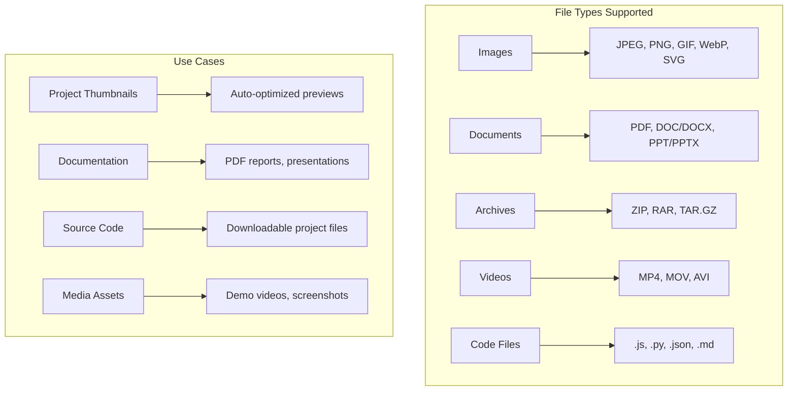
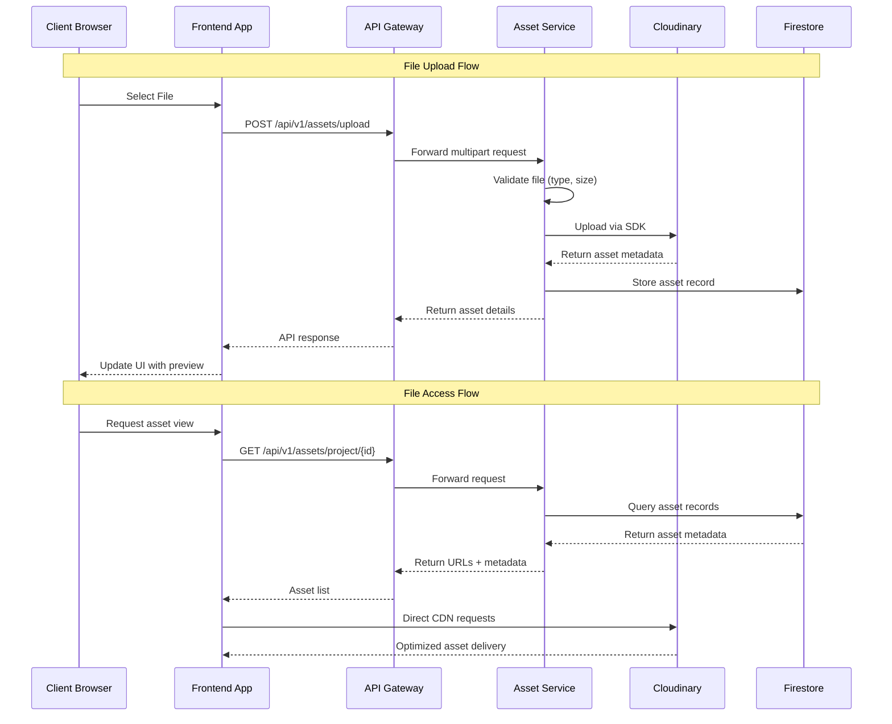
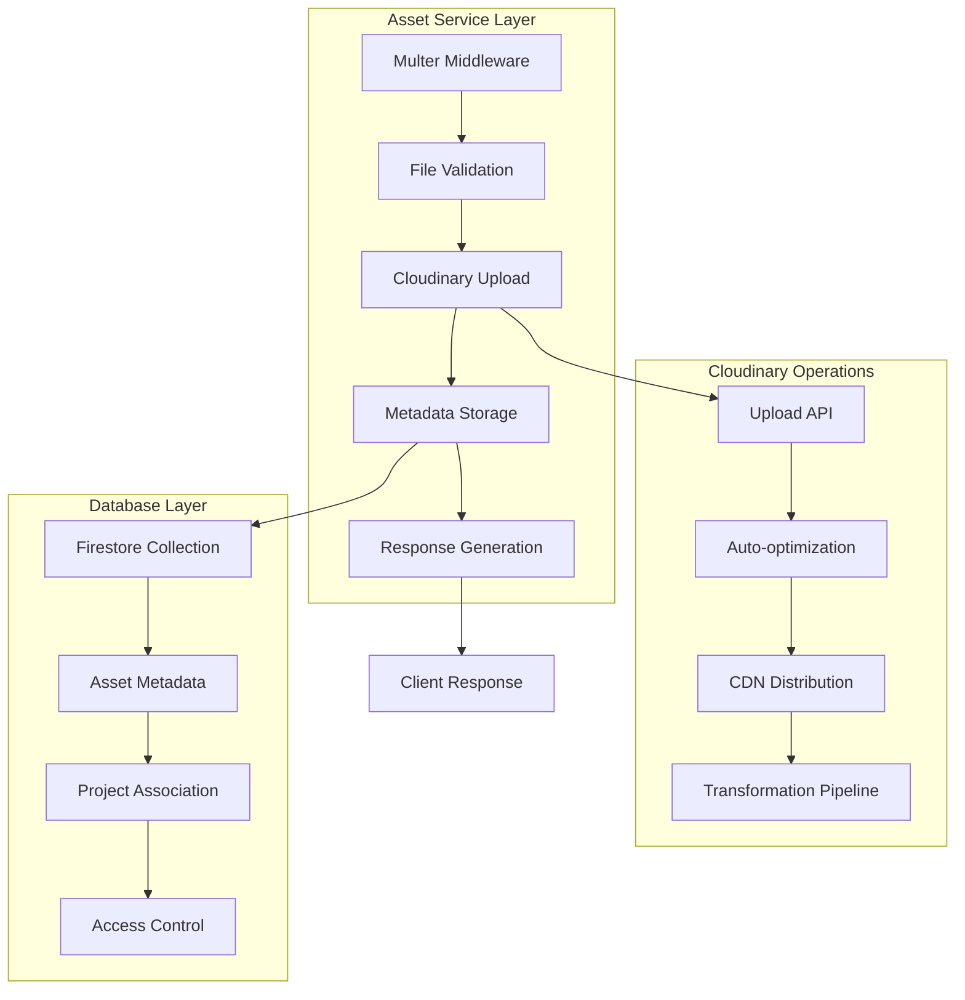
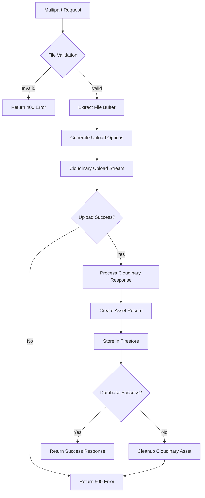
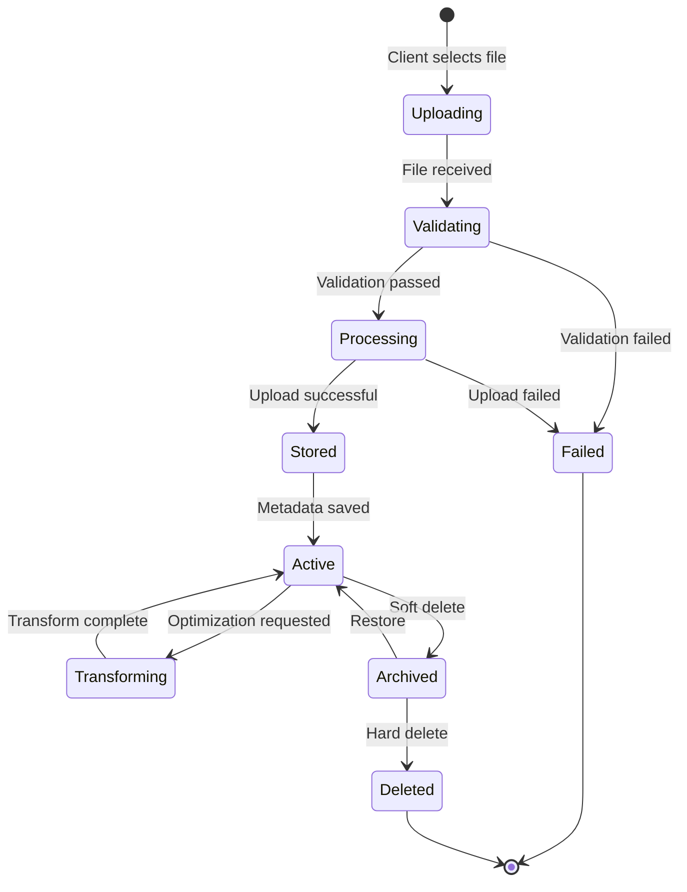
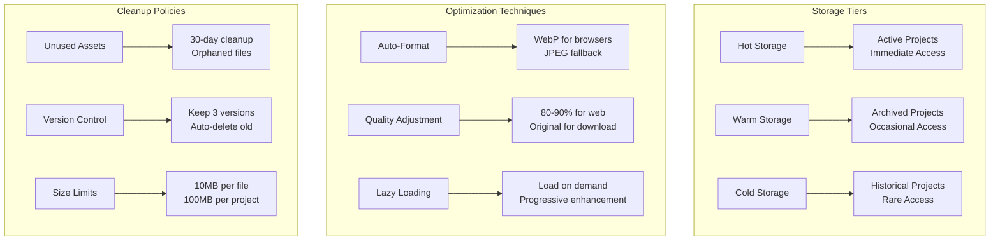
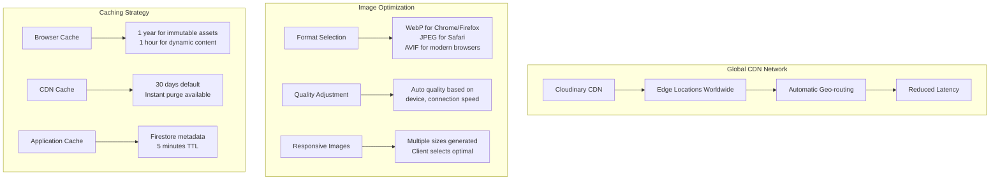
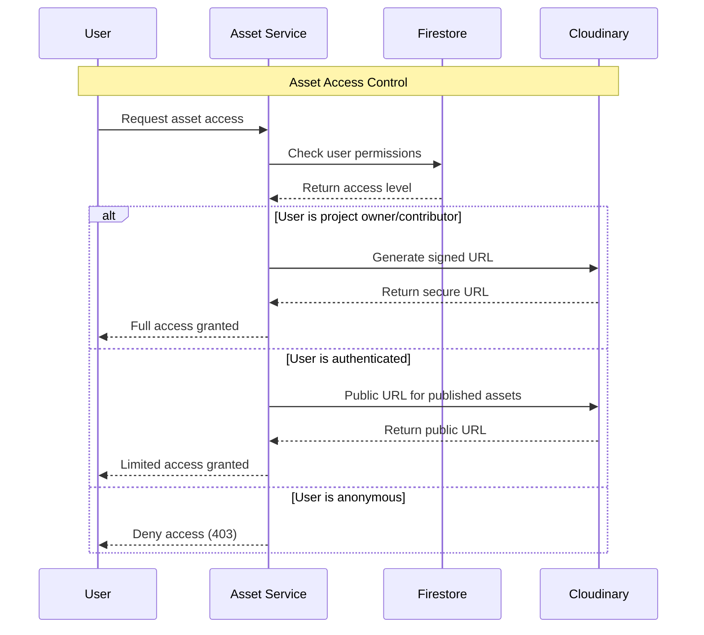
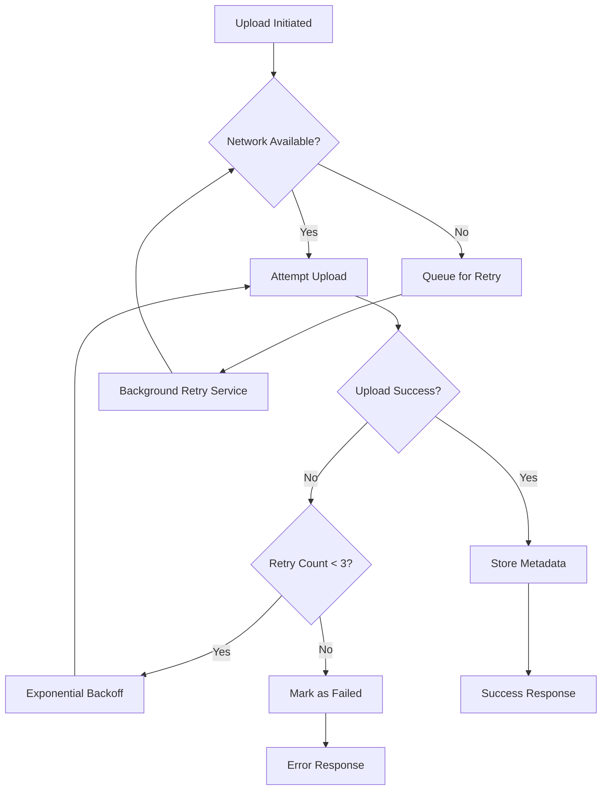

# ACM Digital Project Repository - Cloudinary Integration

## Table of Contents
- [Overview](#overview)
- [Integration Architecture](#integration-architecture)
- [Upload Workflow](#upload-workflow)
- [Asset Management](#asset-management)
- [Storage Strategy](#storage-strategy)
- [Performance Optimization](#performance-optimization)
- [Security & Access Control](#security--access-control)
- [Error Handling & Resilience](#error-handling--resilience)

## Overview

Cloudinary serves as the primary asset management solution for the ACM Digital Project Repository, handling image uploads, document storage, automatic optimization, and global CDN delivery. This integration provides a robust, scalable alternative to Firebase Storage with enhanced features for web applications.

### Why Cloudinary?

**Advantages over Firebase Storage**:
- **Image Optimization**: Automatic format conversion (WebP, AVIF)
- **Dynamic Transformations**: Resize, crop, compress on-the-fly
- **Global CDN**: Faster delivery worldwide
- **Better Analytics**: Upload and delivery metrics
- **Format Support**: Images, videos, documents, and raw files

### Integration Scope



## Integration Architecture

### Service Integration Pattern



### Configuration Layer

```javascript
// backend/shared/utils/cloudinary.js
const cloudinary = require('cloudinary').v2;

// Environment-based configuration
cloudinary.config({
  cloud_name: process.env.CLOUDINARY_CLOUD_NAME,
  api_key: process.env.CLOUDINARY_API_KEY,
  api_secret: process.env.CLOUDINARY_API_SECRET,
  secure: true // Force HTTPS URLs
});

module.exports = cloudinary;
```

### Asset Service Integration



## Upload Workflow

### 1. Client-Side Upload Preparation

```javascript
// Frontend file upload component
const handleFileUpload = async (file, projectId) => {
  // Validation before upload
  const maxSize = 10 * 1024 * 1024; // 10MB
  const allowedTypes = ['image/*', 'application/pdf', 'application/zip'];

  if (file.size > maxSize) {
    throw new Error('File size exceeds 10MB limit');
  }

  // Create FormData for multipart upload
  const formData = new FormData();
  formData.append('file', file);
  formData.append('projectId', projectId);
  formData.append('category', getFileCategory(file.type));

  // Upload with progress tracking
  const response = await fetch('/api/v1/assets/upload', {
    method: 'POST',
    headers: {
      'Authorization': `Bearer ${userToken}`,
    },
    body: formData
  });

  return response.json();
};
```

### 2. Server-Side Upload Processing



### 3. Upload Implementation Details

```javascript
// backend/asset-service/routes/assets.routes.js
router.post('/upload', verifyToken, upload.single('file'), async (req, res) => {
  try {
    const { projectId, category = 'general' } = req.body;
    const file = req.file;

    // Validate file
    if (!file) {
      return res.status(400).json({
        success: false,
        error: 'ValidationError',
        message: 'No file provided'
      });
    }

    // Generate unique public ID
    const publicId = `acm-projects/${projectId}/${Date.now()}-${file.originalname}`;

    // Upload options based on file type
    const uploadOptions = {
      public_id: publicId,
      folder: `acm-projects/${projectId}`,
      resource_type: 'auto', // Auto-detect file type
      format: file.mimetype.startsWith('image/') ? 'auto' : undefined,
      transformation: getTransformationOptions(file.mimetype),
      context: {
        project_id: projectId,
        category: category,
        uploaded_by: req.user.uid
      }
    };

    // Upload to Cloudinary using stream
    const uploadResult = await new Promise((resolve, reject) => {
      const uploadStream = cloudinary.uploader.upload_stream(
        uploadOptions,
        (error, result) => {
          if (error) reject(error);
          else resolve(result);
        }
      );
      uploadStream.end(file.buffer);
    });

    // Store metadata in Firestore
    const assetData = {
      id: uploadResult.public_id,
      projectId: projectId,
      originalName: file.originalname,
      cloudinaryPublicId: uploadResult.public_id,
      cloudinaryUrl: uploadResult.url,
      secureUrl: uploadResult.secure_url,
      mimeType: file.mimetype,
      sizeBytes: uploadResult.bytes,
      format: uploadResult.format,
      category: category,
      uploadedBy: req.user.uid,
      uploadedAt: new Date().toISOString(),
      isDeleted: false,
      transformations: uploadResult.transformation || []
    };

    const assetRef = await db
      .collection('projects')
      .doc(projectId)
      .collection('assets')
      .add(assetData);

    res.status(201).json({
      success: true,
      message: 'File uploaded successfully',
      asset: {
        id: assetRef.id,
        ...assetData
      }
    });

  } catch (error) {
    console.error('Upload error:', error);

    // Cleanup Cloudinary asset if database storage fails
    if (uploadResult?.public_id) {
      cloudinary.uploader.destroy(uploadResult.public_id);
    }

    res.status(500).json({
      success: false,
      error: 'UploadError',
      message: error.message
    });
  }
});
```

## Asset Management

### Asset Lifecycle Management



### File Organization Strategy

```javascript
// Cloudinary folder structure
acm-projects/
├── {projectId}/                    // Project-specific folder
│   ├── thumbnails/                 // Generated thumbnails
│   ├── documents/                  // PDF, DOC files
│   ├── images/                     // Photos, diagrams
│   ├── videos/                     // Demo videos
│   └── archives/                   // ZIP, TAR files
└── shared/                         // Platform-wide assets
    ├── avatars/                    // User profile pictures
    ├── branding/                   // ACM logos, banners
    └── templates/                  // Document templates
```

### Dynamic Transformations

```javascript
// Transformation options based on file type and use case
const getTransformationOptions = (mimeType, context = {}) => {
  const transformations = [];

  if (mimeType.startsWith('image/')) {
    // Image optimizations
    transformations.push({
      quality: 'auto:best',
      format: 'auto',
      flags: 'progressive'
    });

    // Generate responsive variants
    if (context.generateThumbs) {
      transformations.push(
        { width: 150, height: 150, crop: 'fill', gravity: 'center' }, // Thumbnail
        { width: 400, height: 300, crop: 'fit' }, // Preview
        { width: 800, height: 600, crop: 'limit' }  // Display
      );
    }
  }

  if (mimeType === 'application/pdf') {
    // PDF preview generation
    transformations.push({
      format: 'jpg',
      page: 1,
      width: 400,
      height: 300,
      crop: 'fit'
    });
  }

  return transformations;
};
```

### Asset URL Generation

```javascript
// Generate optimized URLs for different contexts
const generateAssetUrls = (asset, context = 'display') => {
  const baseUrl = asset.secureUrl;

  const urls = {
    original: baseUrl,

    // Image variants
    thumbnail: cloudinary.url(asset.cloudinaryPublicId, {
      transformation: [
        { width: 150, height: 150, crop: 'fill', gravity: 'center' },
        { quality: 'auto', format: 'auto' }
      ]
    }),

    preview: cloudinary.url(asset.cloudinaryPublicId, {
      transformation: [
        { width: 400, height: 300, crop: 'fit' },
        { quality: 'auto', format: 'auto' }
      ]
    }),

    display: cloudinary.url(asset.cloudinaryPublicId, {
      transformation: [
        { width: 800, height: 600, crop: 'limit' },
        { quality: 'auto', format: 'auto' }
      ]
    }),

    // PDF preview (first page)
    pdfPreview: asset.mimeType === 'application/pdf' ?
      cloudinary.url(asset.cloudinaryPublicId, {
        transformation: [
          { format: 'jpg', page: 1 },
          { width: 300, height: 200, crop: 'fit' }
        ]
      }) : null
  };

  return urls;
};
```

## Storage Strategy

### Storage Cost Optimization



### Backup & Redundancy

```javascript
// Asset backup strategy
const backupStrategy = {
  primary: 'Cloudinary (Global CDN)',
  secondary: 'Firebase Storage (Legacy)',

  // Automatic backup for critical files
  autoBackup: {
    triggers: ['project_published', 'admin_featured'],
    destinations: ['firebase_storage', 'local_cache'],
    retention: '2_years'
  },

  // Manual backup for bulk operations
  bulkBackup: {
    schedule: 'monthly',
    scope: 'all_active_projects',
    format: 'tar.gz_archive'
  }
};
```

### Migration from Firebase Storage

```javascript
// Migration utility for existing Firebase Storage assets
const migrateFromFirebase = async (projectId) => {
  try {
    // 1. List Firebase Storage files
    const [files] = await bucket
      .getFiles({ prefix: `projects/${projectId}/` });

    const migrationResults = [];

    for (const file of files) {
      // 2. Download from Firebase
      const [buffer] = await file.download();
      const metadata = await file.getMetadata();

      // 3. Upload to Cloudinary
      const uploadResult = await cloudinary.uploader.upload_stream({
        public_id: `migrated/${projectId}/${file.name}`,
        resource_type: 'auto',
        context: {
          migrated_from: 'firebase',
          original_path: file.name,
          migration_date: new Date().toISOString()
        }
      }, buffer);

      // 4. Update Firestore records
      await updateAssetRecord(projectId, file.name, {
        cloudinaryUrl: uploadResult.secure_url,
        cloudinaryPublicId: uploadResult.public_id,
        migrated: true,
        migrationDate: new Date().toISOString()
      });

      migrationResults.push({
        originalPath: file.name,
        cloudinaryUrl: uploadResult.secure_url,
        status: 'success'
      });
    }

    return migrationResults;

  } catch (error) {
    console.error('Migration failed:', error);
    throw error;
  }
};
```

## Performance Optimization

### CDN & Delivery Optimization



### Lazy Loading Implementation

```javascript
// Frontend lazy loading for assets
const LazyImage = ({ asset, alt, className }) => {
  const [loaded, setLoaded] = useState(false);
  const [error, setError] = useState(false);
  const imgRef = useRef();

  useEffect(() => {
    const observer = new IntersectionObserver(
      ([entry]) => {
        if (entry.isIntersecting) {
          const img = imgRef.current;
          img.src = asset.urls.display;
          img.onload = () => setLoaded(true);
          img.onerror = () => setError(true);
          observer.disconnect();
        }
      },
      { threshold: 0.1 }
    );

    if (imgRef.current) {
      observer.observe(imgRef.current);
    }

    return () => observer.disconnect();
  }, [asset]);

  if (error) {
    return <div className="asset-error">Failed to load image</div>;
  }

  return (
    <div className={`asset-container ${loaded ? 'loaded' : 'loading'}`}>
      
      {!loaded && <div className="loading-spinner" />}
    </div>
  );
};
```

### Batch Operations

```javascript
// Efficient bulk operations
const bulkUploadAssets = async (projectId, files) => {
  const uploadPromises = files.map(async (file, index) => {
    // Stagger uploads to avoid rate limits
    await new Promise(resolve => setTimeout(resolve, index * 100));

    return uploadAsset(projectId, file);
  });

  // Process in batches of 5
  const batchSize = 5;
  const results = [];

  for (let i = 0; i < uploadPromises.length; i += batchSize) {
    const batch = uploadPromises.slice(i, i + batchSize);
    const batchResults = await Promise.allSettled(batch);
    results.push(...batchResults);
  }

  return results;
};
```

## Security & Access Control

### Upload Security

```javascript
// File validation and sanitization
const validateUpload = (file) => {
  const security = {
    // File type validation
    allowedMimeTypes: [
      'image/jpeg', 'image/png', 'image/gif', 'image/webp',
      'application/pdf', 'application/zip',
      'video/mp4', 'video/quicktime'
    ],

    // Size limitations
    maxFileSize: 10 * 1024 * 1024, // 10MB
    maxDimensions: { width: 4096, height: 4096 },

    // Content validation
    scanForMalware: true,
    validateHeaders: true,

    // Rate limiting
    maxUploadsPerMinute: 10,
    maxStoragePerProject: 100 * 1024 * 1024 // 100MB
  };

  // MIME type validation
  if (!security.allowedMimeTypes.includes(file.mimetype)) {
    throw new Error(`File type ${file.mimetype} not allowed`);
  }

  // Size validation
  if (file.size > security.maxFileSize) {
    throw new Error('File size exceeds limit');
  }

  // File header validation (prevent MIME spoofing)
  if (!validateFileHeader(file.buffer, file.mimetype)) {
    throw new Error('File content does not match declared type');
  }

  return true;
};
```

### Access Control



### Signed URLs for Private Content

```javascript
// Generate time-limited signed URLs
const generateSignedUrl = (asset, expirationMinutes = 60) => {
  const timestamp = Math.floor(Date.now() / 1000) + (expirationMinutes * 60);

  const signedUrl = cloudinary.utils.private_download_zip_url({
    public_ids: [asset.cloudinaryPublicId],
    expires_at: timestamp,
    type: 'authenticated'
  });

  return {
    url: signedUrl,
    expiresAt: new Date(timestamp * 1000).toISOString()
  };
};
```

## Error Handling & Resilience

### Upload Failure Recovery



### Fallback Strategies

```javascript
// Multi-provider upload with fallback
const uploadWithFallback = async (file, options) => {
  const providers = [
    { name: 'Cloudinary', upload: uploadToCloudinary },
    { name: 'Firebase', upload: uploadToFirebase },
    { name: 'Local', upload: uploadToLocal }
  ];

  for (const provider of providers) {
    try {
      const result = await provider.upload(file, options);

      // Store provider info for future reference
      result.provider = provider.name;
      result.uploadedAt = new Date().toISOString();

      return result;

    } catch (error) {
      console.warn(`Upload failed for ${provider.name}:`, error.message);

      // Continue to next provider
      if (provider === providers[providers.length - 1]) {
        throw new Error('All upload providers failed');
      }
    }
  }
};
```

### Monitoring & Alerting

```javascript
// Upload monitoring and metrics
const uploadMetrics = {
  // Success/failure rates
  trackUpload: (result, duration, fileSize) => {
    metrics.increment('uploads.total');
    metrics.histogram('uploads.duration', duration);
    metrics.histogram('uploads.file_size', fileSize);

    if (result.success) {
      metrics.increment('uploads.success');
    } else {
      metrics.increment('uploads.failure');
      metrics.increment(`uploads.error.${result.errorType}`);
    }
  },

  // Performance monitoring
  trackPerformance: (endpoint, responseTime, statusCode) => {
    metrics.histogram(`api.${endpoint}.duration`, responseTime);
    metrics.increment(`api.${endpoint}.${statusCode}`);
  },

  // Storage utilization
  trackStorage: async () => {
    const usage = await cloudinary.api.usage();
    metrics.gauge('storage.bytes', usage.storage.usage);
    metrics.gauge('storage.transformations', usage.transformations.usage);
    metrics.gauge('storage.requests', usage.requests.usage);
  }
};
```

---

**Cloudinary Integration Benefits**:
- ✅ Global CDN with automatic optimization
- ✅ Dynamic image transformations
- ✅ Robust upload handling with fallbacks
- ✅ Cost-effective storage solution
- ✅ Enhanced user experience with fast delivery
- ✅ Professional asset management capabilities

**Next: See [APP-OVERVIEW.md](./APP-OVERVIEW.md) for complete application functionality**