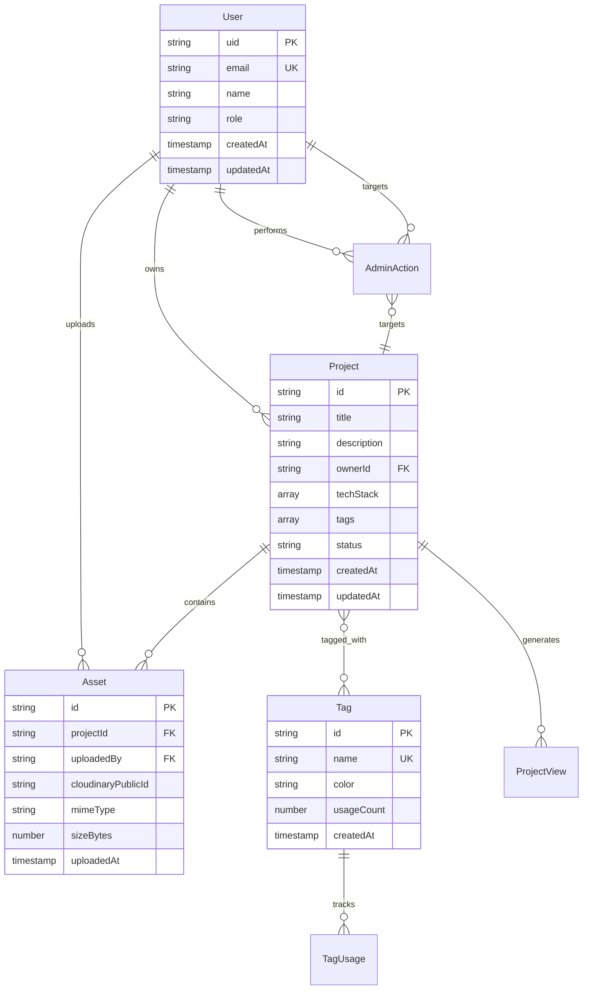
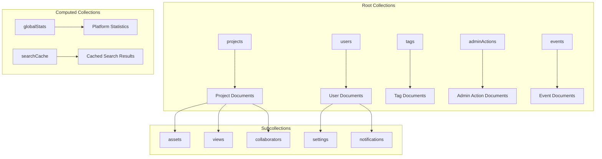

# ACM Digital Project Repository - Database Schema

## Table of Contents
- [Database Overview](#database-overview)
- [Collection Structure](#collection-structure)
- [Data Models](#data-models)
- [Relationships & References](#relationships--references)
- [Indexing Strategy](#indexing-strategy)
- [Security Rules](#security-rules)
- [Data Migration & Versioning](#data-migration--versioning)
- [Query Patterns](#query-patterns)

## Database Overview

The ACM Digital Project Repository uses **Google Firestore** as its primary database, providing a NoSQL document-based storage solution with real-time synchronization capabilities, automatic scaling, and strong consistency guarantees.

### Database Architecture



### Firebase Project Configuration

**Project ID**: `acmdigitalprojectrepository`
**Region**: `us-central1`
**Database Mode**: Native mode (Firestore)

**Key Features Used**:
- Document-based storage with collections
- Real-time listeners for live updates
- Composite indexes for complex queries
- Security rules for access control
- Automatic backups and point-in-time recovery

## Collection Structure

### Primary Collections



### Collection Hierarchy

```
acmdigitalprojectrepository/
├── users/                          # User profiles and authentication data
│   ├── {userId}/                   # User document (UID as document ID)
│   │   ├── settings/               # User-specific configuration
│   │   └── notifications/          # User notification queue
├── projects/                       # Project data and metadata
│   ├── {projectId}/               # Project document (auto-generated ID)
│   │   ├── assets/                # Project files and media
│   │   ├── views/                 # View tracking and analytics
│   │   └── collaborators/         # Project team members
├── tags/                          # Project taxonomy and categorization
├── adminActions/                  # Admin moderation audit trail
├── events/                        # System events for audit and integration
├── globalStats/                   # Platform-wide analytics
└── searchCache/                   # Cached search results for performance
```

## Data Models

### User Document Model

```typescript
interface UserDocument {
  // Identity
  uid: string;                     // Firebase Authentication UID
  email: string;                   // Unique email address
  name: string;                    // Display name

  // Profile Information
  bio?: string;                    // User biography (max 500 chars)
  profilePicture?: string;         // Cloudinary URL
  university?: string;             // Academic institution
  graduationYear?: number;         // Expected/actual graduation year
  major?: string;                  // Academic major/field of study

  // Social Links
  socialLinks?: {
    github?: string;               // GitHub username
    linkedin?: string;             // LinkedIn profile URL
    portfolio?: string;            // Personal portfolio URL
    twitter?: string;              // Twitter handle
  };

  // System Information
  role: 'member' | 'admin';        // User permission level
  isActive: boolean;               // Account status
  createdAt: Timestamp;            // Account creation date
  updatedAt: Timestamp;            // Last profile update
  lastLoginAt?: Timestamp;         // Most recent login

  // Privacy Settings
  profileVisibility: 'public' | 'private' | 'members-only';
  emailVisible: boolean;           // Show email to other users
  githubVisible: boolean;          // Show GitHub link publicly

  // Analytics
  projectCount: number;            // Number of owned projects
  contributionCount: number;       // Number of contributed projects
}
```

### Project Document Model

```typescript
interface ProjectDocument {
  // Basic Information
  id: string;                      // Firestore document ID
  title: string;                   // Project title (max 100 chars)
  description: string;             // Detailed description (max 5000 chars)
  shortDescription?: string;       // Brief summary (max 200 chars)

  // Technical Details
  techStack: string[];             // Technologies used (e.g., ["React", "Node.js"])
  category: string;                // Primary category
  tags: string[];                  // Additional tags for discovery
  difficultyLevel?: 'beginner' | 'intermediate' | 'advanced';

  // External Links
  githubUrl?: string;              // Repository URL
  liveUrl?: string;               // Demo/production URL
  documentationUrl?: string;       // Additional documentation

  // Ownership & Collaboration
  ownerId: string;                 // User UID of project owner
  contributors: string[];          // Array of contributor UIDs
  maintainers?: string[];          // Project maintainers (subset of contributors)

  // Status & Moderation
  status: 'draft' | 'pending' | 'published' | 'featured' | 'archived';
  moderationNotes?: string;        // Admin feedback/notes
  rejectionReason?: string;        // Reason for rejection (if applicable)

  // Metadata
  createdAt: Timestamp;            // Project creation date
  updatedAt: Timestamp;            // Last modification date
  publishedAt?: Timestamp;         // Publication date
  featuredAt?: Timestamp;          // Featured promotion date

  // Analytics & Engagement
  viewCount: number;               // Total view count
  likeCount: number;               // Number of likes/favorites
  downloadCount: number;           // Asset download count
  searchKeywords: string[];        // Generated keywords for search

  // System Flags
  isDeleted: boolean;              // Soft delete flag
  isPrivate: boolean;              // Private project visibility
  allowContributions: boolean;     // Accept contribution requests

  // Computed Fields (updated by cloud functions)
  assetCount: number;              // Number of uploaded assets
  lastActivity: Timestamp;         // Most recent activity date
  popularityScore: number;         // Weighted popularity metric
}
```

### Asset Document Model (Subcollection)

**Path**: `/projects/{projectId}/assets/{assetId}`

```typescript
interface AssetDocument {
  // Basic File Information
  id: string;                      // Firestore document ID
  projectId: string;               // Parent project ID
  originalName: string;            // Original filename
  fileName: string;                // Processed filename
  mimeType: string;               // File MIME type

  // Storage Integration
  cloudinaryPublicId: string;      // Cloudinary asset identifier
  cloudinaryUrl: string;          // CDN URL
  secureUrl: string;              // HTTPS CDN URL
  firebaseStoragePath?: string;   // Legacy Firebase Storage path

  // File Metadata
  sizeBytes: number;              // File size in bytes
  dimensions?: {                  // Image/video dimensions
    width: number;
    height: number;
  };
  duration?: number;              // Video/audio duration in seconds

  // Organization
  category: 'screenshot' | 'document' | 'video' | 'archive' | 'diagram' | 'other';
  folder: string;                 // Organizational folder
  description?: string;           // Asset description

  // Access Control
  uploadedBy: string;             // User UID who uploaded
  isPublic: boolean;              // Public visibility
  downloadAllowed: boolean;       // Allow downloads by non-owners

  // System Information
  uploadedAt: Timestamp;          // Upload timestamp
  isDeleted: boolean;             // Soft delete flag
  virusScanStatus?: 'pending' | 'clean' | 'infected'; // Security scan status

  // Cloudinary Optimizations
  transformations: {              // Applied transformations
    thumbnail: string;            // Thumbnail URL
    preview: string;              // Preview URL
    optimized: string;            // Web-optimized URL
  };

  // Analytics
  downloadCount: number;          // Number of downloads
  viewCount: number;              // Number of views
}
```

### Tag Document Model

```typescript
interface TagDocument {
  // Basic Information
  id: string;                     // Firestore document ID
  name: string;                   // Tag name (unique, lowercase)
  displayName: string;            // Formatted display name
  description?: string;           // Tag description

  // Visual Properties
  color: string;                  // Hex color code for UI display
  icon?: string;                  // Icon identifier (future use)

  // Metadata
  category: 'technology' | 'framework' | 'language' | 'tool' | 'concept';
  createdAt: Timestamp;           // Creation date
  createdBy: string;              // Creator UID (admin)

  // Usage Analytics
  usageCount: number;             // Number of projects using this tag
  trendingScore: number;          // Popularity trend metric
  lastUsed: Timestamp;            // Most recent usage

  // System Flags
  isActive: boolean;              // Tag availability status
  isRecommended: boolean;         // Featured/recommended tag
  aliases?: string[];             // Alternative names/spellings
}
```

### Admin Action Document Model

```typescript
interface AdminActionDocument {
  // Action Information
  id: string;                     // Firestore document ID
  adminId: string;                // Admin user UID
  action: string;                 // Action type (enum)

  // Target Information
  targetType: 'project' | 'user' | 'tag' | 'asset';
  targetId: string;               // Target document ID

  // Action Details
  reason?: string;                // Reason for action
  notes?: string;                 // Additional notes
  previousState?: any;            // State before action (for reversal)

  // System Information
  timestamp: Timestamp;           // Action timestamp
  ipAddress?: string;             // Admin IP address
  userAgent?: string;             // Admin browser/client info

  // Approval Workflow
  requiresReview: boolean;        // Multi-admin approval required
  reviewedBy?: string;            // Reviewing admin UID
  reviewedAt?: Timestamp;         // Review timestamp
  status: 'pending' | 'approved' | 'rejected';
}
```

## Relationships & References

### Reference Patterns

```mermaid
graph TB
    subgraph "Document References"
        A[User Document] -->|uid| B[Project.ownerId]
        A -->|uid| C[Asset.uploadedBy]
        A -->|uid| D[AdminAction.adminId]

        B -->|projectId| E[Asset.projectId]
        F[Project Document] -->|tags[]| G[Tag.name]
    end

    subgraph "Collection Groups"
        H[All Assets] --> I[Query across all projects]
        J[All Views] --> K[Analytics aggregation]
        L[All Collaborators] --> M[User contribution tracking]
    end
```

### Data Relationship Rules

**One-to-Many Relationships**:
- User → Projects (owner)
- User → Assets (uploader)
- Project → Assets (container)
- User → AdminActions (performer)

**Many-to-Many Relationships**:
- Projects ↔ Tags (via array fields)
- Users ↔ Projects (via contributors array)

**Reference Integrity**:
- Foreign keys stored as strings (UIDs/IDs)
- Orphaned data cleanup via Cloud Functions
- Cascade deletions handled in application logic

### Denormalization Strategy

```typescript
// Denormalized user data in projects for performance
interface ProjectWithOwnerInfo {
  // ... project fields
  owner: {
    uid: string;
    name: string;
    profilePicture?: string;
  };
}

// Computed aggregations for quick access
interface UserWithStats {
  // ... user fields
  stats: {
    projectCount: number;
    totalViews: number;
    totalLikes: number;
    contributionCount: number;
  };
}
```

## Indexing Strategy

### Composite Indexes

**Project Query Indexes**:
```javascript
// 1. Project discovery and filtering
{
  collection: 'projects',
  fields: [
    { fieldPath: 'status', order: 'ASCENDING' },
    { fieldPath: 'isDeleted', order: 'ASCENDING' },
    { fieldPath: 'createdAt', order: 'DESCENDING' }
  ]
}

// 2. Technology-based search
{
  collection: 'projects',
  fields: [
    { fieldPath: 'techStack', order: 'ASCENDING' },
    { fieldPath: 'status', order: 'ASCENDING' },
    { fieldPath: 'popularityScore', order: 'DESCENDING' }
  ]
}

// 3. Category and tag filtering
{
  collection: 'projects',
  fields: [
    { fieldPath: 'category', order: 'ASCENDING' },
    { fieldPath: 'tags', order: 'ASCENDING' },
    { fieldPath: 'publishedAt', order: 'DESCENDING' }
  ]
}

// 4. User-specific project queries
{
  collection: 'projects',
  fields: [
    { fieldPath: 'ownerId', order: 'ASCENDING' },
    { fieldPath: 'status', order: 'ASCENDING' },
    { fieldPath: 'updatedAt', order: 'DESCENDING' }
  ]
}
```

**Asset Query Indexes**:
```javascript
// Asset management within projects
{
  collectionGroup: 'assets',
  fields: [
    { fieldPath: 'projectId', order: 'ASCENDING' },
    { fieldPath: 'isDeleted', order: 'ASCENDING' },
    { fieldPath: 'uploadedAt', order: 'DESCENDING' }
  ]
}

// User asset tracking
{
  collectionGroup: 'assets',
  fields: [
    { fieldPath: 'uploadedBy', order: 'ASCENDING' },
    { fieldPath: 'category', order: 'ASCENDING' },
    { fieldPath: 'uploadedAt', order: 'DESCENDING' }
  ]
}
```

### Single-Field Indexes

Firestore automatically creates single-field indexes. Key exemptions:
- Large text fields (descriptions) - disabled for storage optimization
- Array fields where only array-contains queries are used
- Timestamp fields used only for ordering (not filtering)

## Security Rules

### Firestore Security Rules

```javascript
rules_version = '2';
service cloud.firestore {
  match /databases/{database}/documents {

    // Helper functions
    function isAuthenticated() {
      return request.auth != null;
    }

    function getUserRole(uid) {
      return get(/databases/$(database)/documents/users/$(uid)).data.role;
    }

    function isAdmin() {
      return isAuthenticated() && getUserRole(request.auth.uid) == 'admin';
    }

    function isOwner(resourceOwnerId) {
      return isAuthenticated() && request.auth.uid == resourceOwnerId;
    }

    // Users collection
    match /users/{userId} {
      // Users can read public profiles or their own data
      allow read: if resource.data.profileVisibility == 'public'
                  || isOwner(userId)
                  || isAdmin();

      // Users can only write their own data
      allow write: if isOwner(userId) &&
                   (!('role' in request.resource.data) ||
                    request.resource.data.role == resource.data.role);

      // Admins can modify roles
      allow update: if isAdmin() &&
                    request.resource.data.keys().hasOnly(['role', 'isActive', 'updatedAt']);

      // User settings subcollection
      match /settings/{document=**} {
        allow read, write: if isOwner(userId);
      }

      // User notifications subcollection
      match /notifications/{document=**} {
        allow read, write: if isOwner(userId);
        allow create: if isAuthenticated(); // Allow others to send notifications
      }
    }

    // Projects collection
    match /projects/{projectId} {
      // Public read access for published projects
      allow read: if resource.data.status == 'published' &&
                  !resource.data.isDeleted &&
                  !resource.data.isPrivate;

      // Owners can read their projects
      allow read: if isOwner(resource.data.ownerId);

      // Admins can read all projects
      allow read: if isAdmin();

      // Authenticated users can create projects
      allow create: if isAuthenticated() &&
                    request.resource.data.ownerId == request.auth.uid &&
                    request.resource.data.status in ['draft', 'pending'];

      // Owners can update their projects (except status changes to published)
      allow update: if isOwner(resource.data.ownerId) &&
                    (request.resource.data.status == resource.data.status ||
                     request.resource.data.status in ['draft', 'pending']);

      // Admins can update any project
      allow update: if isAdmin();

      // Only admins can delete projects
      allow delete: if isAdmin();

      // Assets subcollection
      match /assets/{assetId} {
        // Read permissions inherit from parent project
        allow read: if resource.data.isPublic ||
                    isOwner(get(/databases/$(database)/documents/projects/$(projectId)).data.ownerId) ||
                    isAdmin();

        // Asset creation by project owner or contributors
        allow create: if isAuthenticated() &&
                      (isOwner(get(/databases/$(database)/documents/projects/$(projectId)).data.ownerId) ||
                       request.auth.uid in get(/databases/$(database)/documents/projects/$(projectId)).data.contributors);

        // Asset updates by uploader or project owner
        allow update: if isOwner(resource.data.uploadedBy) ||
                      isOwner(get(/databases/$(database)/documents/projects/$(projectId)).data.ownerId) ||
                      isAdmin();

        // Asset deletion by uploader, project owner, or admin
        allow delete: if isOwner(resource.data.uploadedBy) ||
                      isOwner(get(/databases/$(database)/documents/projects/$(projectId)).data.ownerId) ||
                      isAdmin();
      }

      // Project views subcollection (analytics)
      match /views/{viewId} {
        // Anyone can create view records
        allow create: if true;

        // Only admins can read view data
        allow read: if isAdmin();
      }

      // Collaborators subcollection
      match /collaborators/{collaboratorId} {
        // Project owners and existing collaborators can read
        allow read: if isOwner(get(/databases/$(database)/documents/projects/$(projectId)).data.ownerId) ||
                    isOwner(collaboratorId) ||
                    isAdmin();

        // Project owners can manage collaborators
        allow create, update, delete: if isOwner(get(/databases/$(database)/documents/projects/$(projectId)).data.ownerId) ||
                                       isAdmin();
      }
    }

    // Tags collection
    match /tags/{tagId} {
      // Public read access
      allow read: if true;

      // Only admins can modify tags
      allow write: if isAdmin();
    }

    // Admin actions collection
    match /adminActions/{actionId} {
      // Only admins can read and write admin actions
      allow read, write: if isAdmin();
    }

    // Events collection (system audit trail)
    match /events/{eventId} {
      // System can write, admins can read
      allow create: if true; // System-generated events
      allow read: if isAdmin();
    }

    // Global stats collection
    match /globalStats/{statId} {
      // Public read access for dashboard
      allow read: if true;

      // Only admins and system can write
      allow write: if isAdmin();
    }

    // Search cache collection
    match /searchCache/{cacheId} {
      // Public read access
      allow read: if true;

      // System writes cached results
      allow write: if true; // System-managed
    }
  }
}
```

### Security Rule Testing

```javascript
// Security rule unit tests
const testSecurityRules = {
  // Test user data access
  userAccess: {
    // Users can read their own data
    'users/user1': {
      read: { uid: 'user1', expected: true },
      write: { uid: 'user1', data: { name: 'New Name' }, expected: true }
    },

    // Users cannot read others' private data
    'users/user2': {
      read: { uid: 'user1', expected: false },
      write: { uid: 'user1', expected: false }
    }
  },

  // Test project access
  projectAccess: {
    // Public projects readable by all
    'projects/public-project': {
      read: { uid: null, expected: true },
      read_auth: { uid: 'user1', expected: true }
    },

    // Private projects only readable by owner
    'projects/private-project': {
      read: { uid: 'owner', expected: true },
      read_other: { uid: 'user1', expected: false }
    }
  }
};
```

## Data Migration & Versioning

### Migration Strategy

```javascript
// Database migration framework
const migrations = {
  version: '1.2.0',

  migrations: [
    {
      version: '1.1.0',
      description: 'Add search keywords to projects',
      up: async () => {
        const projects = await db.collection('projects').get();
        const batch = db.batch();

        projects.docs.forEach(doc => {
          const data = doc.data();
          const keywords = generateSearchKeywords(data.title, data.description, data.techStack);

          batch.update(doc.ref, { searchKeywords: keywords });
        });

        await batch.commit();
      },

      down: async () => {
        const projects = await db.collection('projects').get();
        const batch = db.batch();

        projects.docs.forEach(doc => {
          batch.update(doc.ref, { searchKeywords: FieldValue.delete() });
        });

        await batch.commit();
      }
    },

    {
      version: '1.2.0',
      description: 'Migrate assets to Cloudinary',
      up: async () => {
        // Migration logic for Cloudinary integration
        const assets = await db.collectionGroup('assets')
          .where('cloudinaryUrl', '==', null)
          .get();

        for (const doc of assets.docs) {
          await migrateAssetToCloudinary(doc.id, doc.data());
        }
      }
    }
  ]
};
```

### Schema Versioning

```typescript
// Document version tracking
interface VersionedDocument {
  // Document data...

  // Version information
  schemaVersion: string;           // Schema version (e.g., "1.2.0")
  migrationStatus?: 'pending' | 'completed' | 'failed';
  lastMigration?: Timestamp;       // Last schema update
}

// Backward compatibility handling
const handleDocumentRead = (doc: DocumentSnapshot) => {
  const data = doc.data();
  const currentVersion = '1.2.0';

  if (!data.schemaVersion || data.schemaVersion !== currentVersion) {
    // Apply compatibility transformations
    return applyCompatibilityLayer(data, data.schemaVersion);
  }

  return data;
};
```

## Query Patterns

### Common Query Patterns

```javascript
// 1. Project Discovery - Homepage
const getPublishedProjects = async (filters = {}) => {
  let query = db.collection('projects')
    .where('status', '==', 'published')
    .where('isDeleted', '==', false)
    .orderBy('publishedAt', 'desc')
    .limit(20);

  if (filters.category) {
    query = query.where('category', '==', filters.category);
  }

  if (filters.techStack) {
    query = query.where('techStack', 'array-contains-any', filters.techStack);
  }

  const snapshot = await query.get();
  return snapshot.docs.map(doc => ({ id: doc.id, ...doc.data() }));
};

// 2. User Portfolio - My Projects
const getUserProjects = async (userId) => {
  const snapshot = await db.collection('projects')
    .where('ownerId', '==', userId)
    .where('isDeleted', '==', false)
    .orderBy('updatedAt', 'desc')
    .get();

  return snapshot.docs.map(doc => ({ id: doc.id, ...doc.data() }));
};

// 3. Admin Moderation - Pending Approval
const getPendingProjects = async () => {
  const snapshot = await db.collection('projects')
    .where('status', '==', 'pending')
    .where('isDeleted', '==', false)
    .orderBy('createdAt', 'asc')
    .get();

  return snapshot.docs.map(doc => ({ id: doc.id, ...doc.data() }));
};

// 4. Asset Management - Project Assets
const getProjectAssets = async (projectId) => {
  const snapshot = await db.collection('projects')
    .doc(projectId)
    .collection('assets')
    .where('isDeleted', '==', false)
    .orderBy('uploadedAt', 'desc')
    .get();

  return snapshot.docs.map(doc => ({ id: doc.id, ...doc.data() }));
};

// 5. Analytics - Popular Tags
const getPopularTags = async (limit = 20) => {
  const snapshot = await db.collection('tags')
    .where('isActive', '==', true)
    .orderBy('usageCount', 'desc')
    .limit(limit)
    .get();

  return snapshot.docs.map(doc => ({ id: doc.id, ...doc.data() }));
};
```

### Performance Optimization Queries

```javascript
// Batch reads for related data
const getProjectsWithOwners = async (projectIds) => {
  // Get projects
  const projectPromises = projectIds.map(id =>
    db.collection('projects').doc(id).get()
  );
  const projects = await Promise.all(projectPromises);

  // Get unique owner IDs
  const ownerIds = [...new Set(projects.map(p => p.data()?.ownerId).filter(Boolean))];

  // Batch get owners
  const ownerPromises = ownerIds.map(uid =>
    db.collection('users').doc(uid).get()
  );
  const owners = await Promise.all(ownerPromises);
  const ownerMap = new Map(owners.map(o => [o.id, o.data()]));

  // Combine data
  return projects.map(project => ({
    id: project.id,
    ...project.data(),
    owner: ownerMap.get(project.data()?.ownerId)
  }));
};

// Pagination with cursor-based approach
const getPaginatedProjects = async (pageSize = 20, lastDoc = null) => {
  let query = db.collection('projects')
    .where('status', '==', 'published')
    .where('isDeleted', '==', false)
    .orderBy('publishedAt', 'desc')
    .limit(pageSize);

  if (lastDoc) {
    query = query.startAfter(lastDoc);
  }

  const snapshot = await query.get();

  return {
    projects: snapshot.docs.map(doc => ({ id: doc.id, ...doc.data() })),
    lastDoc: snapshot.docs[snapshot.docs.length - 1],
    hasMore: snapshot.docs.length === pageSize
  };
};
```

### Real-time Subscriptions

```javascript
// Real-time project updates
const subscribeToProject = (projectId, callback) => {
  return db.collection('projects').doc(projectId)
    .onSnapshot(snapshot => {
      if (snapshot.exists) {
        callback({ id: snapshot.id, ...snapshot.data() });
      }
    });
};

// Admin dashboard real-time stats
const subscribeToAdminStats = (callback) => {
  return db.collection('globalStats').doc('platform')
    .onSnapshot(snapshot => {
      if (snapshot.exists) {
        callback(snapshot.data());
      }
    });
};
```

---

**Database Benefits**:
- ✅ **Scalable NoSQL Design**: Handles growing data with automatic scaling
- ✅ **Real-time Capabilities**: Live updates across all clients
- ✅ **Strong Security Model**: Row-level security with custom rules
- ✅ **Flexible Schema**: Easy to evolve data models over time
- ✅ **Offline Support**: Client-side caching and sync
- ✅ **Global Distribution**: Multi-region replication available

**Next: See [AUTHENTICATION.md](./AUTHENTICATION.md) for auth flow and security documentation**