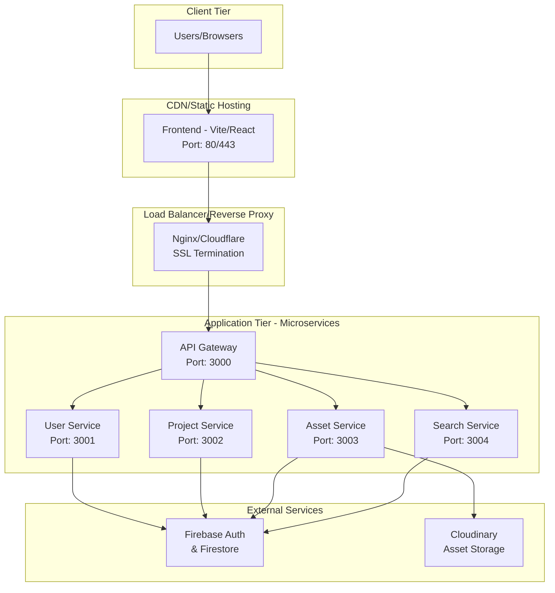

# ACM Digital Project Repository - Deployment Guide

## Table of Contents
- [Prerequisites](#prerequisites)
- [Local Development Setup](#local-development-setup)
- [Production Deployment](#production-deployment)
- [Environment Configuration](#environment-configuration)
- [Monitoring & Health Checks](#monitoring--health-checks)
- [Troubleshooting](#troubleshooting)

## Prerequisites

### System Requirements
- **Node.js**: v16.0.0 or higher
- **npm**: v7.0.0 or higher
- **Git**: Latest version
- **Firebase CLI**: For Firebase Authentication setup
- **Cloudinary Account**: For asset management

### Required Accounts & Services
1. **Firebase Project** with Authentication and Firestore enabled
2. **Cloudinary Account** for image/document storage
3. **Hosting Provider** (Vercel, Netlify, Railway, or VPS)

## Local Development Setup

### 1. Clone Repository
```bash
git clone https://github.com/Aesthetic002/ACMDigitalProjectRepository.git
cd ACMDigitalProjectRepository
```

### 2. Backend Setup (Microservices)

```bash
cd backend

# Install dependencies
npm install

# Create environment file
cp .env.example .env

# Configure environment variables (see Environment Configuration section)
nano .env

# Start all microservices
npm start

# Or start with auto-reload for development
npm run dev
```

### 3. Frontend Setup

```bash
cd ../frontend

# Install dependencies
npm install

# Start development server
npm run dev
```

### 4. Verify Setup
```bash
# Test all services are running
cd ../backend
npm run test:services
```

## Production Deployment

### Architecture Overview



### Deployment Options

#### Option 1: Platform-as-a-Service (Recommended)

**For Frontend (Vercel):**
```bash
# 1. Connect GitHub repository to Vercel
# 2. Set build commands:
#    Build Command: npm run build
#    Output Directory: dist
#    Root Directory: frontend

# 3. Environment variables in Vercel dashboard:
VITE_API_URL=https://your-backend-domain.com
VITE_FIREBASE_API_KEY=your_firebase_key
VITE_FIREBASE_AUTH_DOMAIN=your-project.firebaseapp.com
# ... other Firebase config
```

**For Backend (Railway/Render):**
```bash
# Dockerfile for containerized deployment
FROM node:18-alpine
WORKDIR /app
COPY package*.json ./
RUN npm ci --only=production
COPY . .
EXPOSE 3000 3001 3002 3003 3004
CMD ["npm", "start"]
```

**Railway/Render Configuration:**
- Start Command: `npm start`
- Port: `3000` (API Gateway)
- Auto-deploy: Enable for `microservices` branch

#### Option 2: VPS/Cloud Server (Advanced)

**Server Requirements:**
- 2 CPU cores minimum
- 4GB RAM minimum
- 20GB SSD storage
- Ubuntu 20.04 LTS or similar

**Setup Steps:**
```bash
# 1. Install Node.js & PM2
curl -fsSL https://deb.nodesource.com/setup_18.x | sudo -E bash -
sudo apt-get install -y nodejs
sudo npm install -g pm2

# 2. Clone and setup application
git clone https://github.com/Aesthetic002/ACMDigitalProjectRepository.git
cd ACMDigitalProjectRepository/backend
npm install --production

# 3. Configure PM2 ecosystem
cat > ecosystem.config.js << EOF
module.exports = {
  apps: [
    {
      name: 'api-gateway',
      script: 'api-gateway/app.js',
      env: { PORT: 3000 }
    },
    {
      name: 'user-service',
      script: 'user-service/app.js',
      env: { USER_SERVICE_PORT: 3001 }
    },
    {
      name: 'project-service',
      script: 'project-service/app.js',
      env: { PROJECT_SERVICE_PORT: 3002 }
    },
    {
      name: 'asset-service',
      script: 'asset-service/app.js',
      env: { ASSET_SERVICE_PORT: 3003 }
    },
    {
      name: 'search-service',
      script: 'search-service/app.js',
      env: { SEARCH_SERVICE_PORT: 3004 }
    }
  ]
}
EOF

# 4. Start services
pm2 start ecosystem.config.js
pm2 save
pm2 startup

# 5. Setup Nginx reverse proxy
sudo apt install nginx

cat > /etc/nginx/sites-available/acm-app << EOF
server {
    listen 80;
    server_name your-domain.com;

    location /api/ {
        proxy_pass http://localhost:3000;
        proxy_http_version 1.1;
        proxy_set_header Upgrade \$http_upgrade;
        proxy_set_header Connection 'upgrade';
        proxy_set_header Host \$host;
        proxy_set_header X-Real-IP \$remote_addr;
        proxy_set_header X-Forwarded-For \$proxy_add_x_forwarded_for;
        proxy_set_header X-Forwarded-Proto \$scheme;
        proxy_cache_bypass \$http_upgrade;
    }
}
EOF

sudo ln -s /etc/nginx/sites-available/acm-app /etc/nginx/sites-enabled/
sudo nginx -t && sudo systemctl restart nginx
```

## Environment Configuration

### Backend Environment Variables (.env)

```bash
# Environment
NODE_ENV=production

# Microservice Ports (for local/development)
PORT=3000
USER_SERVICE_PORT=3001
PROJECT_SERVICE_PORT=3002
ASSET_SERVICE_PORT=3003
SEARCH_SERVICE_PORT=3004

# Firebase Configuration
# Option 1: Service Account Key File (place serviceAccountKey.json in backend/)
# Option 2: Environment Variable (recommended for production)
FIREBASE_SERVICE_ACCOUNT={"type":"service_account","project_id":"acmdigitalprojectrepository",...}

# Cloudinary Configuration
CLOUDINARY_CLOUD_NAME=your_cloud_name
CLOUDINARY_API_KEY=your_api_key
CLOUDINARY_API_SECRET=your_api_secret

# Security (optional)
CORS_ORIGIN=https://your-frontend-domain.com
JWT_SECRET=your_jwt_secret_for_dev_tokens
```

### Frontend Environment Variables

```bash
# API Configuration
VITE_API_URL=https://your-backend-domain.com

# Firebase Configuration (Frontend)
VITE_FIREBASE_API_KEY=your_firebase_api_key
VITE_FIREBASE_AUTH_DOMAIN=acmdigitalprojectrepository.firebaseapp.com
VITE_FIREBASE_PROJECT_ID=acmdigitalprojectrepository
VITE_FIREBASE_STORAGE_BUCKET=acmdigitalprojectrepository.appspot.com
VITE_FIREBASE_MESSAGING_SENDER_ID=your_sender_id
VITE_FIREBASE_APP_ID=your_app_id

# Optional - Development
VITE_NODE_ENV=production
```

### Firebase Setup

1. **Create Firebase Project:**
   ```bash
   npm install -g firebase-tools
   firebase login
   firebase projects:create acm-digital-repo
   ```

2. **Enable Services:**
   - Authentication (Email/Password, Google)
   - Firestore Database
   - Storage (if using Firebase Storage)

3. **Generate Service Account:**
   - Go to Project Settings → Service Accounts
   - Generate new private key
   - Download as `serviceAccountKey.json`

4. **Security Rules (Firestore):**
   ```javascript
   rules_version = '2';
   service cloud.firestore {
     match /databases/{database}/documents {
       // Users can read/write their own data
       match /users/{userId} {
         allow read, write: if request.auth != null && request.auth.uid == userId;
       }

       // Projects are readable by all authenticated users
       match /projects/{projectId} {
         allow read: if request.auth != null;
         allow write: if request.auth != null &&
           (request.auth.uid == resource.data.ownerId ||
            get(/databases/$(database)/documents/users/$(request.auth.uid)).data.role == "admin");
       }

       // Assets follow project permissions
       match /projects/{projectId}/assets/{assetId} {
         allow read, write: if request.auth != null;
       }
     }
   }
   ```

## Monitoring & Health Checks

### Built-in Health Endpoints

```bash
# Check all services
curl http://localhost:3000/health  # API Gateway
curl http://localhost:3001/health  # User Service
curl http://localhost:3002/health  # Project Service
curl http://localhost:3003/health  # Asset Service
curl http://localhost:3004/health  # Search Service

# Automated health check script
npm run test:services
```

### Production Monitoring Setup

```bash
# PM2 Monitoring (if using VPS)
pm2 install pm2-logrotate
pm2 set pm2-logrotate:max_size 10M
pm2 set pm2-logrotate:retain 7

# View logs
pm2 logs
pm2 monit

# Setup external monitoring (recommended)
# - Uptime Robot for endpoint monitoring
# - LogRocket/Sentry for error tracking
# - New Relic/DataDog for performance monitoring
```

### Load Testing

```bash
# Install autocannon for load testing
npm install -g autocannon

# Test API Gateway
autocannon -c 10 -d 30 http://localhost:3000/health

# Test individual services
autocannon -c 10 -d 30 http://localhost:3001/health
```

## Troubleshooting

### Common Issues

**1. Port Already in Use:**
```bash
# Kill processes on microservice ports
npx kill-port 3000 3001 3002 3003 3004

# Or find and kill manually
lsof -ti:3000 | xargs kill -9
```

**2. Firebase Connection Issues:**
```bash
# Check service account key
cat backend/serviceAccountKey.json | jq .project_id

# Verify Firebase project settings
firebase projects:list
```

**3. Cloudinary Upload Failures:**
```bash
# Test Cloudinary credentials
curl -X POST \
  https://api.cloudinary.com/v1_1/YOUR_CLOUD_NAME/image/upload \
  -F "upload_preset=YOUR_PRESET" \
  -F "file=@test-image.jpg"
```

**4. Service Communication Issues:**
```bash
# Test API Gateway routing
curl http://localhost:3000/api/v1/projects
curl http://localhost:3000/api/v1/auth

# Check service logs
pm2 logs api-gateway
pm2 logs user-service
```

### Performance Optimization

**Backend:**
- Enable Node.js clustering for CPU-intensive operations
- Implement Redis caching for frequently accessed data
- Use connection pooling for database connections
- Enable gzip compression in Nginx

**Frontend:**
- Enable code splitting and lazy loading
- Implement service worker for caching
- Optimize images and use WebP format
- Use CDN for static assets

### Backup & Recovery

**Database Backup (Firestore):**
```bash
# Export Firestore data
firebase firestore:export gs://your-bucket/backups/$(date +%Y%m%d)

# Import from backup
firebase firestore:import gs://your-bucket/backups/20241215
```

**Application Backup:**
```bash
# Backup application files
tar -czf acm-app-backup-$(date +%Y%m%d).tar.gz \
  /path/to/ACMDigitalProjectRepository/

# Database dump (if using PostgreSQL/MySQL instead of Firestore)
pg_dump acm_database > acm_backup_$(date +%Y%m%d).sql
```

## Security Checklist

- [ ] HTTPS enabled with valid SSL certificate
- [ ] Environment variables secured (no hardcoded secrets)
- [ ] Firebase Security Rules configured properly
- [ ] CORS origins restricted to your domain
- [ ] Rate limiting implemented on API Gateway
- [ ] Input validation and sanitization enabled
- [ ] Regular security updates applied
- [ ] Access logs enabled and monitored
- [ ] Firewall rules configured (if using VPS)
- [ ] Backup and disaster recovery plan tested

---

**Next Steps:**
- Set up CI/CD pipeline for automated deployments
- Implement blue-green deployment strategy
- Configure auto-scaling based on traffic
- Set up comprehensive logging and monitoring
- Plan disaster recovery procedures