# ACM Digital Project Repository - Microservices Architecture

## Table of Contents
- [Architecture Overview](#architecture-overview)
- [Service Breakdown](#service-breakdown)
- [Communication Patterns](#communication-patterns)
- [Data Flow & Routing](#data-flow--routing)
- [Service Discovery & Health Checks](#service-discovery--health-checks)
- [Scalability & Performance](#scalability--performance)
- [Development Workflow](#development-workflow)

## Architecture Overview

### Migration from Monolith to Microservices

The ACM Digital Project Repository was migrated from a monolithic Express.js application to a microservices architecture to achieve:

- **Better Scalability**: Each service can be scaled independently
- **Fault Isolation**: Failure in one service doesn't affect others
- **Technology Diversity**: Different services can use different technologies
- **Team Autonomy**: Teams can work on services independently
- **Faster Deployments**: Individual services have faster build/deploy cycles

### High-Level Architecture

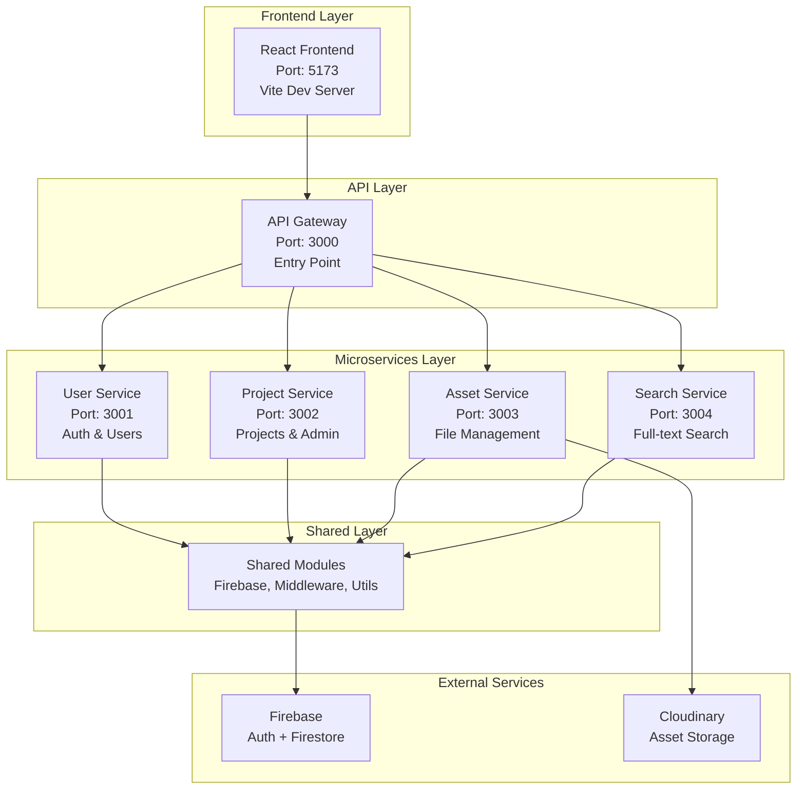

## Service Breakdown

### 1. API Gateway (Port 3000)
**Purpose**: Single entry point for all client requests, routing and load balancing

**Technology Stack**:
- Express.js
- http-proxy-middleware
- CORS middleware

**Key Responsibilities**:
- Route incoming requests to appropriate microservices
- Centralized CORS handling
- Request logging and monitoring
- Rate limiting (future enhancement)
- Authentication middleware (future enhancement)

**Routing Rules**:
```javascript
// API Gateway Routing Configuration
{
  '/api/v1/users': 'http://localhost:3001',     // User Service
  '/api/v1/auth': 'http://localhost:3001',      // User Service
  '/api/v1/test': 'http://localhost:3001',      // User Service (dev)
  '/api/v1/diagnose': 'http://localhost:3001',  // User Service (dev)

  '/api/v1/projects': 'http://localhost:3002',  // Project Service
  '/api/v1/admin': 'http://localhost:3002',     // Project Service
  '/api/v1/tags': 'http://localhost:3002',      // Project Service

  '/api/v1/assets': 'http://localhost:3003',    // Asset Service

  '/api/v1/search': 'http://localhost:3004'     // Search Service
}
```

### 2. User Service (Port 3001)
**Purpose**: User management, authentication, and authorization

**Technology Stack**:
- Express.js
- Firebase Admin SDK
- JWT for development tokens

**Domain Model**:
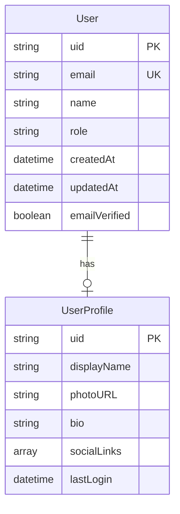

**Key Endpoints**:
- `POST /api/v1/auth/register` - User registration
- `POST /api/v1/auth/login` - User authentication
- `POST /api/v1/auth/verify` - Token verification
- `GET /api/v1/users/profile` - Get user profile
- `PUT /api/v1/users/profile` - Update user profile
- `GET /api/v1/users/check-admin` - Check admin status

**Development Endpoints** (NODE_ENV !== "production"):
- `POST /api/v1/test/create-user` - Create test user
- `POST /api/v1/test/get-id-token` - Generate test tokens
- `GET /api/v1/diagnose/firebase` - Firebase connection test

### 3. Project Service (Port 3002)
**Purpose**: Project CRUD operations, admin moderation, and taxonomy management

**Technology Stack**:
- Express.js
- Firebase Admin SDK (Firestore)
- Admin middleware for protected operations

**Domain Model**:
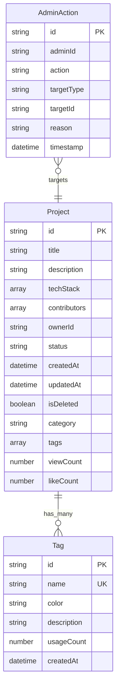

**Key Endpoints**:

**Public Endpoints**:
- `GET /api/v1/projects` - List projects with filters
- `GET /api/v1/projects/:id` - Get project details
- `GET /api/v1/tags` - List all tags

**Authenticated Endpoints**:
- `POST /api/v1/projects` - Create new project
- `PUT /api/v1/projects/:id` - Update project
- `DELETE /api/v1/projects/:id` - Soft delete project

**Admin Endpoints**:
- `GET /api/v1/admin/stats` - Get platform statistics
- `GET /api/v1/admin/projects` - List all projects for moderation
- `PUT /api/v1/admin/projects/:id/approve` - Approve project
- `PUT /api/v1/admin/projects/:id/reject` - Reject project
- `POST /api/v1/tags` - Create new tag
- `PUT /api/v1/tags/:id` - Update tag
- `DELETE /api/v1/tags/:id` - Delete tag

### 4. Asset Service (Port 3003)
**Purpose**: File upload, storage, and management

**Technology Stack**:
- Express.js
- Multer for multipart file handling
- Cloudinary SDK for cloud storage
- Firebase Storage (legacy support)

**Domain Model**:
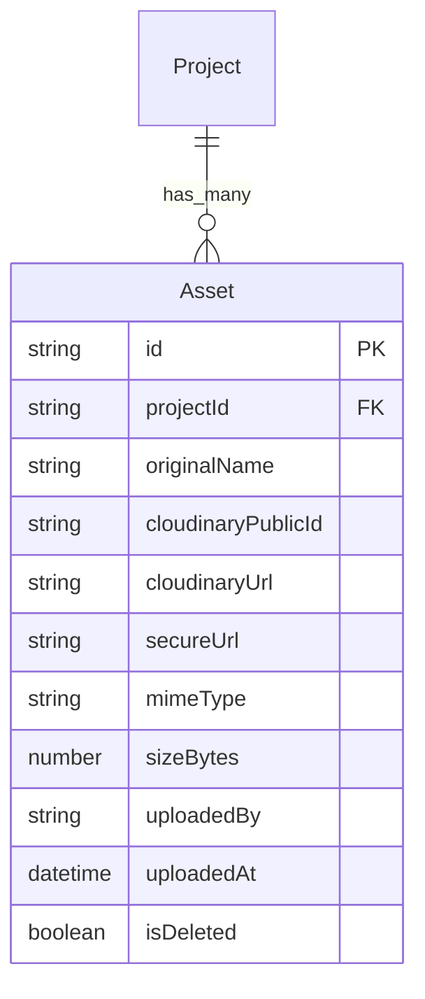

**Key Endpoints**:
- `POST /api/v1/assets/upload` - Upload single file
- `POST /api/v1/assets/upload-multiple` - Upload multiple files
- `GET /api/v1/assets/project/:projectId` - Get project assets
- `DELETE /api/v1/assets/:assetId` - Delete asset
- `GET /api/v1/assets/download/:assetId` - Get signed download URL

**File Upload Flow**:
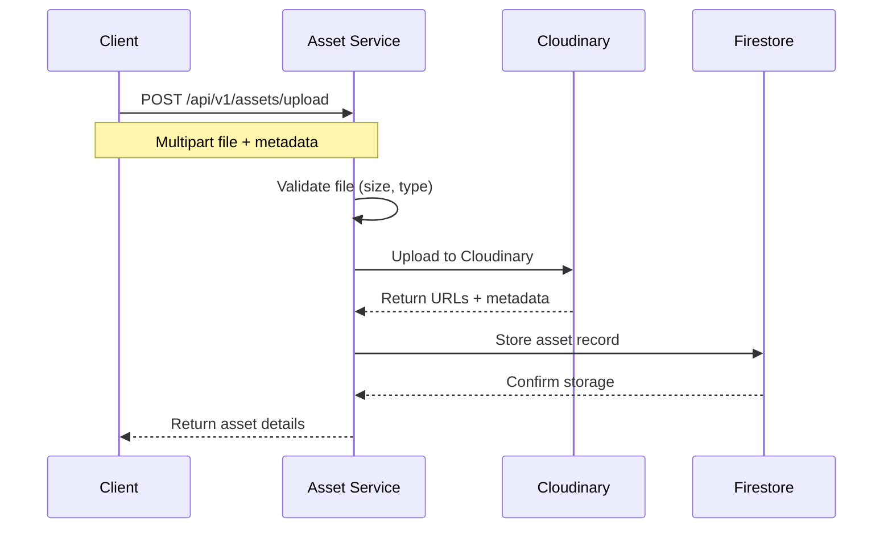

### 5. Search Service (Port 3004)
**Purpose**: Full-text search across projects and users

**Technology Stack**:
- Express.js
- Firebase Admin SDK (Firestore queries)
- Future: Algolia or Elasticsearch integration

**Search Capabilities**:
- Project title and description search
- Technology stack filtering
- User name and profile search
- Tag-based filtering
- Combined filters and sorting

**Key Endpoints**:
- `GET /api/v1/search/projects` - Search projects
- `GET /api/v1/search/users` - Search users
- `GET /api/v1/search/global` - Global search across all content
- `GET /api/v1/search/suggestions` - Get search suggestions

**Search Flow**:
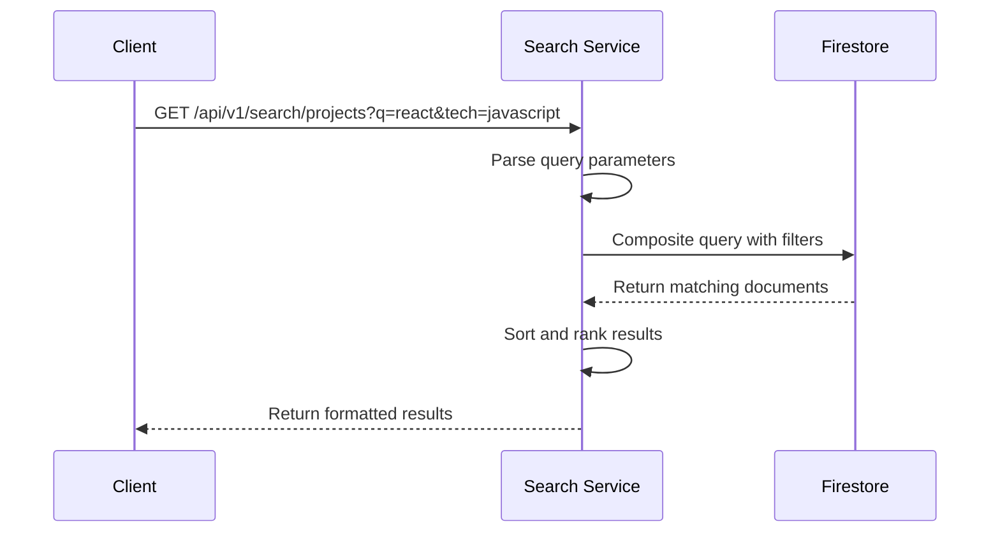

## Communication Patterns

### 1. Synchronous Communication (Current)

**API Gateway → Microservices**: HTTP/REST via proxy middleware

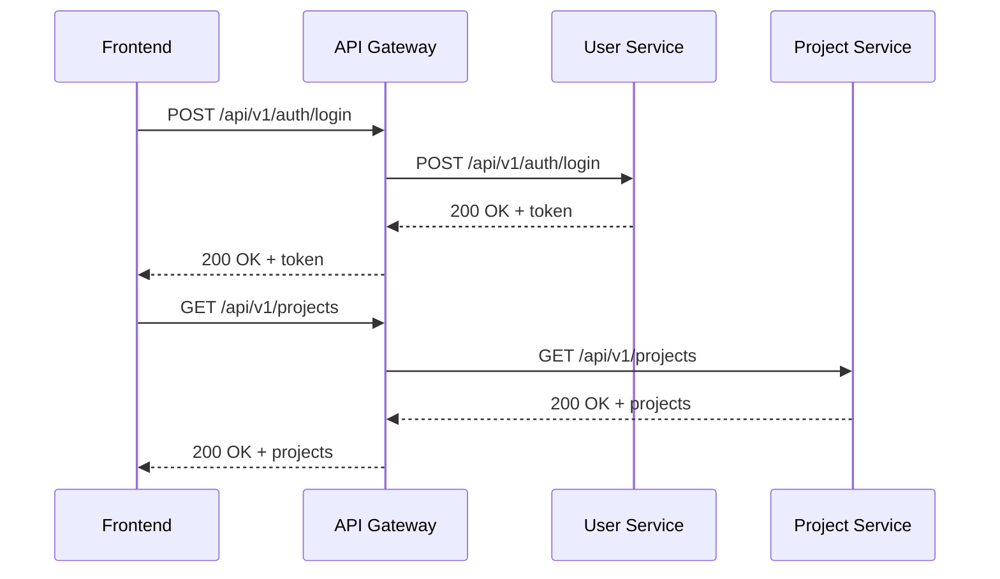

### 2. Shared Database Pattern

All services share the same Firestore database but access different collections:

- **User Service**: `users` collection
- **Project Service**: `projects`, `tags` collections
- **Asset Service**: `projects/{id}/assets` subcollections
- **Search Service**: Read-only access to all collections

### 3. Shared Code Libraries

Common functionality is extracted to `shared/` modules:

```
backend/shared/
├── firebase.js          # Firebase Admin SDK initialization
├── middleware/
│   ├── auth.js         # JWT verification middleware
│   └── admin.js        # Admin role verification
├── services/
│   └── storage.service.js  # Firebase Storage operations
└── utils/
    ├── cloudinary.js   # Cloudinary configuration
    └── tokenGenerator.js   # Development token generation
```

## Data Flow & Routing

### Request Routing Flow

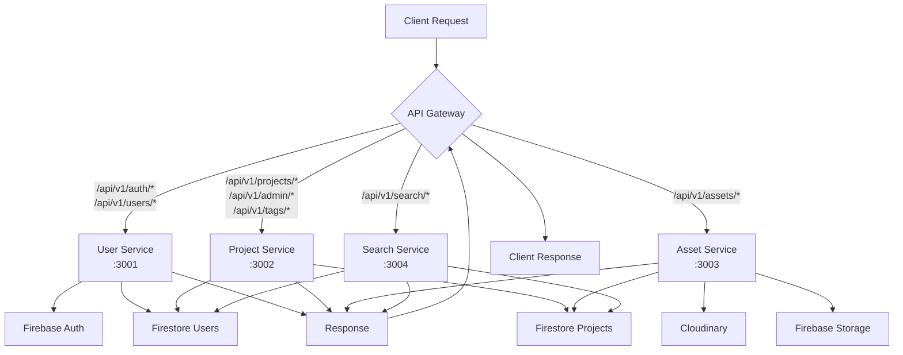

### Authentication Flow

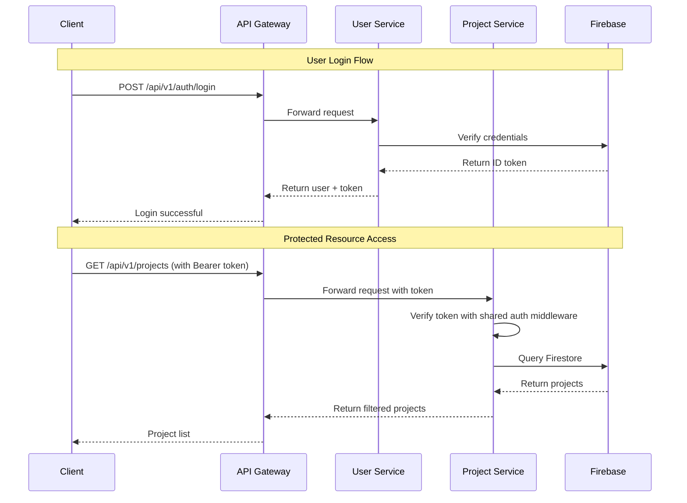

## Service Discovery & Health Checks

### Health Check System

Each service exposes a `/health` endpoint:

```javascript
// Standard health check response
{
  "status": "ok",
  "service": "user-service",
  "timestamp": "2024-03-15T14:18:06.113Z",
  "uptime": 450.123
}
```

### Health Check Flow

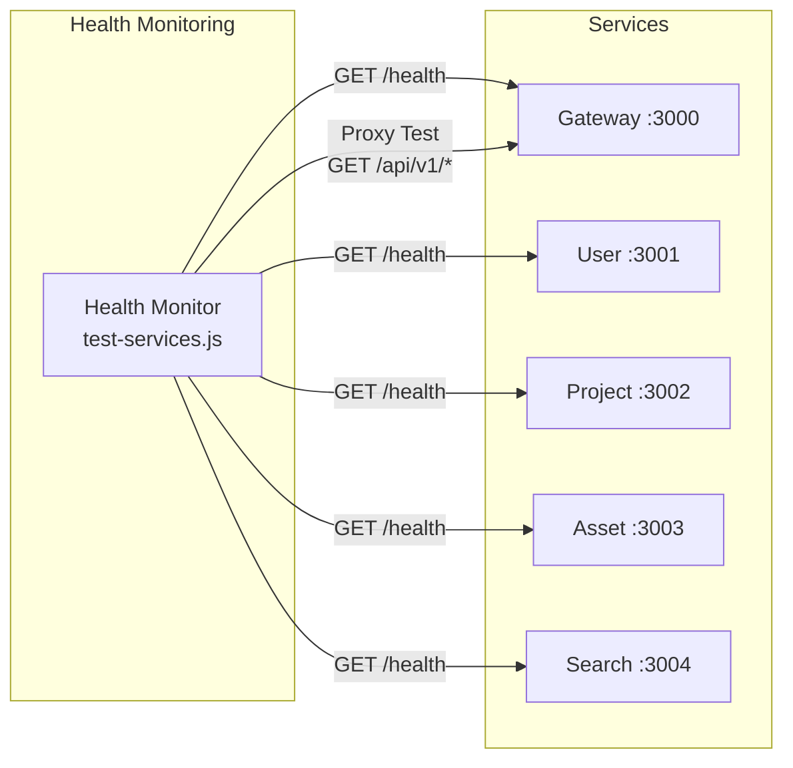

### Automated Health Checks

```bash
# Run health checks for all services
npm run test:services

# Expected output:
# [PASS] API Gateway (port 3000)
# [PASS] User Service (port 3001)
# [PASS] Project Service (port 3002)
# [PASS] Asset Service (port 3003)
# [PASS] Search Service (port 3004)
```

## Scalability & Performance

### Current Scaling Approach

1. **Horizontal Scaling**: Each service can be scaled independently
2. **Load Balancing**: API Gateway distributes requests
3. **Database Optimization**: Firestore queries optimized per service
4. **Caching**: Future implementation of Redis/Memcached

### Performance Considerations

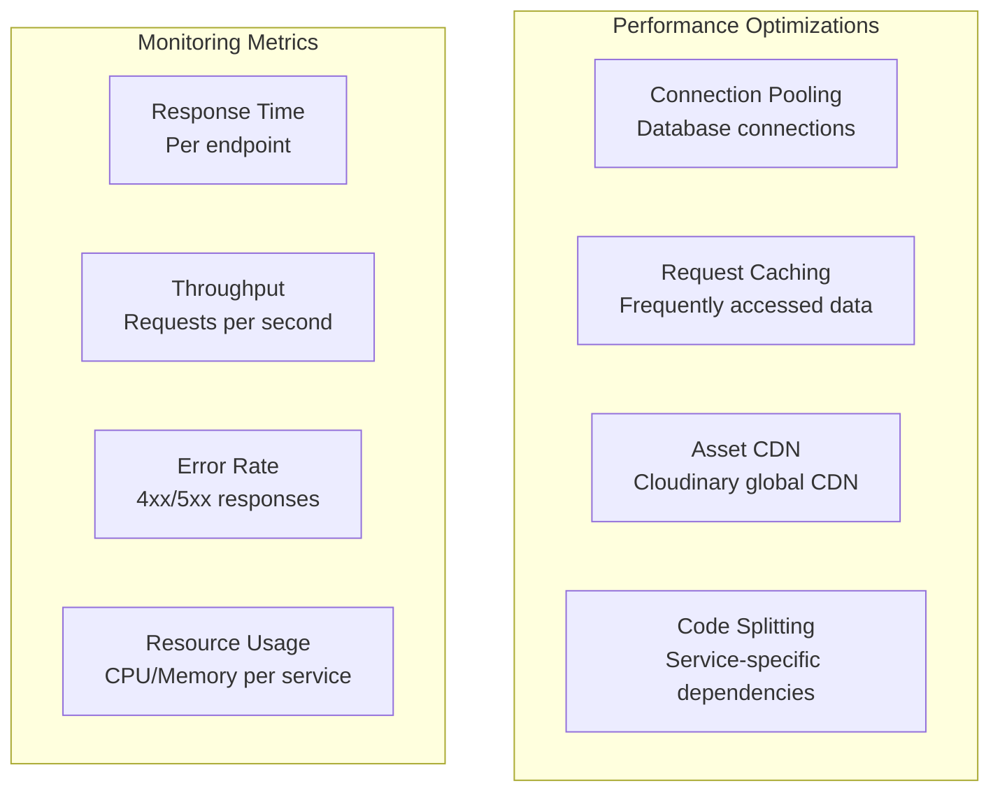

### Future Scaling Improvements

1. **Message Queues**: Implement RabbitMQ/Redis for async processing
2. **Event Sourcing**: Track state changes across services
3. **CQRS**: Separate read/write operations
4. **Circuit Breakers**: Prevent cascade failures
5. **Service Mesh**: Istio/Linkerd for advanced networking

## Development Workflow

### Service Development Lifecycle

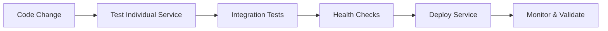

### Local Development Commands

```bash
# Start all services
npm start

# Start with auto-reload
npm run dev

# Start individual services
npm run start:gateway
npm run start:user
npm run start:project
npm run start:asset
npm run start:search

# Development with nodemon
npm run dev:gateway
npm run dev:user
# ... etc

# Test all services
npm run test:services
```

### Service Dependencies

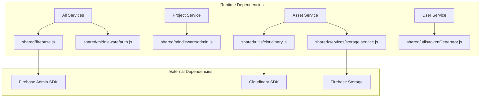

### Environment Configuration Per Service

Each service loads environment variables from the root `.env` file:

```javascript
// In each service app.js
const path = require('path');
require('dotenv').config({ path: path.join(__dirname, '..', '.env') });

// Service-specific port configuration
const PORT = process.env.USER_SERVICE_PORT || 3001;
const PORT = process.env.PROJECT_SERVICE_PORT || 3002;
const PORT = process.env.ASSET_SERVICE_PORT || 3003;
const PORT = process.env.SEARCH_SERVICE_PORT || 3004;
```

---

**Benefits Achieved**:
✅ Independent scaling per service
✅ Fault isolation and resilience
✅ Technology flexibility per team
✅ Faster deployment cycles
✅ Better code organization
✅ Easier testing and maintenance

**Next: See [SYSTEM-ARCHITECTURE.md](./SYSTEM-ARCHITECTURE.md) for overall system design patterns**