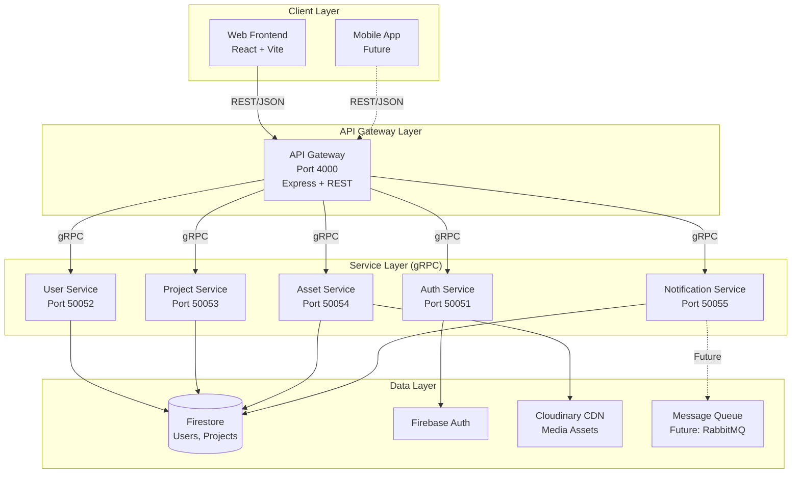

# Microservices Architecture

**Parent Document**: [[Recent-Implementation-Changes|Recent Changes]]

## Table of Contents
- [[#Overview & Goals|Overview]]
- [[#Architecture Design|Architecture]]
- [[#Service Breakdown|Services]]
- [[#Communication Patterns|Communication]]
- [[#Deployment Strategy|Deployment]]
- [[#Migration Path|Migration]]
- [[#Key Decisions|Decisions]]

---

## Overview & Goals

### What This Achieves
The microservices architecture provides a foundation for scaling the ACM Digital Repository beyond a single monolithic server. Each service handles a specific domain and can be scaled independently.

### Core Problem Solved
**Monolithic Bottleneck**: As usage grows, different features have different scaling needs:
- Asset uploads → CPU/bandwidth intensive
- Authentication → High frequency, low latency
- Notifications → Asynchronous, can tolerate delays
- Projects → Read-heavy, benefits from caching

A monolith scales everything together. Microservices scale only what needs it.

### Current Status
🟡 **Scaffolded, Not Active**  
- ✅ Services implemented with gRPC
- ✅ API Gateway routing layer ready
- ✅ Docker configs created
- ⏳ Not yet production-deployed (monolith still primary)

### Tech Stack
- **Protocol**: gRPC (HTTP/2, Protocol Buffers)
- **API Gateway**: Express (REST → gRPC translation)
- **Services**: Node.js microservices
- **Deployment**: Docker + Docker Compose (future: Kubernetes)
- **Service Discovery**: Static config (future: Consul/Eureka)

---

## Architecture Design

### System Diagram



### Data Flow Example: Create Project

```
1. Frontend POST /api/v1/projects
   ↓
2. API Gateway receives REST request
   ↓
3. Gateway validates JWT token
   ↓
4. Gateway calls AuthService.verifyToken(token) via gRPC
   ↓
5. AuthService returns user { uid, role }
   ↓
6. Gateway checks role >= 'contributor'
   ↓
7. Gateway calls ProjectService.createProject(data) via gRPC
   ↓
8. ProjectService writes to Firestore
   ↓
9. ProjectService calls NotificationService.notify() via gRPC
   ↓
10. NotificationService queues admin notification
   ↓
11. ProjectService returns { success: true, projectId }
   ↓
12. Gateway translates gRPC response to JSON
   ↓
13. Frontend receives { success: true, data: {...} }
```

### Component Responsibilities

| Component | Responsibility | Stateful? |
|-----------|----------------|-----------|
| API Gateway | REST→gRPC translation, auth check, response formatting | No |
| Auth Service | Token verification, user role lookup | No (reads Firestore) |
| User Service | User CRUD, profile management | Yes (writes Firestore) |
| Project Service | Project CRUD, search, approval workflow | Yes (writes Firestore) |
| Asset Service | Media upload, Cloudinary integration | Yes (writes metadata) |
| Notification Service | Event notifications, email queuing | Yes (queues) |

---

## Service Breakdown

### 1. Auth Service

**Location**: `backend/services/auth-service/`  
**Port**: 50051  
**Protocol**: `backend/proto/auth.proto`

**Purpose**: Centralize authentication logic - verify Firebase tokens, check roles.

**gRPC Methods**:
```protobuf
service AuthService {
  rpc VerifyToken (VerifyTokenRequest) returns (VerifyTokenResponse);
  rpc CheckRole (CheckRoleRequest) returns (CheckRoleResponse);
}

message VerifyTokenRequest {
  string token = 1;
}

message VerifyTokenResponse {
  bool valid = 1;
  User user = 2;
  string error = 3;
}
```

**Implementation**:
```javascript
// backend/services/auth-service/index.js
async function verifyToken(call, callback) {
  const { token } = call.request;
  
  try {
    const decodedToken = await admin.auth().verifyIdToken(token);
    const userDoc = await db.collection('users').doc(decodedToken.uid).get();
    
    callback(null, {
      valid: true,
      user: {
        uid: decodedToken.uid,
        email: decodedToken.email,
        role: userDoc.data()?.role || 'viewer'
      }
    });
  } catch (error) {
    callback(null, { valid: false, error: error.message });
  }
}
```

**Why Separate Service**:
- Auth checks happen on every request → high frequency
- Can cache token validation results independently
- Security-critical code isolated from business logic

---

### 2. User Service

**Location**: `backend/services/user-service/`  
**Port**: 50052  
**Protocol**: `backend/proto/user.proto`

**Purpose**: Manage user profiles, role assignments, member directory.

**gRPC Methods**:
```protobuf
service UserService {
  rpc GetUser (GetUserRequest) returns (GetUserResponse);
  rpc UpdateUser (UpdateUserRequest) returns (UpdateUserResponse);
  rpc ListUsers (ListUsersRequest) returns (ListUsersResponse);
  rpc DeleteUser (DeleteUserRequest) returns (DeleteUserResponse);
}
```

**Key Operations**:
| Operation | Role Required | Description |
|-----------|---------------|-------------|
| GetUser | Any authenticated | Fetch user by UID |
| UpdateUser (self) | Any authenticated | Edit own profile |
| UpdateUser (others) | admin | Change other user's role/profile |
| ListUsers | Any authenticated | View member directory |
| DeleteUser | admin | Permanently remove user |

**Data Model**:
```javascript
// Firestore: users/{uid}
{
  uid: "abc123",
  email: "user@example.com",
  name: "John Doe",
  role: "contributor", // viewer | contributor | admin
  photoURL: "https://...",
  bio: "...",
  skills: ["React", "Node.js"],
  graduationYear: "2025",
  createdAt: "2026-01-15T...",
  updatedAt: "2026-03-29T..."
}
```

---

### 3. Project Service

**Location**: `backend/services/project-service/`  
**Port**: 50053  
**Protocol**: `backend/proto/project.proto`

**Purpose**: Handle project CRUD, approval workflow, search.

**gRPC Methods**:
```protobuf
service ProjectService {
  rpc CreateProject (CreateProjectRequest) returns (CreateProjectResponse);
  rpc GetProject (GetProjectRequest) returns (GetProjectResponse);
  rpc UpdateProject (UpdateProjectRequest) returns (UpdateProjectResponse);
  rpc DeleteProject (DeleteProjectRequest) returns (DeleteProjectResponse);
  rpc ListProjects (ListProjectsRequest) returns (ListProjectsResponse);
  rpc SearchProjects (SearchProjectsRequest) returns (SearchProjectsResponse);
  rpc ApproveProject (ApproveProjectRequest) returns (ApproveProjectResponse);
}
```

**Approval Workflow**:
```javascript
// Project status lifecycle
"pending" → (admin approves) → "approved"
         ↘ (admin rejects) → "rejected"
         
// Only approved projects visible to non-contributors
```

**Search Implementation**:
```javascript
// Full-text search across multiple fields
async function searchProjects(call, callback) {
  const { query, limit = 20 } = call.request;
  const results = [];
  
  const snapshot = await db.collection('projects').get();
  snapshot.forEach(doc => {
    const project = doc.data();
    const searchText = 
      `${project.title} ${project.description} 
       ${project.techStack.join(' ')}`.toLowerCase();
    
    if (searchText.includes(query.toLowerCase())) {
      results.push(project);
    }
  });
  
  callback(null, { 
    projects: results.slice(0, limit),
    total: results.length 
  });
}
```

---

### 4. Asset Service

**Location**: `backend/services/asset-service/`  
**Port**: 50054  
**Protocol**: `backend/proto/asset.proto`

**Purpose**: Handle media uploads to Cloudinary, manage asset metadata.

**gRPC Methods**:
```protobuf
service AssetService {
  rpc UploadAsset (stream UploadAssetRequest) returns (UploadAssetResponse);
  rpc GetAsset (GetAssetRequest) returns (GetAssetResponse);
  rpc DeleteAsset (DeleteAssetRequest) returns (DeleteAssetResponse);
  rpc ListProjectAssets (ListProjectAssetsRequest) returns (ListProjectAssetsResponse);
}
```

**Upload Flow**:
```javascript
// Streaming upload to handle large files
async function uploadAsset(call, callback) {
  const chunks = [];
  
  call.on('data', (chunk) => {
    chunks.push(chunk.data);
  });
  
  call.on('end', async () => {
    const buffer = Buffer.concat(chunks);
    
    // Upload to Cloudinary
    const result = await cloudinary.uploader.upload_stream(
      { folder: 'acm-projects', resource_type: 'auto' },
      (error, result) => {
        if (error) return callback(error);
        
        // Save metadata to Firestore
        const assetDoc = {
          url: result.secure_url,
          publicId: result.public_id,
          format: result.format,
          size: result.bytes,
          uploadedAt: new Date().toISOString()
        };
        
        callback(null, { asset: assetDoc });
      }
    ).end(buffer);
  });
}
```

**Why Separate**:
- CPU-intensive (image processing, compression)
- Bandwidth-intensive (streaming large files)
- Can scale horizontally for multiple uploads
- Isolates Cloudinary API keys

---

### 5. Notification Service

**Location**: `backend/services/notification-service/`  
**Port**: 50055  
**Protocol**: `backend/proto/notification.proto`

**Purpose**: Handle async notifications (email, push, in-app).

**gRPC Methods**:
```protobuf
service NotificationService {
  rpc SendNotification (SendNotificationRequest) returns (SendNotificationResponse);
  rpc GetUserNotifications (GetUserNotificationsRequest) returns (GetUserNotificationsResponse);
  rpc MarkAsRead (MarkAsReadRequest) returns (MarkAsReadResponse);
}
```

**Event Triggers**:
| Event | Recipients | Message |
|-------|-----------|---------|
| Project submitted | All admins | "New project awaits review" |
| Project approved | Project author | "Your project was approved" |
| Project rejected | Project author | "Your project needs changes" |
| Role changed | Affected user | "You are now a contributor" |

**Implementation** (Future):
```javascript
// Queue-based for reliability
async function sendNotification(call, callback) {
  const { userId, type, message } = call.request;
  
  // Add to queue (RabbitMQ/SQS)
  await messageQueue.publish('notifications', {
    userId, type, message,
    timestamp: Date.now()
  });
  
  // Worker processes queue asynchronously
  callback(null, { success: true });
}
```

---

## Communication Patterns

### gRPC vs REST

**Why gRPC Between Services**:
- **Performance**: HTTP/2 multiplexing, binary protocol (faster than JSON)
- **Type Safety**: Protocol Buffers provide strict schemas
- **Streaming**: Built-in support for upload/download streams
- **Code Generation**: Auto-generate client libraries

**Why REST for Client-Facing**:
- **Browser Compatibility**: gRPC-Web requires proxy, REST works everywhere
- **Developer Experience**: Easier to debug with browser tools
- **Ecosystem**: Existing tools (Postman, curl) work out of the box

### Service-to-Service Calls

**Example: Creating a Project with Notification**

```javascript
// API Gateway calls multiple services
async function createProject(req, res) {
  // 1. Verify user
  const authClient = new grpc.AuthServiceClient('localhost:50051');
  const { user } = await authClient.verifyToken({ token: req.token });
  
  if (!hasRole(user.role, 'contributor')) {
    return res.status(403).json({ error: 'Forbidden' });
  }
  
  // 2. Create project
  const projectClient = new grpc.ProjectServiceClient('localhost:50053');
  const { project } = await projectClient.createProject({
    authorUid: user.uid,
    title: req.body.title,
    description: req.body.description
  });
  
  // 3. Notify admins
  const notifClient = new grpc.NotificationServiceClient('localhost:50055');
  await notifClient.sendNotification({
    type: 'PROJECT_SUBMITTED',
    recipientRole: 'admin',
    message: `New project: ${project.title}`
  });
  
  // 4. Return to client
  res.json({ success: true, project });
}
```

### Error Handling

**gRPC Status Codes**:
```javascript
const grpc = require('@grpc/grpc-js');

// Service returns error
callback({
  code: grpc.status.PERMISSION_DENIED,
  message: 'User lacks required role'
});

// Gateway translates to HTTP
if (error.code === grpc.status.PERMISSION_DENIED) {
  res.status(403).json({ error: error.message });
}
```

---

## Deployment Strategy

### Docker Compose Setup

**Location**: `docker-compose.yml`

```yaml
version: '3.8'

services:
  api-gateway:
    build: ./backend/gateway
    ports:
      - "4000:4000"
    environment:
      - AUTH_SERVICE_URL=auth-service:50051
      - USER_SERVICE_URL=user-service:50052
      - PROJECT_SERVICE_URL=project-service:50053
    depends_on:
      - auth-service
      - user-service
      - project-service
      
  auth-service:
    build: ./backend/services/auth-service
    ports:
      - "50051:50051"
    environment:
      - FIREBASE_SERVICE_ACCOUNT=/secrets/serviceAccountKey.json
    volumes:
      - ./backend/serviceAccountKey.json:/secrets/serviceAccountKey.json
      
  user-service:
    build: ./backend/services/user-service
    ports:
      - "50052:50052"
    environment:
      - FIREBASE_SERVICE_ACCOUNT=/secrets/serviceAccountKey.json
      
  # ... other services
```

### Scaling Individual Services

**Horizontal Scaling Example**:
```bash
# Scale asset service to handle upload traffic
docker-compose up --scale asset-service=3

# API Gateway load-balances across 3 instances
```

**When to Scale**:
| Service | Scale Trigger | Metric |
|---------|---------------|--------|
| Asset Service | Upload backlog > 10 | Queue depth |
| Project Service | Search latency > 500ms | P95 response time |
| Auth Service | Token verification > 100ms | Request throughput |

---

## Migration Path

### Phase 1: Co-Existence (Current)
- ✅ Monolith serves all production traffic
- ✅ Microservices scaffolded and tested locally
- ⏳ No breaking changes, full backward compatibility

### Phase 2: Shadow Testing
- ⏳ Deploy microservices alongside monolith
- ⏳ Route 10% of traffic to microservices (canary)
- ⏳ Compare response times, error rates
- ⏳ Rollback if issues detected

### Phase 3: Gradual Migration
- ⏳ Start with lowest-risk service (Notification)
- ⏳ Move 50% → 90% → 100% traffic per service
- ⏳ Monitor metrics at each step
- ⏳ Keep monolith as fallback

### Phase 4: Full Microservices
- ⏳ All traffic through API Gateway
- ⏳ Monolith deprecated
- ⏳ Independent deployment per service

### Rollback Plan
```bash
# Emergency: Switch traffic back to monolith
# 1. Update API URL in frontend
VITE_API_URL=http://localhost:3000  # Monolith

# 2. Stop microservices
docker-compose down

# 3. Restart monolith
cd backend && node app.js
```

---

## Key Decisions & Trade-offs

### Why gRPC Over REST Internally
- **Alternative**: Keep REST for service-to-service
- **Why Rejected**: JSON serialization overhead, no streaming
- **Chosen**: gRPC for performance, REST only at edge
- **Trade-off**: More complexity, requires protobuf knowledge

### Why API Gateway Pattern
- **Alternative**: Direct client → service communication
- **Why Rejected**: Exposes internal architecture, no single auth point
- **Chosen**: Gateway handles auth, routing, translation
- **Trade-off**: Single point of failure (mitigated by load balancer)

### Why Not Kubernetes Yet
- **Alternative**: Deploy to K8s immediately
- **Why Rejected**: Over-engineering for current scale
- **Chosen**: Docker Compose → K8s when needed
- **Trade-off**: Manual scaling for now

### Why Shared Firestore
- **Alternative**: Database-per-service pattern
- **Why Rejected**: Adds complexity, Firestore is already NoSQL/flexible
- **Chosen**: Services share Firestore, own their collections
- **Trade-off**: Tighter coupling, but simpler infrastructure

> [!note]
> Services are **logically separate** (different codebases) but **share data layer** (Firestore). This is a pragmatic middle ground between monolith and full microservices isolation.

---

## Next Steps

### Before Production Deployment
- [ ] Add health check endpoints (`/health`) to all services
- [ ] Implement circuit breakers (prevent cascading failures)
- [ ] Set up centralized logging (ELK stack or Cloud Logging)
- [ ] Add distributed tracing (Jaeger or OpenTelemetry)
- [ ] Configure service discovery (Consul) for dynamic IPs
- [ ] Write integration tests for service-to-service calls

### Performance Optimization
- [ ] Enable gRPC connection pooling
- [ ] Cache frequently-accessed data (Redis)
- [ ] Implement request deduplication
- [ ] Add rate limiting per service

### Monitoring
- [ ] Track gRPC method latencies (Prometheus)
- [ ] Alert on error rate spikes
- [ ] Dashboard showing service health (Grafana)

---

**Status**: Scaffolded, not production-deployed  
**Recommended Next Action**: Shadow test Notification Service (lowest risk)  
**Estimated Migration Timeline**: 2-3 months for full cutover
