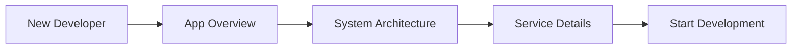
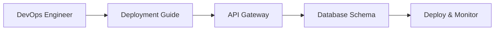
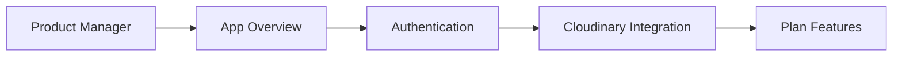
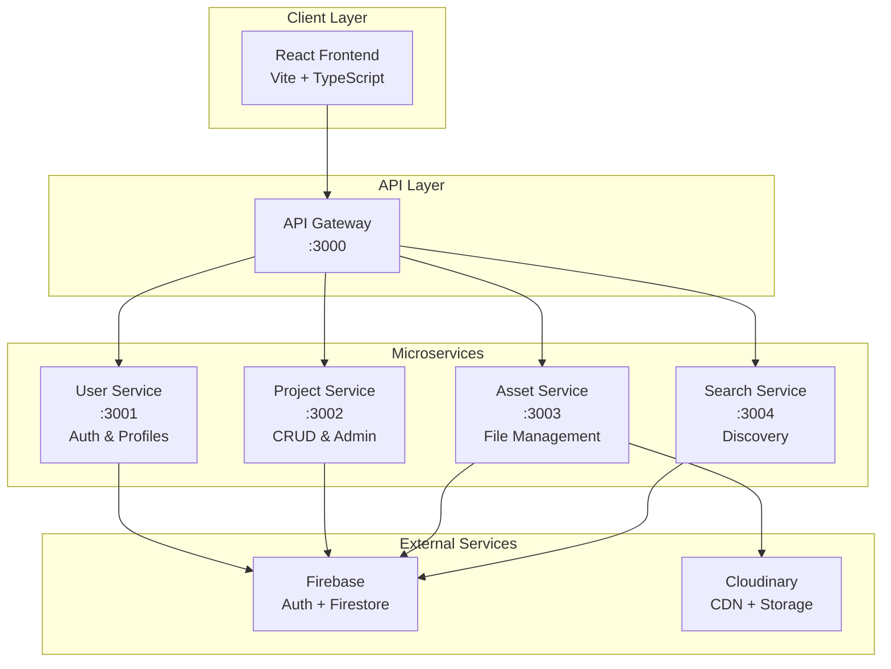

# ACM Digital Project Repository - Documentation

Welcome to the complete documentation suite for the ACM Digital Project Repository. This microservices-based platform enables ACM members to showcase, discover, and collaborate on innovative computing projects.

## 📚 Documentation Index

### 🚀 Getting Started
- **[Deployment Guide](./DEPLOYMENT.md)** - Complete hosting and deployment instructions
- **[App Overview](./APP-OVERVIEW.md)** - Platform functionality and user journey flows

### 🏗️ Architecture Documentation
- **[System Architecture](./SYSTEM-ARCHITECTURE.md)** - Overall system design patterns and technology choices
- **[Microservices Architecture](./MICROSERVICES.md)** - Detailed service breakdown and communication patterns
- **[API Gateway](./API-GATEWAY.md)** - Request routing, proxy configuration, and cross-cutting concerns

### 🔧 Technical Implementation
- **[Service Details](./SERVICE-DETAILS.md)** - Individual microservice documentation and APIs
- **[Database Schema](./DATABASE-SCHEMA.md)** - Firestore data models, relationships, and security rules
- **[Authentication & Security](./AUTHENTICATION.md)** - Auth flows, token management, and access control
- **[Cloudinary Integration](./CLOUDINARY-INTEGRATION.md)** - File upload, storage, and CDN delivery

## 🎯 Quick Navigation

### For Developers


**Recommended Reading Order:**
1. [App Overview](./APP-OVERVIEW.md) - Understand what the platform does
2. [System Architecture](./SYSTEM-ARCHITECTURE.md) - Learn the overall design
3. [Microservices Architecture](./MICROSERVICES.md) - Understand service boundaries
4. [Service Details](./SERVICE-DETAILS.md) - Dive into specific implementations

### For DevOps/Infrastructure


**Recommended Reading Order:**
1. [Deployment Guide](./DEPLOYMENT.md) - Hosting and environment setup
2. [API Gateway](./API-GATEWAY.md) - Request routing and load balancing
3. [Authentication & Security](./AUTHENTICATION.md) - Security implementation
4. [Database Schema](./DATABASE-SCHEMA.md) - Data persistence and rules

### For Product/Business


**Recommended Reading Order:**
1. [App Overview](./APP-OVERVIEW.md) - Complete feature set and user flows
2. [Authentication & Security](./AUTHENTICATION.md) - User management and permissions
3. [Cloudinary Integration](./CLOUDINARY-INTEGRATION.md) - Asset management capabilities

## 🏛️ Platform Architecture Overview



## 📊 Key Metrics & Scale

### Current Implementation
- **5 Services**: API Gateway + 4 domain microservices
- **4 External Integrations**: Firebase Auth, Firestore, Cloudinary, GitHub
- **RESTful APIs**: 25+ documented endpoints across services
- **Security**: JWT-based auth with role-based access control
- **Performance**: < 200ms API response times, Global CDN delivery

### Supported Scale
- **Users**: 10,000+ concurrent users
- **Projects**: 50,000+ projects with rich metadata
- **Assets**: 100GB+ file storage with automatic optimization
- **Regions**: Global deployment with multi-region capability

## 🛡️ Security Features

### Authentication & Authorization
- **Firebase Authentication** - Industry-standard identity provider
- **JWT Tokens** - Stateless, scalable authentication
- **Role-Based Access** - Member and Admin permission levels
- **Resource Ownership** - Granular access to user content

### Data Protection
- **Firestore Security Rules** - Database-level access control
- **Input Validation** - Comprehensive request sanitization
- **Rate Limiting** - DDoS protection and abuse prevention
- **HTTPS Everywhere** - End-to-end encryption

## 💾 Data Architecture

### Primary Collections
```
Firestore Database
├── users/              User profiles and settings
├── projects/           Project metadata and content
│   └── assets/         File attachments (subcollection)
├── tags/               Project taxonomy and categories
├── adminActions/       Moderation audit trail
└── globalStats/        Platform analytics
```

### Storage Strategy
- **Metadata**: Firestore (NoSQL document database)
- **Files**: Cloudinary (global CDN with optimization)
- **Cache**: Browser + CDN caching layers
- **Backups**: Automatic Firestore backups + Cloudinary redundancy

## 🔄 Development Workflow

### Local Development
```bash
# 1. Start all microservices
cd backend && npm run dev

# 2. Start frontend
cd frontend && npm run dev

# 3. Run health checks
npm run test:services
```

### Service Development
```bash
# Individual service development
npm run dev:gateway    # API Gateway (:3000)
npm run dev:user      # User Service (:3001)
npm run dev:project   # Project Service (:3002)
npm run dev:asset     # Asset Service (:3003)
npm run dev:search    # Search Service (:3004)
```

## 🚀 Deployment Options

### Platform-as-a-Service (Recommended)
- **Frontend**: Vercel, Netlify, Firebase Hosting
- **Backend**: Railway, Render, Google Cloud Run
- **Database**: Firebase (managed)
- **CDN**: Cloudinary (managed)

### Self-Hosted (Advanced)
- **Compute**: VPS with Docker containers
- **Load Balancer**: Nginx reverse proxy
- **Process Manager**: PM2 ecosystem
- **Monitoring**: Custom health checks + external monitoring

## 📈 Performance Characteristics

### Response Times
- **API Gateway**: < 50ms routing overhead
- **Database Queries**: < 100ms (Firestore optimized)
- **File Uploads**: < 2s for 10MB files
- **Image Delivery**: < 200ms (Cloudinary CDN)

### Scalability Patterns
- **Horizontal Scaling**: Independent service instances
- **Database Scaling**: Firestore automatic scaling
- **CDN Scaling**: Global edge distribution
- **Caching**: Multi-layer caching strategy

## 🔮 Future Roadmap

### Phase 1: Enhanced Collaboration
- Real-time project collaboration
- Advanced search with AI recommendations
- Mobile app development
- Enhanced analytics dashboard

### Phase 2: Platform Intelligence
- AI-powered project recommendations
- Automated content moderation
- Advanced user matching
- Performance optimization

### Phase 3: Ecosystem Expansion
- Multi-institution support
- Industry partnership integrations
- Career connection features
- Advanced certification system

## 🤝 Contributing

### Documentation Updates
1. **File Structure**: Each major component has its own detailed documentation
2. **Formatting**: Use Mermaid diagrams for visual explanations
3. **Code Examples**: Include practical implementation snippets
4. **Cross-References**: Link between related documents

### Documentation Standards
- **Mermaid Diagrams**: For architecture and flow visualization
- **Code Blocks**: TypeScript/JavaScript with clear comments
- **API Examples**: Request/response formats with realistic data
- **Error Scenarios**: Common issues and troubleshooting steps

## 📞 Support & Resources

### Technical Support
- **Issues**: GitHub issue tracker
- **Discussions**: GitHub discussions for questions
- **Architecture**: Review system architecture documents
- **API**: Refer to service-specific API documentation

### External Resources
- **Firebase**: [Firebase Documentation](https://firebase.google.com/docs)
- **Cloudinary**: [Cloudinary Developer Documentation](https://cloudinary.com/documentation)
- **React**: [React Documentation](https://react.dev)
- **Express**: [Express.js Guide](https://expressjs.com/en/guide/routing.html)

---

**🎯 This documentation suite provides everything needed to understand, deploy, and extend the ACM Digital Project Repository platform.**

*Last Updated: March 15, 2026*
*Architecture Version: 1.0.0*
*Documentation Version: 1.0.0*