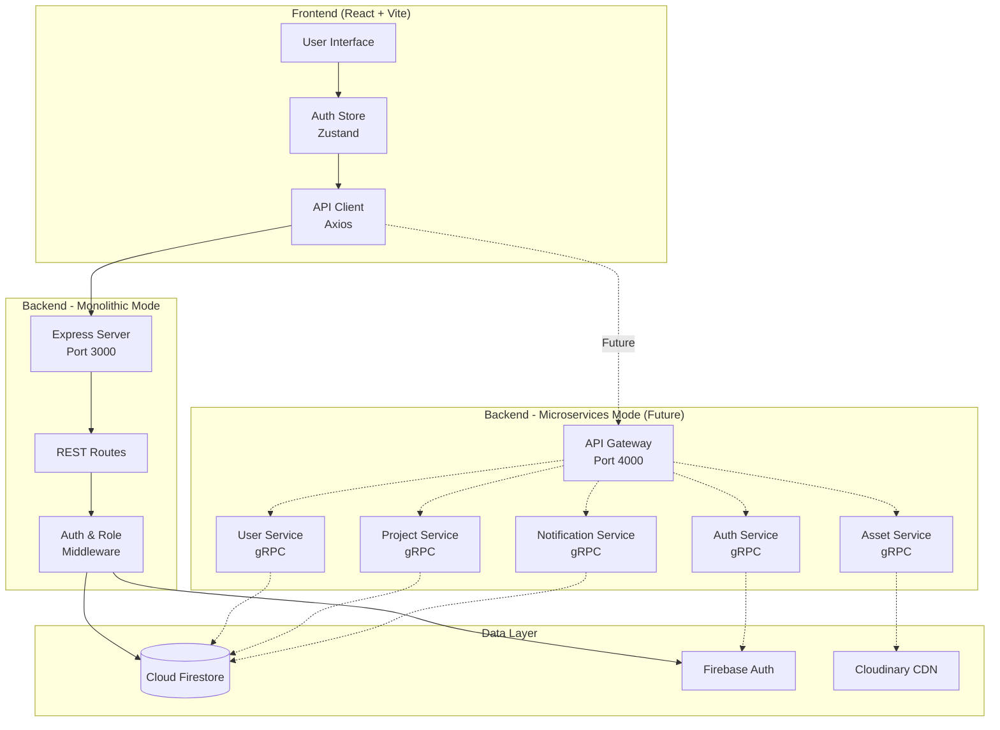

# Recent Implementation Changes

**Companion Documents:**
- [[Microservices-Architecture|Microservices Architecture Details]]
- [[3-Role-Access-Control|3-Role Access Control System]]

## Table of Contents
- [[#Overview & Goals|Overview]]
- [[#Architecture & Design|Architecture]]
- [[#Major Working Parts|Components]]
- [[#Setup & Configuration|Setup]]
- [[#Key Decisions & Trade-offs|Decisions]]
- [[#Testing & Verification|Testing]]

---

## Overview & Goals

### What Changed
This implementation phase focused on two major architectural improvements to the ACM Digital Project Repository:

1. **Microservices Architecture Foundation** - Laid groundwork for transitioning from monolithic to microservices
2. **3-Role Access Control System** - Implemented granular permission management replacing binary admin/user model

### Core Problems Solved
- **Scalability Bottleneck**: Monolithic backend made it difficult to scale individual features independently
- **Insufficient Access Control**: Binary admin/user roles couldn't handle the need for contributors who can create but not manage
- **User Sync Issues**: New users signing in via Google/GitHub weren't being persisted to Firestore
- **Search Usability**: Users had to know exact terms and press enter to get results

### Success Criteria
✅ Three distinct roles (viewer, contributor, admin) working end-to-end  
✅ All new users automatically synced to Firestore on first login  
✅ Search with live autocomplete suggestions  
✅ Microservices foundation ready for Docker deployment  
✅ No breaking changes to existing functionality  

### Tech Stack
- **Backend**: Node.js, Express, Firebase Admin SDK, gRPC (microservices)
- **Frontend**: React 18, Vite, Zustand (state), TanStack Query, Firebase Client SDK
- **Database**: Cloud Firestore
- **Assets**: Cloudinary
- **Auth**: Firebase Authentication

---

## Architecture & Design

### High-Level Changes

The system now supports two operational modes:

1. **Monolithic Mode** (Current Default) - Single Express server handles all requests
2. **Microservices Mode** (Future) - API Gateway routes to specialized gRPC services



### Component Interactions

**Authentication Flow (3-Role System):**
1. User signs in via Firebase (Google/GitHub/Email)
2. Frontend obtains Firebase ID token
3. Frontend calls `POST /auth/verify` with token
4. Backend validates token, creates/updates user in Firestore with default role: `viewer`
5. User document includes role field used for all subsequent requests
6. Middleware checks role on protected routes

**Search Flow with Autocomplete:**
1. User types in search box (debounced 300ms)
2. After 2+ characters, frontend calls `GET /search?q=...&limit=6`
3. Backend searches Firestore projects and users collections
4. Results returned as suggestions dropdown
5. User clicks suggestion or presses Enter to see full results

### Key Design Decisions

| Decision | Reasoning |
|----------|-----------|
| Default role = `viewer` | Safe default - users can view but not modify until promoted |
| `/auth/verify` endpoint | Allows self-registration without requiring admin approval |
| Debounced autocomplete | Reduces API calls while maintaining responsiveness |
| Role hierarchy check | `hasRole(userRole, requiredRole)` enables "at least X" checks |
| Microservices foundation | Prepares for future scale without forcing immediate migration |

> [!note]
> The microservices architecture is scaffolded but **not active by default**. The monolithic Express server is still the primary mode. Microservices can be enabled via Docker Compose when ready for production.

---

## Major Working Parts

For detailed breakdowns, see companion documents:
- [[Microservices-Architecture|Microservices Architecture Details]]
- [[3-Role-Access-Control|3-Role Access Control System]]

### 1. Authentication & User Sync

**Location**: `frontend/src/store/authStore.js`, `backend/routes/auth.routes.js`

**Purpose**: Ensure all users (Google, GitHub, email) are synced to Firestore with proper roles.

**How It Works**:
```javascript
// Frontend - authStore.js
const response = await axiosInstance.post('/auth/verify', {}, authHeader);
backendUser = response.data.user; // Contains role
```

```javascript
// Backend - auth.routes.js
if (!userDoc.exists) {
  userData = {
    uid, email, name, photoURL,
    role: 'viewer', // Default role
    createdAt: new Date().toISOString()
  };
  await userRef.set(userData);
}
```

**Inputs**: Firebase ID token  
**Outputs**: User object with role  
**Key Function**: `POST /auth/verify` - Creates user if not exists, returns role

---

### 2. Role-Based Middleware

**Location**: `backend/middleware/admin.js`

**Purpose**: Protect routes based on role hierarchy (viewer < contributor < admin).

**How It Works**:
```javascript
const VALID_ROLES = ['viewer', 'contributor', 'admin'];

function hasRole(userRole, requiredRole) {
  const userIndex = VALID_ROLES.indexOf(userRole);
  const requiredIndex = VALID_ROLES.indexOf(requiredRole);
  return userIndex >= requiredIndex;
}

const requireContributor = async (req, res, next) => {
  if (!hasRole(req.user.role, 'contributor')) {
    return res.status(403).json({ 
      error: 'Forbidden', 
      message: 'Contributor or Admin access required' 
    });
  }
  next();
};
```

**Protected Routes**:
| Route | Required Role | Purpose |
|-------|---------------|---------|
| `POST /projects` | contributor | Create projects |
| `PUT /users/:id` (other users) | admin | Modify other users |
| `POST /users` | admin | Create user (admin add) |
| `DELETE /users/:id` | admin | Delete users |

---

### 3. Search with Autocomplete

**Location**: `frontend/src/pages/SearchPage.jsx`, `backend/routes/search.routes.js`

**Purpose**: Help users find projects/users without knowing exact names.

**Frontend Implementation**:
```javascript
// Debounce hook prevents excessive API calls
const debouncedInput = useDebounce(searchInput, 300);

// Query triggers after 2+ chars
const { data: suggestionsData } = useQuery({
  queryKey: ["search-suggestions", debouncedInput],
  queryFn: () => searchAPI.search({ q: debouncedInput, limit: 6 }),
  enabled: debouncedInput.length >= 2 && showSuggestions,
});
```

**Backend Search Logic**:
```javascript
// Search across title, description, techStack, authorName
const searchableText = 
  `${project.title || ''} ${project.description || ''} 
   ${(project.techStack || []).join(" ")} ${project.authorName || ''}`.toLowerCase();

if (searchableText.includes(query)) {
  results.push({ id: doc.id, type: "project", ...project });
}
```

**Filters Supported**:
- `techStack`: Filter by technology (e.g., "React")
- `status`: Filter by approval status (approved/pending)
- `type`: Search scope (projects/users/all)

---

### 4. Frontend Role Helpers

**Location**: `frontend/src/store/authStore.js`

**Purpose**: Provide easy role checks for UI components.

**Helper Functions**:
```javascript
canCreateProjects: () => {
  const { user } = get();
  return user && (user.role === 'contributor' || user.role === 'admin');
}

isAdmin: () => {
  const { user } = get();
  return user?.role === 'admin';
}
```

**Usage in Components**:
```javascript
// Navbar.jsx - Hide submit button for viewers
const showSubmitProject = canCreateProjects();

{showSubmitProject && (
  <Link to="/submit">Submit Project</Link>
)}
```

**Route Protection**:
```javascript
// App.jsx - Protect submit route
<Route path="/submit" element={
  <ProtectedRoute contributorOnly>
    <CreateProjectPage />
  </ProtectedRoute>
} />
```

---

### 5. Admin Role Management UI

**Location**: `frontend/src/pages/AdminMembersPage.jsx`, `AdminMemberProfilePage.jsx`

**Purpose**: Allow admins to change user roles via dropdown.

**Role Dropdown**:
```javascript
<Select value={member.role} onValueChange={(role) => 
  updateRoleMutation.mutate({ uid: member.uid, newRole: role })
}>
  <SelectItem value="viewer">Viewer - Can only view</SelectItem>
  <SelectItem value="contributor">Contributor - Can create</SelectItem>
  <SelectItem value="admin">Admin - Full access</SelectItem>
</Select>
```

**Role Styling**:
```javascript
const ROLE_STYLES = {
  admin: { color: 'amber', icon: ShieldCheck },
  contributor: { color: 'green', icon: Edit3 },
  viewer: { color: 'blue', icon: Eye }
};
```

---

## Setup & Configuration

### Prerequisites
- Node.js 18+
- Firebase project with Authentication & Firestore enabled
- Cloudinary account (for media uploads)

### Environment Setup

**Backend `.env`**:
```bash
PORT=3000
CLOUDINARY_CLOUD_NAME=your_cloud_name
CLOUDINARY_API_KEY=your_api_key
CLOUDINARY_API_SECRET=your_api_secret
```

**Backend `serviceAccountKey.json`**:
```json
{
  "type": "service_account",
  "project_id": "your-project-id",
  "private_key_id": "...",
  "private_key": "...",
  "client_email": "...",
  ...
}
```

**Frontend `.env`**:
```bash
VITE_API_URL=http://localhost:3000
VITE_FIREBASE_API_KEY=your_firebase_api_key
VITE_FIREBASE_AUTH_DOMAIN=your-app.firebaseapp.com
VITE_FIREBASE_PROJECT_ID=your-project-id
VITE_FIREBASE_STORAGE_BUCKET=your-app.appspot.com
VITE_FIREBASE_MESSAGING_SENDER_ID=123456789
VITE_FIREBASE_APP_ID=1:123456789:web:abc123
```

### Running the Application

**Monolithic Mode (Current)**:
```bash
# Terminal 1 - Backend
cd backend
npm install
node app.js  # Runs on port 3000

# Terminal 2 - Frontend
cd frontend
npm install
npm run dev  # Runs on port 5173
```

**Microservices Mode (Future)**:
```bash
# Docker Compose (not yet configured for production)
docker-compose up --build
```

### Make Your First Admin

```bash
cd backend
node make-admin.js your-email@example.com
```

This script:
1. Finds user by email in Firebase Auth
2. Creates/updates Firestore document
3. Sets `role: 'admin'`

---

## Key Decisions & Trade-offs

### Why Default Role is "Viewer"
- **Pro**: Safe default - prevents accidental spam/abuse
- **Pro**: Forces intentional role assignment by admins
- **Con**: Admins must manually promote contributors
- **Why Chosen**: Security > convenience for public-facing repos

### Why `/auth/verify` for User Creation
- **Alternative Considered**: Require admin to manually add all users
- **Why Rejected**: Doesn't scale, creates friction for legitimate users
- **Chosen Approach**: Auto-create with viewer role, admin promotes later
- **Trade-off**: Slight spam risk, mitigated by viewer having no write permissions

### Why Hierarchical Role System
- **Alternative Considered**: Independent permissions (can_create, can_delete, etc.)
- **Why Rejected**: Over-engineering for current needs, harder to reason about
- **Chosen Approach**: Simple hierarchy (viewer < contributor < admin)
- **Trade-off**: Less granular but easier to understand and maintain

### Why Debounced Search
- **Alternative Considered**: Search on every keystroke
- **Why Rejected**: Generates 5-10x more API calls
- **Chosen Approach**: 300ms debounce with 2-char minimum
- **Trade-off**: Slight delay vs. server load

### Why Microservices Foundation Now
- **Alternative Considered**: Wait until we actually need to scale
- **Why Rejected**: Major refactoring later is riskier
- **Chosen Approach**: Scaffold now, activate when needed
- **Trade-off**: Added complexity upfront, but easier migration path

> [!warning]
> The microservices architecture is **scaffolded but NOT active**. Do not attempt to run via Docker Compose without further configuration. The Express monolith is production-ready.

---

## Testing & Verification

### Role System Tests

**Test 1: Viewer Cannot Create Projects**
1. Log in as viewer
2. Navigate to `/submit`
3. Expected: Redirected to home page
4. Verify: "Submit Project" not visible in navbar

**Test 2: Contributor Can Create Projects**
1. Admin changes user role to contributor
2. Log out and back in
3. Expected: "Submit Project" appears in navbar
4. Can access `/submit` and create project

**Test 3: Admin Can Manage Roles**
1. Log in as admin
2. Go to Admin → Members
3. Expected: Role dropdown shows for all users
4. Change a user's role → verify update in Firestore

### Search Autocomplete Tests

**Test 1: Suggestions Appear**
1. Go to `/search`
2. Type "React" (wait 300ms)
3. Expected: Dropdown shows ≤6 suggestions
4. Verify: Loading indicator during fetch

**Test 2: Click Suggestion Works**
1. Type partial project name
2. Click a suggestion
3. Expected: Search executes for that project
4. Verify: Results appear below

### User Sync Tests

**Test 1: New Google User**
1. Sign in with new Google account
2. Expected: User created in Firestore with role: viewer
3. Verify in Admin → Members panel

**Test 2: Existing User Login**
1. Log out and back in
2. Expected: Role persists from Firestore
3. No duplicate user documents created

---

## Open Questions / To Explore

### Authentication
- [ ] Add email verification requirement before allowing viewer access?
- [ ] Should we allow users to request contributor status vs. admin grant only?
- [ ] Implement session timeout / force re-auth after X hours?

### Microservices
- [ ] What's the threshold for switching to microservices mode (requests/sec, data size)?
- [ ] Do we need inter-service auth (service-to-service tokens)?
- [ ] Should services share Firestore or have dedicated databases?

### Search
- [ ] Add full-text search via Algolia/Elasticsearch for large datasets?
- [ ] Weight search results by project popularity/stars?
- [ ] Cache top searches to reduce Firestore reads?

### Role System
- [ ] Need a "moderator" role between contributor and admin?
- [ ] Should contributors be able to edit/delete their own projects post-approval?
- [ ] Track role change history (audit log)?

---

**Last Updated**: 2026-03-29  
**Status**: Production-ready (monolithic mode), Microservices scaffolded  
**Next Steps**: Monitor usage patterns, prepare microservices Docker configs for future scaling
