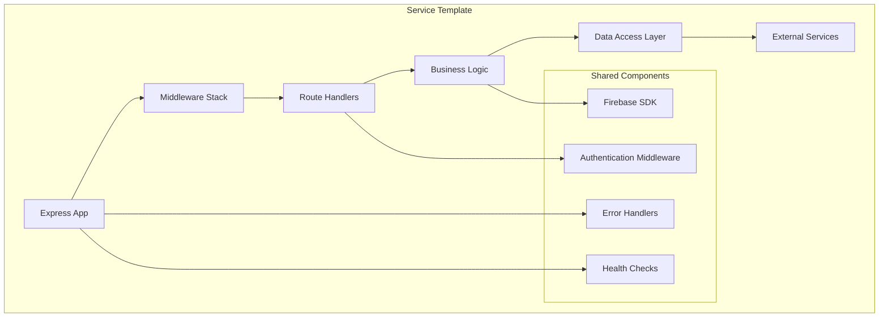
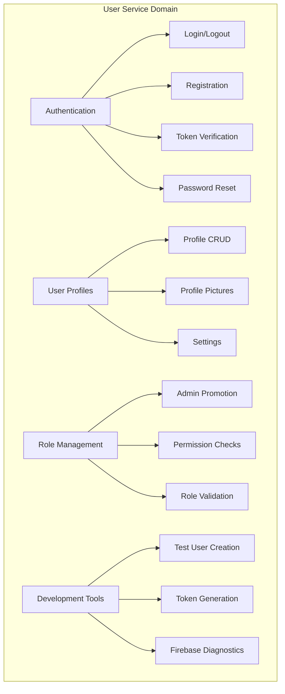
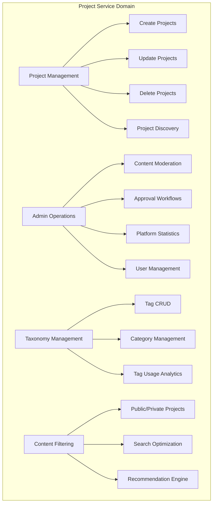
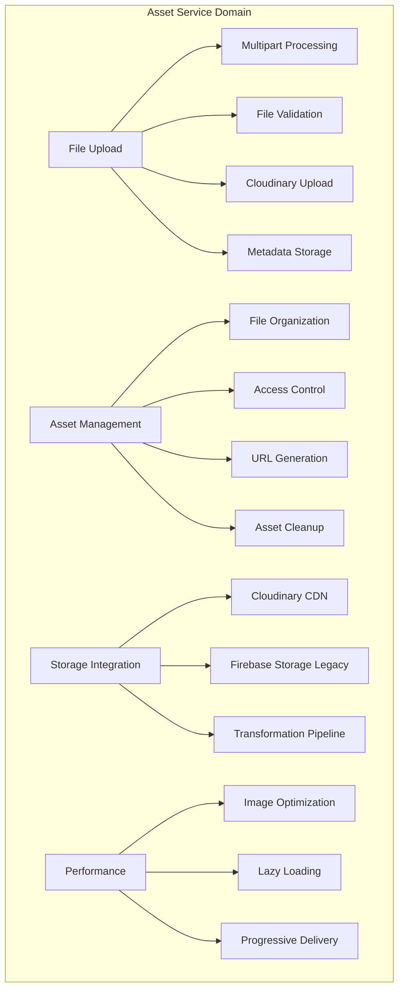
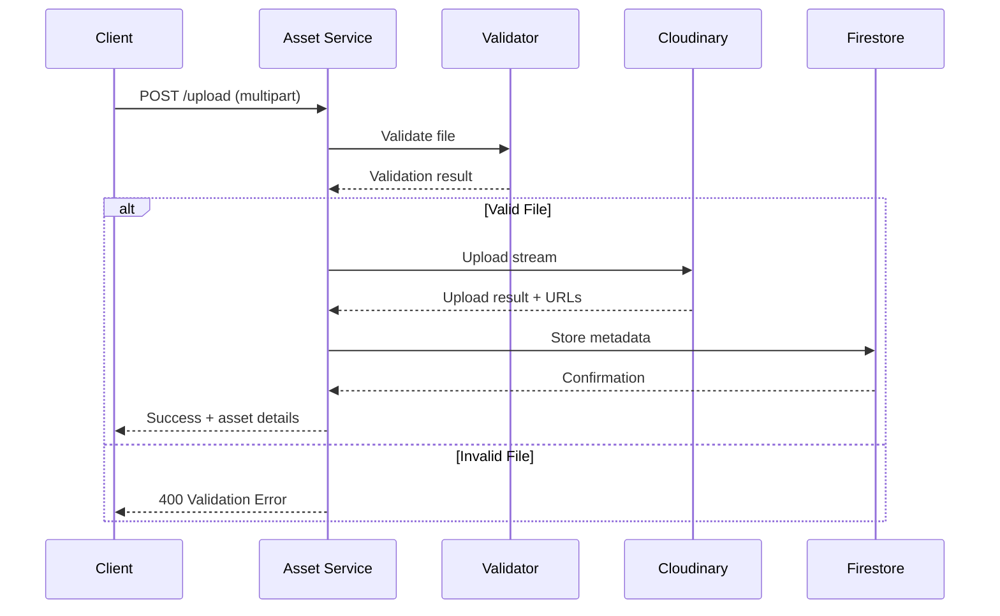
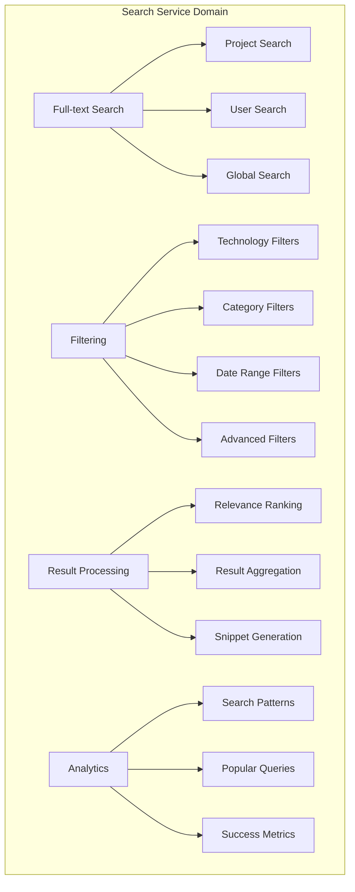

# ACM Digital Project Repository - Service Details

## Table of Contents
- [Service Overview](#service-overview)
- [User Service (Port 3001)](#user-service-port-3001)
- [Project Service (Port 3002)](#project-service-port-3002)
- [Asset Service (Port 3003)](#asset-service-port-3003)
- [Search Service (Port 3004)](#search-service-port-3004)
- [Shared Components](#shared-components)
- [Service Communication](#service-communication)
- [Development Guidelines](#development-guidelines)

## Service Overview

Each microservice in the ACM Digital Project Repository is designed following domain-driven principles, with clear boundaries and responsibilities. All services share common patterns for configuration, error handling, and monitoring while maintaining independence in their business logic.

### Common Service Architecture



### Service Communication Matrix

| Service | User | Project | Asset | Search | Firebase | Cloudinary |
|---------|------|---------|--------|--------|----------|------------|
| **User** | - | ❌ | ❌ | ❌ | ✅ Auth + DB | ❌ |
| **Project** | ❌ | - | ❌ | ❌ | ✅ DB Only | ❌ |
| **Asset** | ❌ | ❌ | - | ❌ | ✅ DB Only | ✅ Storage |
| **Search** | ❌ | ❌ | ❌ | - | ✅ DB Read-Only | ❌ |

*Note: ✅ = Direct Integration, ❌ = No Direct Communication*

## User Service (Port 3001)

### Service Responsibilities

The User Service handles all user-related operations including authentication, user profiles, and role management. It serves as the primary interface to Firebase Authentication and user data management.



### API Endpoints

#### Authentication Endpoints

**POST /api/v1/auth/register**
```typescript
interface RegisterRequest {
  email: string;
  password: string;
  name?: string;
  university?: string;
}

interface RegisterResponse {
  success: boolean;
  message: string;
  user: {
    uid: string;
    email: string;
    name: string;
    role: 'member' | 'admin';
  };
  token: string;
}
```

**POST /api/v1/auth/login**
```typescript
interface LoginRequest {
  email: string;
  password: string;
}

interface LoginResponse {
  success: boolean;
  message: string;
  user: UserProfile;
  token: string;
}
```

**POST /api/v1/auth/verify**
```typescript
// Verifies JWT token validity
interface VerifyResponse {
  success: boolean;
  valid: boolean;
  user?: UserProfile;
  expiresAt?: string;
}
```

#### User Profile Endpoints

**GET /api/v1/users/profile**
```typescript
// Requires authentication
interface ProfileResponse {
  success: boolean;
  user: {
    uid: string;
    email: string;
    name: string;
    bio?: string;
    university?: string;
    graduationYear?: number;
    profilePicture?: string;
    socialLinks?: {
      github?: string;
      linkedin?: string;
      portfolio?: string;
    };
    role: 'member' | 'admin';
    createdAt: string;
    updatedAt: string;
  };
}
```

**PUT /api/v1/users/profile**
```typescript
interface UpdateProfileRequest {
  name?: string;
  bio?: string;
  university?: string;
  graduationYear?: number;
  socialLinks?: {
    github?: string;
    linkedin?: string;
    portfolio?: string;
  };
}
```

### Business Logic Implementation

```javascript
// User registration with profile creation
const registerUser = async (userData) => {
  try {
    // 1. Create Firebase Authentication user
    const userRecord = await admin.auth().createUser({
      email: userData.email,
      password: userData.password,
      displayName: userData.name,
      emailVerified: false
    });

    // 2. Create user profile in Firestore
    const userProfile = {
      uid: userRecord.uid,
      email: userData.email,
      name: userData.name || 'ACM Member',
      role: 'member',
      university: userData.university,
      createdAt: new Date().toISOString(),
      updatedAt: new Date().toISOString(),
      isActive: true
    };

    await db.collection('users').doc(userRecord.uid).set(userProfile);

    // 3. Generate custom token
    const customToken = await admin.auth().createCustomToken(userRecord.uid);

    return {
      success: true,
      user: userProfile,
      token: customToken
    };

  } catch (error) {
    throw new ServiceError('Registration failed', error);
  }
};
```

### Development & Testing Tools

**Development-Only Endpoints** (NODE_ENV !== "production"):

**POST /api/v1/test/create-user**
- Creates test users with predefined credentials
- Generates development tokens for API testing
- Useful for integration testing and development workflows

**POST /api/v1/diagnose/firebase**
- Tests Firebase connectivity and configuration
- Validates service account permissions
- Provides debugging information for Firebase issues

## Project Service (Port 3002)

### Service Responsibilities

The Project Service manages the core business logic for project CRUD operations, admin moderation workflows, and taxonomy management (tags/categories).



### Project Data Model

```typescript
interface Project {
  id: string;
  title: string;
  description: string;
  shortDescription?: string;

  // Technical Information
  techStack: string[];
  category: string;
  tags: string[];

  // Repository & Demo Links
  githubUrl?: string;
  liveUrl?: string;
  documentationUrl?: string;

  // Ownership & Collaboration
  ownerId: string;
  contributors: string[];
  collaborators?: {
    uid: string;
    role: 'contributor' | 'maintainer';
    joinedAt: string;
  }[];

  // Status & Moderation
  status: 'draft' | 'pending' | 'published' | 'featured' | 'archived';
  moderationNotes?: string;

  // Metadata
  createdAt: string;
  updatedAt: string;
  publishedAt?: string;
  viewCount: number;
  likeCount: number;
  isDeleted: boolean;

  // Search & Discovery
  searchKeywords: string[];
  difficultyLevel?: 'beginner' | 'intermediate' | 'advanced';
  completionStatus?: 'in-progress' | 'completed' | 'maintained';
}
```

### API Endpoints

#### Public Project Endpoints

**GET /api/v1/projects**
```typescript
interface ProjectListRequest {
  page?: number;
  limit?: number;
  category?: string;
  techStack?: string[];
  tags?: string[];
  sortBy?: 'recent' | 'popular' | 'alphabetical';
  search?: string;
}

interface ProjectListResponse {
  success: boolean;
  projects: ProjectSummary[];
  pagination: {
    page: number;
    limit: number;
    total: number;
    totalPages: number;
  };
  filters?: {
    categories: string[];
    popularTech: string[];
    popularTags: string[];
  };
}
```

**GET /api/v1/projects/:id**
```typescript
interface ProjectDetailResponse {
  success: boolean;
  project: Project & {
    owner: {
      name: string;
      profilePicture?: string;
    };
    assets?: AssetSummary[];
    relatedProjects?: ProjectSummary[];
  };
}
```

#### Authenticated Project Endpoints

**POST /api/v1/projects**
```typescript
interface CreateProjectRequest {
  title: string;
  description: string;
  shortDescription?: string;
  techStack: string[];
  category: string;
  tags: string[];
  githubUrl?: string;
  liveUrl?: string;
  difficultyLevel?: 'beginner' | 'intermediate' | 'advanced';
}
```

**PUT /api/v1/projects/:id**
```typescript
// Updates project (only owner or admins)
interface UpdateProjectRequest {
  title?: string;
  description?: string;
  techStack?: string[];
  // ... other updatable fields
}
```

### Admin API Endpoints

**GET /api/v1/admin/stats**
```typescript
interface AdminStatsResponse {
  success: boolean;
  stats: {
    totalProjects: number;
    pendingApproval: number;
    totalUsers: number;
    activeUsers: number;
    popularTechnologies: {
      name: string;
      count: number;
    }[];
    recentActivity: {
      date: string;
      newProjects: number;
      newUsers: number;
    }[];
  };
}
```

**GET /api/v1/admin/projects**
```typescript
// List all projects for moderation
interface AdminProjectListResponse {
  success: boolean;
  projects: (Project & {
    owner: { name: string; email: string; };
    flags?: ModerationFlag[];
  })[];
}
```

### Business Logic Examples

```javascript
// Project approval workflow
const approveProject = async (projectId, adminId, moderationNotes) => {
  const batch = db.batch();

  // Update project status
  const projectRef = db.collection('projects').doc(projectId);
  batch.update(projectRef, {
    status: 'published',
    publishedAt: new Date().toISOString(),
    moderationNotes,
    updatedAt: new Date().toISOString()
  });

  // Log admin action
  const actionRef = db.collection('adminActions').doc();
  batch.set(actionRef, {
    adminId,
    action: 'approve_project',
    targetType: 'project',
    targetId: projectId,
    notes: moderationNotes,
    timestamp: new Date().toISOString()
  });

  await batch.commit();

  // Send notification to project owner (future enhancement)
  await notificationService.send({
    userId: project.ownerId,
    type: 'project_approved',
    data: { projectId, projectTitle: project.title }
  });
};
```

## Asset Service (Port 3003)

### Service Responsibilities

The Asset Service handles all file operations including uploads, storage management, and delivery optimization through Cloudinary integration.



### Asset Data Model

```typescript
interface Asset {
  id: string;
  projectId: string;

  // File Information
  originalName: string;
  fileName: string;
  mimeType: string;
  sizeBytes: number;

  // Cloudinary Integration
  cloudinaryPublicId: string;
  cloudinaryUrl: string;
  secureUrl: string;

  // Organization
  category: 'screenshot' | 'document' | 'video' | 'archive' | 'diagram';
  folder: string;

  // Access Control
  uploadedBy: string;
  isPublic: boolean;

  // Metadata
  uploadedAt: string;
  isDeleted: boolean;

  // Optimization
  transformations?: CloudinaryTransformation[];
  generatedThumbnails?: string[];
}

interface CloudinaryTransformation {
  width?: number;
  height?: number;
  crop?: string;
  quality?: string;
  format?: string;
}
```

### Upload Processing Pipeline



### API Endpoints

**POST /api/v1/assets/upload**
```typescript
interface UploadRequest {
  file: File; // Multipart form data
  projectId: string;
  category?: string;
  isPublic?: boolean;
}

interface UploadResponse {
  success: boolean;
  asset: {
    id: string;
    originalName: string;
    cloudinaryUrl: string;
    secureUrl: string;
    sizeBytes: number;
    mimeType: string;
    category: string;
  };
  urls: {
    original: string;
    thumbnail: string;
    preview: string;
    display: string;
  };
}
```

**GET /api/v1/assets/project/:projectId**
```typescript
interface ProjectAssetsResponse {
  success: boolean;
  assets: Asset[];
  categories: {
    screenshots: Asset[];
    documents: Asset[];
    videos: Asset[];
    archives: Asset[];
  };
}
```

## Search Service (Port 3004)

### Service Responsibilities

The Search Service provides comprehensive search and discovery capabilities across projects and users with advanced filtering and ranking.



### Search Implementation

```javascript
// Advanced project search with multiple criteria
const searchProjects = async (query, filters, options) => {
  let firebaseQuery = db.collection('projects')
    .where('status', '==', 'published')
    .where('isDeleted', '==', false);

  // Apply filters
  if (filters.category) {
    firebaseQuery = firebaseQuery.where('category', '==', filters.category);
  }

  if (filters.techStack && filters.techStack.length > 0) {
    firebaseQuery = firebaseQuery.where('techStack', 'array-contains-any', filters.techStack);
  }

  if (filters.tags && filters.tags.length > 0) {
    firebaseQuery = firebaseQuery.where('tags', 'array-contains-any', filters.tags);
  }

  // Execute query
  const snapshot = await firebaseQuery.limit(options.limit || 50).get();
  let results = snapshot.docs.map(doc => ({ id: doc.id, ...doc.data() }));

  // Text search (post-processing due to Firestore limitations)
  if (query && query.trim()) {
    const searchTerms = query.toLowerCase().split(' ');
    results = results.filter(project => {
      const searchableText = [
        project.title,
        project.description,
        project.shortDescription,
        ...project.techStack,
        ...project.tags,
        ...project.searchKeywords
      ].join(' ').toLowerCase();

      return searchTerms.some(term => searchableText.includes(term));
    });

    // Rank by relevance
    results = rankSearchResults(results, searchTerms);
  }

  // Apply sorting
  if (options.sortBy === 'popular') {
    results.sort((a, b) => (b.viewCount + b.likeCount) - (a.viewCount + a.likeCount));
  } else if (options.sortBy === 'recent') {
    results.sort((a, b) => new Date(b.createdAt) - new Date(a.createdAt));
  }

  return {
    results: results.slice(0, options.limit || 20),
    total: results.length,
    query,
    filters
  };
};
```

### API Endpoints

**GET /api/v1/search/projects**
```typescript
interface ProjectSearchRequest {
  q?: string; // Search query
  category?: string;
  techStack?: string[];
  tags?: string[];
  sortBy?: 'relevance' | 'recent' | 'popular';
  page?: number;
  limit?: number;
}

interface SearchResponse {
  success: boolean;
  results: ProjectSummary[];
  pagination: {
    page: number;
    limit: number;
    total: number;
  };
  suggestions?: string[];
  filters: {
    appliedFilters: any;
    availableFilters: {
      categories: string[];
      technologies: string[];
      tags: string[];
    };
  };
}
```

## Shared Components

### Firebase Integration (`shared/firebase.js`)

```javascript
// Centralized Firebase configuration
const admin = require('firebase-admin');
const path = require('path');

// Initialize Firebase Admin SDK
const serviceAccount = process.env.FIREBASE_SERVICE_ACCOUNT
  ? JSON.parse(process.env.FIREBASE_SERVICE_ACCOUNT)
  : require(path.join(__dirname, '..', 'serviceAccountKey.json'));

admin.initializeApp({
  credential: admin.credential.cert(serviceAccount),
  databaseURL: `https://${serviceAccount.project_id}-default-rtdb.firebaseio.com`,
  storageBucket: `${serviceAccount.project_id}.appspot.com`
});

// Export common instances
module.exports = {
  admin,
  db: admin.firestore(),
  auth: admin.auth(),
  bucket: admin.storage().bucket(),
  FieldValue: admin.firestore.FieldValue,
  Timestamp: admin.firestore.Timestamp
};
```

### Authentication Middleware (`shared/middleware/auth.js`)

```javascript
// JWT token verification middleware
const verifyToken = async (req, res, next) => {
  try {
    const token = req.headers.authorization?.replace('Bearer ', '');

    if (!token) {
      return res.status(401).json({
        success: false,
        error: 'Unauthorized',
        message: 'Authentication token required'
      });
    }

    // Verify Firebase ID token
    const decodedToken = await admin.auth().verifyIdToken(token);

    // Fetch user profile from Firestore
    const userDoc = await db.collection('users').doc(decodedToken.uid).get();

    if (!userDoc.exists) {
      return res.status(401).json({
        success: false,
        error: 'UserNotFound',
        message: 'User profile not found'
      });
    }

    // Attach user data to request
    req.user = {
      uid: decodedToken.uid,
      email: decodedToken.email,
      ...userDoc.data()
    };

    next();

  } catch (error) {
    console.error('Token verification failed:', error);

    res.status(401).json({
      success: false,
      error: 'InvalidToken',
      message: 'Invalid or expired token'
    });
  }
};

module.exports = { verifyToken };
```

## Service Communication

### Inter-Service Data Flow

```mermaid
graph TB
    subgraph "Data Dependencies"
        A[User Service] --> B[User Profiles]
        C[Project Service] --> D[Project Data]
        C --> B
        E[Asset Service] --> D
        E --> B
        F[Search Service] --> B
        F --> D
        F --> G[Asset Metadata]
    end

    subgraph "Shared Database Collections"
        H[users] --> B
        I[projects] --> D
        J[projects/{id}/assets] --> G
        K[tags] --> L[Tag Data]
        M[adminActions] --> N[Audit Trail]
    end
```

### Event-Driven Communication (Future Enhancement)

```javascript
// Event-driven architecture for cross-service communication
const eventBus = {
  events: {
    USER_REGISTERED: 'user.registered',
    PROJECT_PUBLISHED: 'project.published',
    ASSET_UPLOADED: 'asset.uploaded',
    ADMIN_ACTION: 'admin.action_taken'
  },

  // Publish event
  publish: async (eventType, data) => {
    const event = {
      id: generateEventId(),
      type: eventType,
      data: data,
      timestamp: new Date().toISOString(),
      source: process.env.SERVICE_NAME
    };

    // Store event for audit and replay
    await db.collection('events').add(event);

    // Trigger service-specific handlers
    await eventHandlers[eventType]?.(event);
  },

  // Subscribe to events
  subscribe: (eventType, handler) => {
    eventHandlers[eventType] = handler;
  }
};

// Example event handlers
eventBus.subscribe(eventBus.events.PROJECT_PUBLISHED, async (event) => {
  // Update search indexes
  await searchService.indexProject(event.data.projectId);

  // Send notifications
  await notificationService.notifyFollowers(event.data.ownerId);

  // Update analytics
  await analyticsService.trackProjectPublished(event.data);
});
```

## Development Guidelines

### Service Development Standards

**Code Structure**:
```
service-name/
├── app.js              # Service entry point
├── routes/             # API route definitions
├── controllers/        # Business logic handlers
├── middleware/         # Service-specific middleware
├── utils/              # Helper functions
├── config/             # Configuration files
└── tests/              # Unit and integration tests
```

**Error Handling Pattern**:
```javascript
// Consistent error response format
class ServiceError extends Error {
  constructor(message, statusCode = 500, errorCode = 'InternalError') {
    super(message);
    this.statusCode = statusCode;
    this.errorCode = errorCode;
  }
}

// Global error handler
const errorHandler = (err, req, res, next) => {
  console.error(`[${serviceName.toUpperCase()}] Error:`, {
    message: err.message,
    stack: err.stack,
    url: req.originalUrl,
    method: req.method,
    user: req.user?.uid
  });

  if (err instanceof ServiceError) {
    return res.status(err.statusCode).json({
      success: false,
      error: err.errorCode,
      message: err.message
    });
  }

  // Unknown error
  res.status(500).json({
    success: false,
    error: 'InternalServerError',
    message: 'An unexpected error occurred'
  });
};
```

**Testing Strategy**:
```javascript
// Unit test example
describe('User Service - Authentication', () => {
  test('should register new user successfully', async () => {
    const userData = {
      email: 'test@example.com',
      password: 'password123',
      name: 'Test User'
    };

    const result = await registerUser(userData);

    expect(result.success).toBe(true);
    expect(result.user.email).toBe(userData.email);
    expect(result.token).toBeDefined();
  });

  test('should reject duplicate email registration', async () => {
    const userData = {
      email: 'existing@example.com',
      password: 'password123'
    };

    await expect(registerUser(userData)).rejects.toThrow('Email already exists');
  });
});
```

---

**Service Architecture Benefits**:
- ✅ **Clear Domain Separation**: Each service owns its business logic
- ✅ **Independent Development**: Teams can work on services independently
- ✅ **Scalable Design**: Services can be scaled based on load patterns
- ✅ **Maintainable Code**: Consistent patterns across all services
- ✅ **Testable Components**: Each service can be tested in isolation
- ✅ **Shared Infrastructure**: Common components reduce duplication

**Next: See [DATABASE-SCHEMA.md](./DATABASE-SCHEMA.md) for Firestore data structure details**