# ACM Digital Project Repository - System Architecture

## Table of Contents
- [System Overview](#system-overview)
- [Architecture Patterns](#architecture-patterns)
- [Technology Stack](#technology-stack)
- [Design Principles](#design-principles)
- [Data Architecture](#data-architecture)
- [Security Architecture](#security-architecture)
- [Performance Architecture](#performance-architecture)
- [Future Architecture](#future-architecture)

## System Overview

The ACM Digital Project Repository is a full-stack web application designed to showcase and manage academic computing projects. The system follows a modern microservices architecture with a React frontend, Node.js backend services, and Firebase for authentication and data storage.

### Mission Statement
Enable ACM members to discover, contribute to, and showcase innovative computing projects while providing administrators with tools for content moderation and community management.

### System Context Diagram

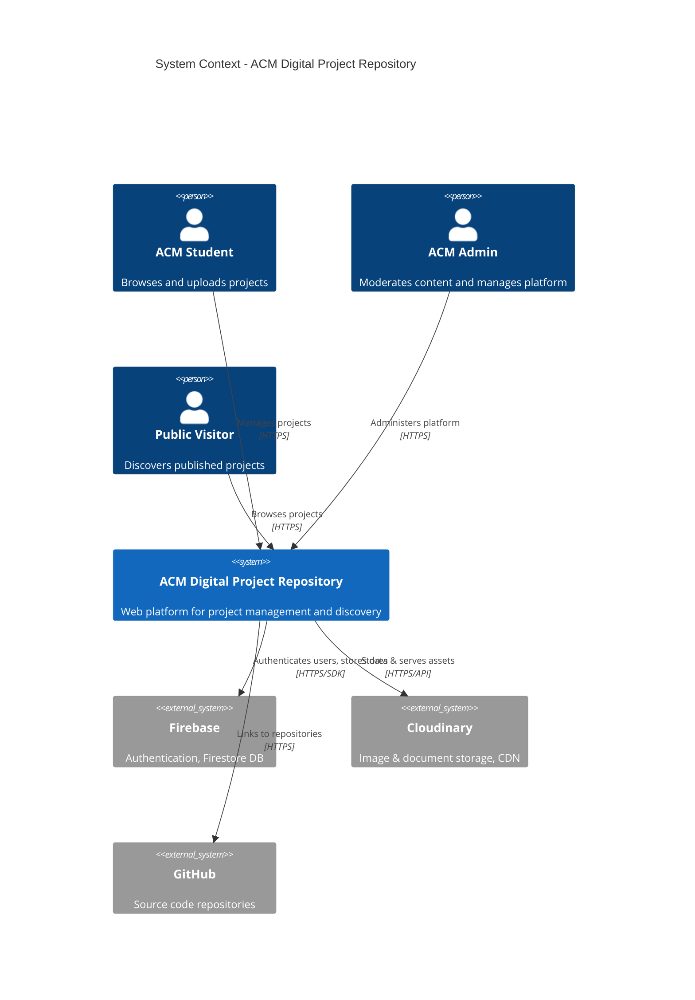

### Container Diagram

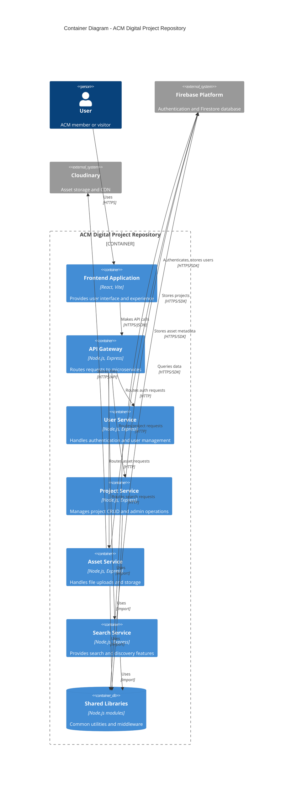

## Architecture Patterns

### 1. Microservices Architecture

**Pattern**: Domain-Driven Design with Service Decomposition
- Each service owns a specific business domain
- Services communicate via HTTP/REST APIs
- Shared database with collection-level separation
- Centralized API Gateway for routing

**Benefits**:
- Independent deployment and scaling
- Technology diversity per service
- Better fault isolation
- Team autonomy and ownership

### 2. API Gateway Pattern

**Pattern**: Single Entry Point with Request Routing
- All client requests go through API Gateway
- Service discovery via static configuration
- Centralized cross-cutting concerns (CORS, logging)

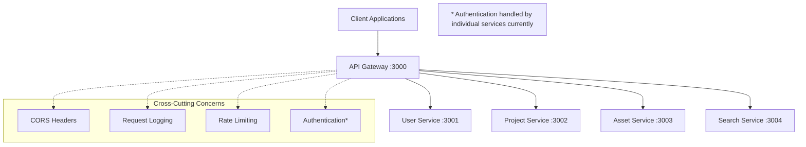

### 3. Shared Database Pattern

**Pattern**: Single Database, Multiple Service Access
- All services share Firebase Firestore instance
- Collection-level data ownership boundaries
- Eventual consistency across services

**Trade-offs**:
- ✅ Simplified transactions and queries
- ✅ Reduced operational complexity
- ❌ Tight coupling between services
- ❌ Schema coordination required

### 4. Backend for Frontend (BFF) Pattern

**Pattern**: API designed specifically for web frontend needs
- RESTful APIs tailored for React application
- Aggregated responses to minimize round trips
- Frontend-friendly data structures

## Technology Stack

### Frontend Technology Choices

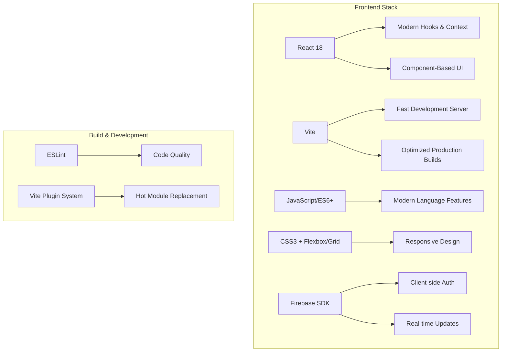

**Rationale**:
- **React**: Component reusability, large ecosystem, team familiarity
- **Vite**: Faster builds than webpack, better development experience
- **Firebase SDK**: Direct integration with backend services
- **Modern JavaScript**: Better performance, cleaner code

### Backend Technology Choices

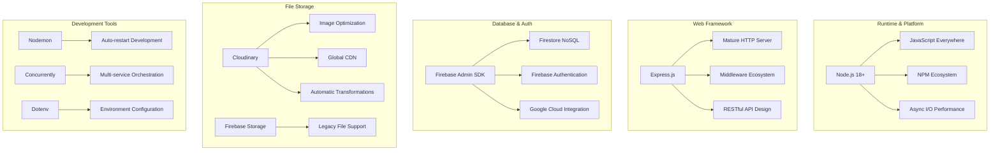

**Rationale**:
- **Node.js**: Single language across stack, good for I/O intensive operations
- **Express.js**: Lightweight, flexible, extensive middleware ecosystem
- **Firebase**: Managed authentication, real-time database, Google integration
- **Cloudinary**: Professional asset management, better than building custom solution

### External Service Integration

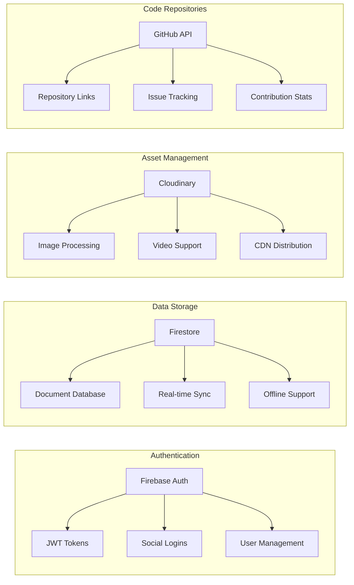

## Design Principles

### 1. Domain-Driven Design (DDD)

Services are organized around business capabilities:

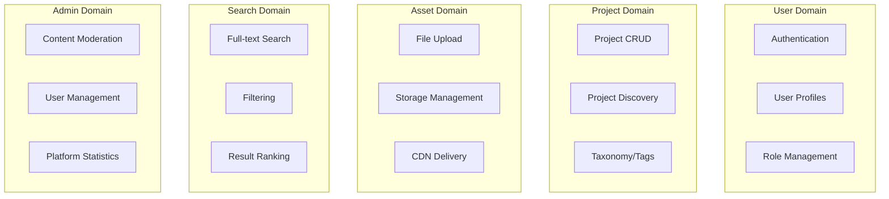

### 2. Separation of Concerns

**Layered Architecture within Services**:
```
┌─────────────────┐
│   Routes        │ ← HTTP endpoint definitions
├─────────────────┤
│   Controllers   │ ← Business logic coordination
├─────────────────┤
│   Services      │ ← Core business operations
├─────────────────┤
│   Data Access   │ ← Firebase/Cloudinary integration
├─────────────────┤
│   Models        │ ← Data structure definitions
└─────────────────┘
```

### 3. Fail-Fast Principle

- Input validation at service boundaries
- Early error detection and reporting
- Graceful degradation when external services fail

### 4. Configuration over Convention

- Environment-based configuration
- Explicit service discovery
- Configurable external service endpoints

## Data Architecture

### Data Flow Patterns

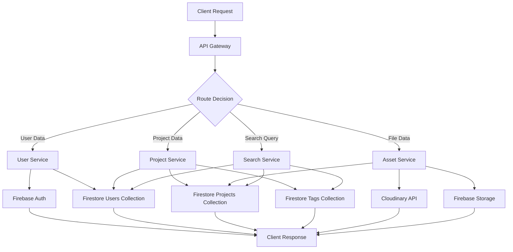

### Data Consistency Model

**Eventual Consistency**:
- Services may have slightly stale data
- Updates propagate through shared database
- Client-side optimistic updates for better UX

**Strong Consistency**:
- Authentication decisions (critical security)
- Financial or audit-related operations (future)

### Caching Strategy

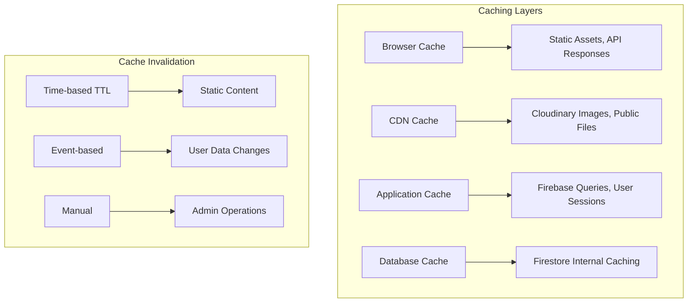

## Security Architecture

### Authentication & Authorization Flow

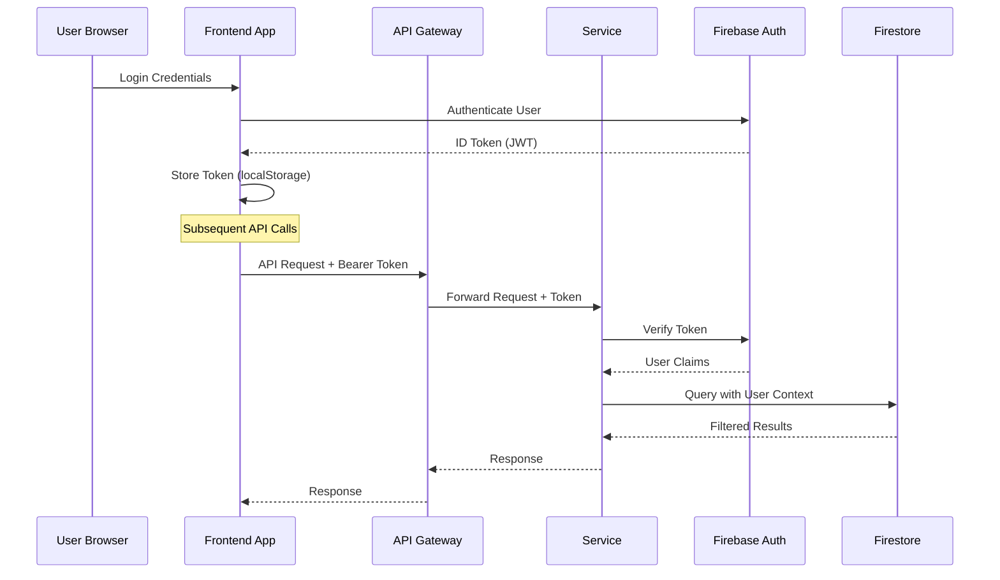

### Security Layers

**1. Transport Security**:
- HTTPS enforced in production
- Firebase SDK encryption in transit
- Cloudinary secure URLs

**2. Authentication Security**:
- Firebase ID tokens (JWT with Google signing)
- Token expiration (1 hour default)
- Refresh token rotation

**3. Authorization Security**:
- Role-based access control (user, admin)
- Resource ownership validation
- Firebase Security Rules as backup

**4. Input Security**:
- Request validation middleware
- File type and size restrictions
- SQL injection prevention (NoSQL database)

**5. Data Security**:
- User data isolation by UID
- Soft deletes for audit trails
- Admin action logging

### Security Configuration

```javascript
// Firebase Security Rules Example
rules_version = '2';
service cloud.firestore {
  match /databases/{database}/documents {
    // Users can only access their own data
    match /users/{userId} {
      allow read, write: if request.auth != null
        && request.auth.uid == userId;
    }

    // Projects are readable by authenticated users
    match /projects/{projectId} {
      allow read: if request.auth != null;
      allow write: if request.auth != null &&
        (request.auth.uid == resource.data.ownerId ||
         isAdmin(request.auth.uid));
    }
  }
}
```

## Performance Architecture

### Performance Optimization Strategies

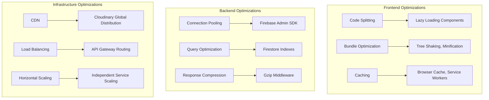

### Monitoring & Observability

**Application Metrics**:
- Response time per endpoint
- Request volume per service
- Error rates and patterns
- User session analytics

**Infrastructure Metrics**:
- CPU and memory usage per service
- Network I/O patterns
- Database query performance
- External API latency

**Business Metrics**:
- User registration/retention rates
- Project upload success rates
- Search query patterns
- Asset storage utilization

## Future Architecture

### Planned Architectural Improvements

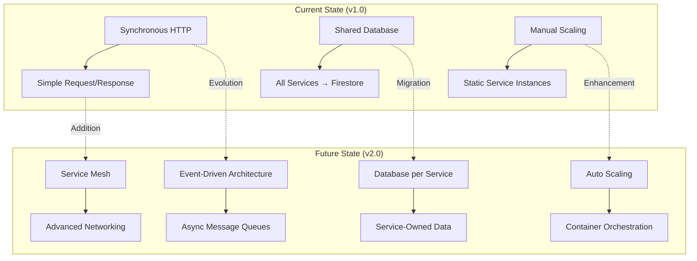

### Technology Roadmap

**Phase 1 (Current)**: Microservices Foundation
- ✅ Service decomposition
- ✅ API Gateway implementation
- ✅ Shared libraries
- ✅ Health monitoring

**Phase 2 (Next 6 months)**: Enhanced Resilience
- Circuit breakers for external services
- Redis caching layer
- Comprehensive logging (ELK stack)
- API rate limiting

**Phase 3 (6-12 months)**: Advanced Architecture
- Event sourcing for audit trails
- CQRS for read/write separation
- Message queues (RabbitMQ/Apache Kafka)
- Container orchestration (Docker + Kubernetes)

**Phase 4 (12+ months)**: Platform Maturity
- Service mesh (Istio/Linkerd)
- Advanced monitoring (Prometheus/Grafana)
- AI/ML integration for project recommendations
- Multi-tenant architecture for different organizations

### Scaling Strategy

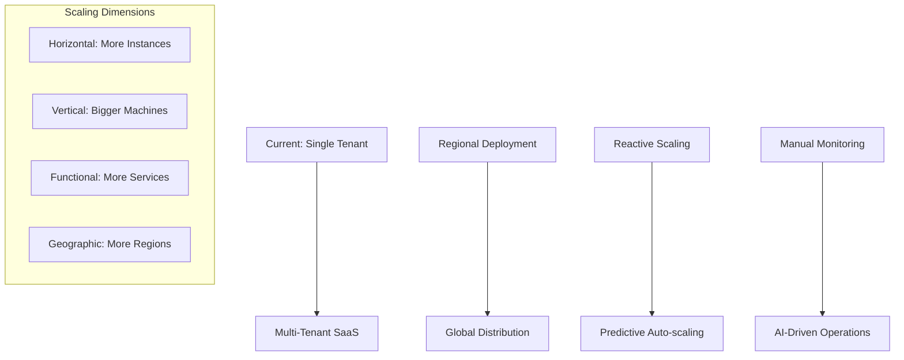

---

**Architecture Benefits Achieved**:
- ✅ Modular, maintainable codebase
- ✅ Independent service lifecycle
- ✅ Technology flexibility
- ✅ Improved fault tolerance
- ✅ Better developer experience
- ✅ Simplified testing and deployment

**Next: See [CLOUDINARY-INTEGRATION.md](./CLOUDINARY-INTEGRATION.md) for asset management details**