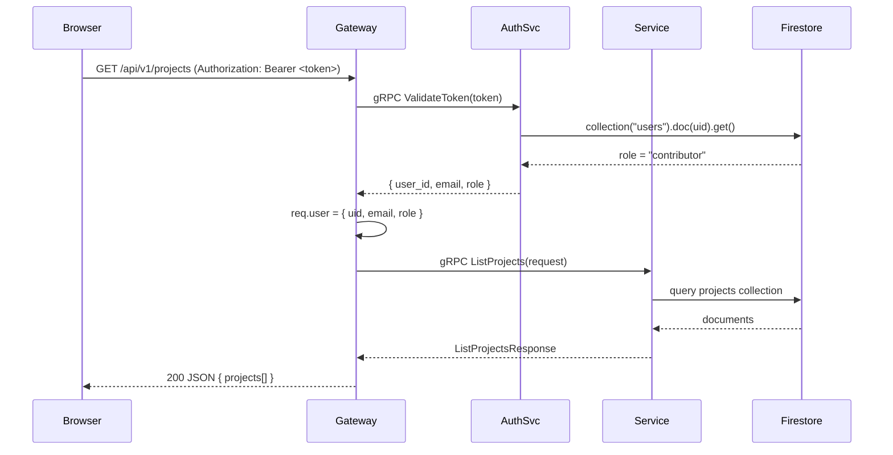

# System Architecture

## Overview

The ACM Digital Project Repository uses a **microservices architecture** on the backend with a React SPA on the frontend. The core idea: each domain of responsibility (auth, users, projects, assets, notifications) lives in an isolated Node.js gRPC server. A single Express **API Gateway** acts as the public face — translating REST requests from the browser into gRPC calls, aggregating responses, and enforcing authentication.

This design gives each service:
- Its own process and port
- Its own `package.json` and dependencies
- Independent deployability via Docker

---

## Service Boundaries

| Service | Port | Protocol | Responsibility |
|---|---|---|---|
| API Gateway | 3000 | REST/HTTP | Auth middleware, REST→gRPC translation, Cloudinary upload, Firestore direct routes |
| Auth Service | 50051 | gRPC | Firebase token verification, admin role check, user sync on first login |
| User Service | 50052 | gRPC | User CRUD, role management, profile data |
| Project Service | 50053 | gRPC | Project CRUD, tags, search, domain filtering |
| Asset Service | 50054 | gRPC | Upload URL generation, Cloudinary streaming, asset metadata |
| Notification Service | 50055 | gRPC | Events CRUD, analytics aggregation, notification dispatch |

The Comments and Domains Stats subsystems are **not routed through gRPC** — they are Express routes mounted directly in the Gateway that communicate with Firestore using the Firebase Admin SDK. This tradeoff was made for simplicity (those features were added later and don't justify a new service).

---

## Tech Choices and Why

| Choice | Reason |
|---|---|
| **gRPC + Protocol Buffers** | Strongly-typed service contracts; auto-generated stubs; efficient binary serialization |
| **Firebase Auth** | Managed OAuth/email auth; no self-hosted auth server needed; ID tokens are self-verifiable JWTs |
| **Firestore** | No-SQL document store with real-time capability; works natively with Firebase Admin SDK across all services |
| **Cloudinary** | Managed media CDN; handles image transformation, signed raw file delivery; avoids building a custom file server |
| **React + Vite** | Fast HMR in dev; tree-shakeable builds; Vite handles TS/JSX transpilation without CRA overhead |
| **TanStack Query** | Server-state caching with automatic stale/refresh cycles; avoids prop-drilling loading states |
| **Zustand** | Minimal global state for auth only; persisted to `localStorage` so the token survives page refresh |
| **shadcn/ui + Tailwind** | Pre-built accessible components with full CSS customization; no runtime CSS-in-JS overhead |

---

## Data Flow — Authenticated Request



---

## Startup Sequence (Local Development)

`backend/start-microservices.js` spawns all services as child processes with staggered 500ms delays, then waits 2 seconds before starting the Gateway. Shutdown is graceful via `SIGTERM` with a 5-second force-kill fallback.

```js
// Simplified from start-microservices.js
const services = [
  { name: 'Auth Service',          port: 50051, dir: 'services/auth-service' },
  { name: 'User Service',          port: 50052, dir: 'services/user-service' },
  { name: 'Project Service',       port: 50053, dir: 'services/project-service' },
  { name: 'Asset Service',         port: 50054, dir: 'services/asset-service' },
  { name: 'Notification Service',  port: 50055, dir: 'services/notification-service' },
];
// All spawned in parallel, then gateway launches after 2s
```

---

## Proto Loading Pattern

Every service and the Gateway loads `.proto` files from `backend/proto/` using `@grpc/proto-loader`:

```js
const packageDef = protoLoader.loadSync(path.join(__dirname, '../../proto/auth.proto'), {
  keepCase: true,
  longs: String,       // int64 fields serialized as strings (avoids JS precision loss)
  enums: String,
  defaults: true,
  oneofs: true,
});
```

> ⚠️ The `longs: String` option means all `int64` timestamps arrive as numeric strings like `"1712814881000"`. Frontend `parseDate()` helpers must handle both `_seconds` Firestore objects and these numeric strings.

---

## Inter-Service Communication

Only the **Project Service** calls another service: it creates a gRPC client for the User Service to resolve contributor IDs into full user objects during project responses.

```js
// project-service/index.js
const userServiceClient = new userProto.acm.user.UserService(
  process.env.USER_SERVICE_ADDR || "127.0.0.1:50052",
  grpc.credentials.createInsecure()
);
```

All other services are independent — they talk to Firestore directly and do not call each other.

---

## Network Topology (Docker)

All containers share a `acm-network` Docker bridge. Service addresses use container names as hostnames:

```yaml
AUTH_SERVICE_ADDR=auth-service:50051
USER_SERVICE_ADDR=user-service:50052
PROJECT_SERVICE_ADDR=project-service:50053
ASSET_SERVICE_ADDR=asset-service:50054
NOTIFICATION_SERVICE_ADDR=notification-service:50055
```

Only port `3000` (Gateway) and `5173` (Frontend) are published to the host. All gRPC ports are internal.

---

## Related

- [[Project_Overview]]
- [[Microservices]]
- [[Authentication]]
- [[Deployment]]
- [[Database]]
