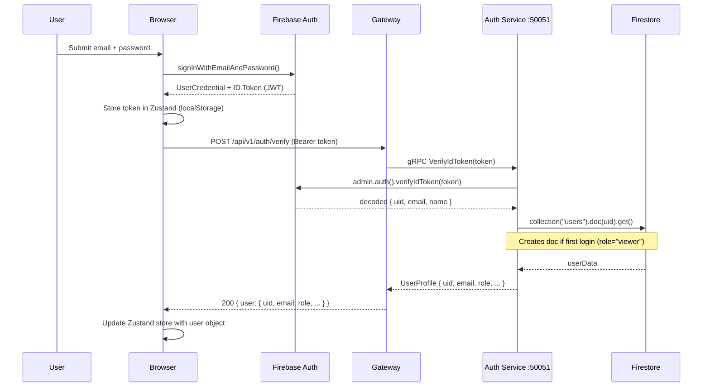

# Authentication

## Overview

Authentication is handled end-to-end by **Firebase Authentication**. The browser uses the Firebase Client SDK to sign in and receive a short-lived **ID token** (JWT, valid ~1 hour). Every protected API call sends this token as a `Bearer` header. The API Gateway delegates token verification to the **Auth gRPC Service**, which calls `firebase-admin.auth().verifyIdToken()` and looks up the user's role in Firestore.

---

## Authentication Flow



---

## Token Lifecycle

| Event | Action |
|---|---|
| Login / Register | Firebase issues ID token → stored in Zustand + localStorage |
| Every API call | Axios request interceptor reads `store.getState().token`, adds `Authorization: Bearer <token>` |
| Token expiry (1h) | Response interceptor catches 401 → calls `logout(false)` to clear state |
| Token refresh | `refreshToken()` in Zustand calls `auth.currentUser.getIdToken(true)` |
| Page reload | `onAuthStateChanged` fires on mount → calls `getIdToken(true)` to get fresh token |

---

## Gateway Middleware

```js
// backend/gateway/index.js
function verifyToken(req, res, next) {
  const token = extractToken(req); // reads Authorization: Bearer <token>
  if (!token) return res.status(401).json({ error: "Unauthorized" });

  authClient.validateToken({ token }, (err, response) => {
    if (err) return res.status(401).json({ error: err.message });
    req.user = {
      uid: response.user_id,
      email: response.email,
      role: response.role,
      emailVerified: response.email_verified,
    };
    next();
  });
}
```

`validateToken` (not `verifyIdToken`) is used at the gateway level — it's a lighter call that just returns role + uid without the full user profile.

### Admin Middleware

```js
function requireAdmin(req, res, next) {
  authClient.checkAdmin({ user_id: req.user.uid }, (err, response) => {
    if (err || !response.is_admin) return res.status(403).json({ error: "Forbidden" });
    next();
  });
}
```

---

## Supported Sign-In Methods

| Method | Implementation |
|---|---|
| Email + Password | `signInWithEmailAndPassword(auth, email, password)` |
| Google OAuth | `signInWithPopup(auth, googleProvider)` |
| GitHub OAuth | `signInWithPopup(auth, githubProvider)` |
| Register | `createUserWithEmailAndPassword` + `updateProfile(displayName)` |

All OAuth providers are configured in `frontend/src/config/firebase.js`:

```js
export const googleProvider = new GoogleAuthProvider();
export const githubProvider = new GithubAuthProvider();
```

---

## Role System

Three roles exist, stored in `users/{uid}.role` in Firestore:

| Role | Capabilities |
|---|---|
| `viewer` | Browse projects, view profiles, comment on projects |
| `contributor` | All viewer permissions + create/edit own projects + upload assets |
| `admin` | All contributor permissions + approve/reject projects + manage users + delete any comment |

Role assignment is done exclusively by admins via the Admin Members panel (`/admin/members/:uid`). New users always start as `viewer`.

### Checking Permissions in Frontend

```js
// Zustand helpers
canCreateProjects: () => user?.role === 'contributor' || user?.role === 'admin'
isAdmin: () => user?.role === 'admin'
```

The `ProtectedRoute` component reads these from the store:
```jsx
<ProtectedRoute contributorOnly> → blocks viewers
<ProtectedRoute adminOnly>       → blocks viewers + contributors
```

---

## User Sync Pattern

When any user logs in (including social OAuth), the frontend calls `POST /api/v1/auth/verify` immediately after receiving the ID token. This endpoint:

1. Runs `VerifyIdToken` via gRPC → decodes the Firebase JWT
2. If no Firestore user doc exists: **creates** one with `role: "viewer"`
3. If user exists: **updates** `updatedAt` timestamp
4. Returns the full Firestore user object to the browser

This means the user object in Zustand always reflects the backend source of truth for the role field, not just the Firebase token claims.

---

## Dev Fallback (Non-Production)

The Auth Service accepts tokens signed with `"test-secret-key"` in non-production mode:

```js
if (process.env.NODE_ENV !== "production") {
  const jwt = require("jsonwebtoken");
  decodedToken = jwt.verify(token, "test-secret-key");
}
```

> ⚠️ This fallback must be removed or disabled before any public deployment.

---

## Firebase Client Config

```js
// frontend/src/config/firebase.js
const firebaseConfig = {
  apiKey:            import.meta.env.VITE_FIREBASE_API_KEY,
  authDomain:        import.meta.env.VITE_FIREBASE_AUTH_DOMAIN,
  projectId:         import.meta.env.VITE_FIREBASE_PROJECT_ID,
  storageBucket:     import.meta.env.VITE_FIREBASE_STORAGE_BUCKET,
  messagingSenderId: import.meta.env.VITE_FIREBASE_MESSAGING_SENDER_ID,
  appId:             import.meta.env.VITE_FIREBASE_APP_ID,
};
setPersistence(auth, browserLocalPersistence); // survives browser refresh
```

---

## Related

- [[Project_Overview]]
- [[Architecture]]
- [[Microservices]]
- [[Member_System]]
- [[API_Reference]]
- [[Developer_Guide]]
