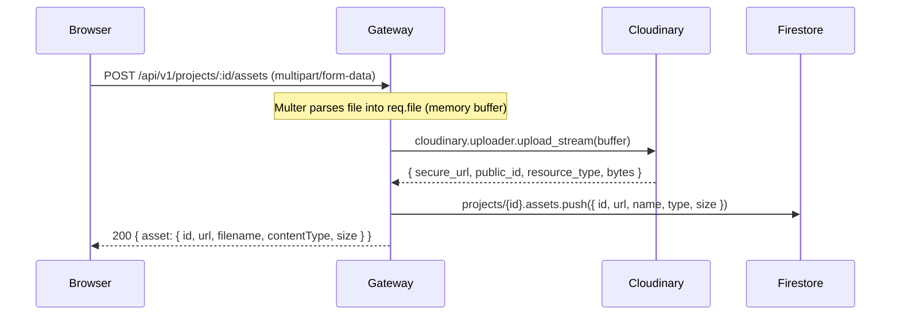

# Media Upload

## Overview

Project assets (images, PDFs, videos, code archives) are uploaded via multipart form-data to the **API Gateway**, which streams them to **Cloudinary** using the Node.js Cloudinary SDK. The resulting `secure_url` and metadata are stored in a subcollection or embedded array in the project's Firestore document. Cloudinary handles CDN delivery, image transformations, and signed URL generation for private files.

---

## Upload Flow



---

## Cloudinary Configuration

`backend/gateway/utils/cloudinary.js`:

```js
const cloudinary = require('cloudinary').v2;

cloudinary.config({
  cloud_name: process.env.CLOUDINARY_CLOUD_NAME,
  api_key:    process.env.CLOUDINARY_API_KEY,
  api_secret: process.env.CLOUDINARY_API_SECRET,
});

module.exports = cloudinary;
```

Required environment variables (in `backend/.env`):
```env
CLOUDINARY_CLOUD_NAME=your_cloud_name
CLOUDINARY_API_KEY=your_api_key
CLOUDINARY_API_SECRET=your_api_secret
```

---

## Multer Configuration

File parsing in the Gateway uses Multer in **memory storage** mode, meaning files are buffered in RAM before streaming to Cloudinary:

```js
// backend/gateway/middleware/upload.js
const multer = require('multer');
const upload = multer({ storage: multer.memoryStorage() });
module.exports = upload;
```

The upload endpoint is:
```js
app.post('/api/v1/projects/:projectId/assets',
  verifyToken,
  upload.single('file'),
  async (req, res) => { ... }
);
```

---

## Asset Storage in Firestore

After a successful Cloudinary upload, the asset metadata is pushed to the project's Firestore document:

```json
// projects/{projectId}
{
  "assets": [
    {
      "id": "cloudinary_public_id",
      "url": "https://res.cloudinary.com/.../image.jpg",
      "filename": "screenshot.jpg",
      "contentType": "image/jpeg",
      "size": 248000
    }
  ]
}
```

The Asset Service (`:50054`) also maintains a separate Firestore path for more granular asset metadata including `created_at` and `updated_at`.

---

## File Type Handling

Cloudinary distinguishes between resource types:
- **`image`** — JPEG, PNG, WebP, SVG (auto-detected)
- **`raw`** — PDFs, ZIP archives, code files (must explicitly pass `resource_type: 'raw'`)
- **`video`** — MP4, MOV

The gateway detects the content type from the upload and sets the appropriate `resource_type`. PDFs served from Cloudinary use the `.pdf` extension in the URL to avoid 401 errors on unsigned raw resources.

---

## Signed URL Generation

For private/restricted files, the Asset Service can generate time-limited signed URLs via `GenerateSignedUrl(file_path, expiration)`. This calls Cloudinary's signed URL generation API with an expiry timestamp.

> ⚠️ Signed URL generation via the Asset Service gRPC method is implemented in the proto but the gateway REST binding for this endpoint may not be fully wired in all cases. Direct `secure_url` delivery from Cloudinary is the primary media serving path.

---

## Deleting Assets

```
DELETE /api/v1/assets/:assetId
Auth: verifyToken required
```

The gateway calls `assetClient.deleteAsset({ asset_id, project_id, user_id })`. The Asset Service:
1. Fetches the asset Firestore document to get the Cloudinary `public_id`
2. Calls `cloudinary.uploader.destroy(public_id)`
3. Removes the asset from Firestore
4. Returns `{ success: true }`

---

## Frontend Upload

```js
// frontend/src/services/api.js
export const assetsAPI = {
  upload: (projectId, formData) =>
    axiosInstance.post(`/projects/${projectId}/assets`, formData, {
      headers: { 'Content-Type': 'multipart/form-data' },
    }),
  uploadAsset: (formData, onUploadProgress) =>
    axiosInstance.post('/assets/upload', formData, {
      headers: { 'Content-Type': 'multipart/form-data' },
      onUploadProgress, // for progress bars
    }),
};
```

---

## Related

- [[Project_Overview]]
- [[Microservices]]
- [[CRUD_Operations]]
- [[Database]]
- [[Deployment]]
