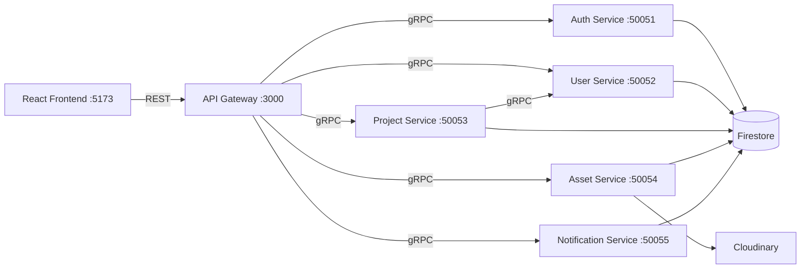

# Microservices

## Overview

The backend consists of **five gRPC microservices** plus an **Express API Gateway**. Each service is a self-contained Node.js process that:
1. Loads its `.proto` contract from `backend/proto/`  
2. Initializes the Firebase Admin SDK (shared `backend/services/firebase.js`)  
3. Binds a gRPC server to a dedicated port  

The API Gateway is the only public-facing process. It creates gRPC client stubs for each service and translates incoming REST calls into the appropriate gRPC calls.

---

## Service Map



---

## 1. Auth Service `:50051`

**Proto:** `auth.proto` — package `acm.auth`  
**File:** `backend/services/auth-service/index.js`

### RPC Methods

| Method | Request | Response | Description |
|---|---|---|---|
| `ValidateToken` | `{ token }` | `{ user_id, email, role, email_verified }` | Validates Firebase ID token; looks up role in Firestore |
| `VerifyIdToken` | `{ token }` | `UserProfile` | Full verification + upsert user doc if first login |
| `CheckAdmin` | `{ user_id }` | `{ is_admin, role }` | Reads `users/{uid}.role === "admin"` |

### Auto-Provisioning Logic

On `VerifyIdToken`, if the user document does not exist in Firestore (i.e., first login), the service **creates it** with `role: "viewer"`:

```js
if (!userDoc.exists) {
  await db.collection("users").doc(uid).set({
    uid, email, name, avatar,
    role: "viewer",
    emailVerified: false,
    createdAt: Date.now(),
    updatedAt: Date.now(),
  });
}
```

### Dev Fallback

In non-production (`NODE_ENV !== "production"`), the service accepts JWTs signed with `"test-secret-key"` as a fallback, enabling local testing without a real Firebase project.

---

## 2. User Service `:50052`

**Proto:** `user.proto` — package `acm.user`  
**File:** `backend/services/user-service/index.js`

### RPC Methods

| Method | Description |
|---|---|
| `GetUser(user_id)` | Fetch single user document |
| `ListUsers(limit, offset, role, exclude_ids)` | Paginated user list with optional role filter |
| `CreateUser(email, name, password, role, avatar)` | Admin-initiated user creation |
| `UpdateUser(user_id, name, avatar, role)` | Update mutable user fields |
| `DeleteUser(user_id)` | Remove user document |
| `GetUsersByRole(role, limit, offset)` | Filter by role (useful for admin dashboards) |

### User Document Schema

```
users/{uid}
├── uid: string
├── email: string
├── name: string
├── avatar: string          (URL)
├── role: "viewer" | "contributor" | "admin"
├── emailVerified: boolean
├── createdAt: number       (ms epoch)
└── updatedAt: number       (ms epoch)
```

---

## 3. Project Service `:50053`

**Proto:** `project.proto` — package `acm.project`  
**File:** `backend/services/project-service/index.js`

This is the largest service (771 lines). It also manages **Tags** and **User Search** in addition to projects.

### RPC Methods

| Method | Description |
|---|---|
| `ListProjects(limit, offset, status, tech_stack, owner_id, tag_ids, domain, user_id)` | Paginated, multi-filter project list (ordered by `createdAt desc`) |
| `GetProject(project_id)` | Single project with resolved assets |
| `CreateProject(title, description, owner_id, tags, tech_stack, contributors, domain)` | Create new project (status: `pending`) |
| `UpdateProject(project_id, user_id, ...)` | Update fields including admin-only `status` |
| `DeleteProject(project_id, user_id)` | Soft delete (`is_deleted: true`) |
| `SearchProjects(query, limit)` | Full-text style search on title/description/techStack |
| `GetTags / CreateTag / UpdateTag / DeleteTag` | Tag management |
| `SearchUsers(query, limit)` | Search users by name/email (used in contributor picker) |

### Domain Filtering

The project service supports filtering by `domain` string. The gateway passes the domain value from query params down through gRPC:

```js
// gateway/index.js (simplified)
projectClient.listProjects({ domain: req.query.domain, ... }, callback);
```

---

## 4. Asset Service `:50054`

**Proto:** `asset.proto` — package `acm.asset`  
**File:** `backend/services/asset-service/index.js`

### RPC Methods

| Method | Description |
|---|---|
| `GetUploadUrl(project_id, user_id, file_name, file_type)` | Returns a signed Cloudinary upload URL + `asset_id` |
| `UploadAsset(stream)` | Client-streaming: receives file chunks, uploads to Cloudinary |
| `ListAssets(project_id)` | Returns all assets for a project |
| `DeleteAsset(asset_id, project_id, user_id)` | Deletes from Cloudinary and removes from Firestore |
| `GenerateSignedUrl(file_path, expiration)` | Generates a time-limited signed URL for private files |

### Note on Direct Upload

In practice, the **Gateway handles multipart uploads directly** using Multer and the Cloudinary Node SDK (`gateway/utils/cloudinary.js`). The `UploadAsset` gRPC streaming method exists but the REST path through the gateway is the primary upload path. See [[Media_Upload]].

---

## 5. Notification Service `:50055`

**Proto:** `notification.proto` — package `acm.notification`  
**File:** `backend/services/notification-service/index.js`

### RPC Methods

| Method | Description |
|---|---|
| `SendNotification(user_id, message)` | Fire-and-forget notification (no push/websocket — persisted to Firestore) |
| `ListEvents / GetEvent` | Public event listing and detail |
| `CreateEvent / UpdateEvent / DeleteEvent` | Admin-only event management |
| `GetAnalytics(start_date, end_date)` | Returns aggregate platform statistics |

### Analytics Response Shape

```protobuf
AnalyticsResponse {
  int32 total_projects
  int32 total_users
  int32 total_admins
  int32 featured_projects
  map<string, int32> projects_by_status
  map<string, int32> tech_stack_distribution
  int32 total_assets
  int64 total_storage_used
}
```

---

## API Gateway (Express `:3000`)

**File:** `backend/gateway/index.js`

The gateway is not a "microservice" per se — it is an Express HTTP server that:

1. Loads all five `.proto` files and creates gRPC client stubs
2. Runs the `verifyToken` middleware on protected routes
3. Translates REST requests to gRPC calls using the appropriate client
4. Handles file uploads directly (Multer + Cloudinary SDK)
5. Mounts two special Firestore-direct Express routers:
   - `GET /api/v1/domains/stats` — aggregates project counts by domain
   - `/api/v1/comments/*` — full comments CRUD (see [[Comment_System]])

### Port Summary

```
3000  ← REST (from frontend)
50051 ← gRPC Auth
50052 ← gRPC User
50053 ← gRPC Project
50054 ← gRPC Asset
50055 ← gRPC Notification
```

---

## Shared Firebase Initialization

`backend/services/firebase.js` exports `admin`, `db`, `auth`, and `bucket`. Every service imports from this file. The initialization uses `backend/serviceAccountKey.json`:

```js
admin.initializeApp({
  credential: admin.credential.cert(serviceAccount),
  storageBucket: `${serviceAccount.project_id}.appspot.com`,
});
```

---

## Related

- [[Project_Overview]]
- [[Architecture]]
- [[Authentication]]
- [[Database]]
- [[API_Reference]]
- [[Media_Upload]]
