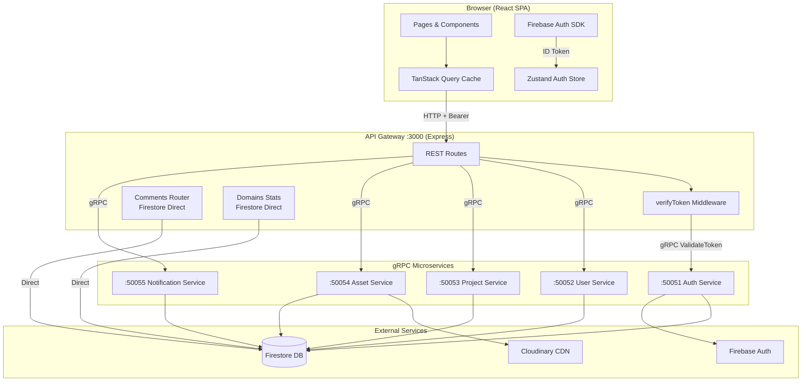

# ACM Digital Project Repository

> A full-stack microservices platform for the ACM Chapter to archive, discover, and discuss student-built technical projects.

**Tech Stack:** React 18 · Vite · Tailwind CSS · shadcn/ui · Zustand · TanStack Query · Firebase Auth · Firestore · Cloudinary · Node.js · Express · gRPC · Protocol Buffers · Docker

---

## Table of Contents

| Document | Description |
|---|---|
| [[Architecture\|System Architecture]] | Service boundaries, data flows, tech decisions |
| [[Frontend\|Frontend]] | Component hierarchy, routing, state management |
| [[Microservices\|Microservices]] | All five gRPC services + the API Gateway |
| [[Authentication\|Authentication]] | Firebase Auth, token flow, role system |
| [[Comment_System\|Comment System]] | Discussion model, ML ranking, REST API |
| [[Media_Upload\|Media Upload]] | Cloudinary upload flow, signed URLs, file serving |
| [[CRUD_Operations\|CRUD Operations]] | Projects, Users, Tags, Events — full API contracts |
| [[Member_System\|Member System]] | Roles, profiles, domain assignments |
| [[Database\|Database]] | Firestore collections, schemas, relationships |
| [[API_Reference\|API Reference]] | Full endpoint catalogue |
| [[Search_System\|Search System]] | Full-text search, filters, suggestions |
| [[Deployment\|Deployment]] | Docker, env vars, deployment guide |
| [[Developer_Guide\|Developer Guide]] | Local setup, folder structure, conventions |

---

## Idea & Motivation

The ACM Chapter at this institution needed a centralized, searchable archive of all past and present student projects. Previously, project knowledge was scattered across personal GitHub repos and informal documents with no discovery mechanism. This platform solves that by giving every project a canonical home with metadata, assets, contributors, domain classification, and open discussion threads.

## Architecture

The backend is a **microservices architecture**: five independent gRPC services (Auth, User, Project, Asset, Notification) sit behind a single Express API Gateway that translates REST calls from the frontend into gRPC calls to the appropriate service. The gateway is the only publicly exposed backend process. See [[Architecture]] for full details.

## Frontend

The frontend is a React 18 SPA built with Vite. Routing is handled by React Router v6, server state by TanStack Query, and client auth state by Zustand with localStorage persistence. All authenticated routes are gated by a `<ProtectedRoute>` that checks the Zustand store before rendering. See [[Frontend]] for component hierarchy and page catalogue.

## Microservices

Five Node.js gRPC servers each bind to a dedicated port (50051–50055) and share a common Firestore database via the Firebase Admin SDK. They expose strongly-typed service contracts via `.proto` files in `backend/proto/`. The API Gateway loads the same proto files and creates gRPC client stubs to call each service. See [[Microservices]].

## Authentication

Authentication is handled end-to-end by **Firebase Authentication**. The browser SDK issues ID tokens; the gateway's `verifyToken` middleware forwards them to the Auth Service via gRPC (`ValidateToken`), which calls `admin.auth().verifyIdToken()`. The resolved UID is then used to look up the user's Firestore `role` field. Three roles exist: `viewer`, `contributor`, `admin`. See [[Authentication]].

## Comment System

Every project page hosts a discussion section powered by a dedicated Express router (`gateway/routes/comments.routes.js`) that speaks directly to Firestore's `comments` collection, bypassing gRPC for simplicity. Comments support likes, edits, soft deletes, and four sort modes including an ML-heuristic "Top Relevant" mode. See [[Comment_System]].

## Media Upload

Project assets (images, PDFs, code archives) are uploaded via multipart form data to the API Gateway, which streams the file to Cloudinary using the Node.js Cloudinary SDK. The returned `secure_url` is persisted in Firestore under the project document. See [[Media_Upload]].

## CRUD Operations

Full create/read/update/delete coverage is implemented for Projects, Users, Tags, and Events. All project and user mutations go through gRPC services; events go through the Notification Service; tags are managed within the Project Service. See [[CRUD_Operations]].

## Member System

Every registered user gets a Firestore document in the `users` collection assigned the `viewer` role. Admins can promote accounts to `contributor` or `admin` via the Admin Members panel. Contributor profiles are publicly browsable at `/members/:uid` and show linked projects. See [[Member_System]].

## Search

The search endpoint at `GET /api/v1/search` delegates to `ProjectService.SearchProjects` (gRPC) and also queries users by name/email. The frontend provides a debounced autocomplete dropdown and advanced filters for tech stack and status. See [[Search_System]].

## Deployment

A `docker-compose.yml` at the project root orchestrates all seven containers (5 services + gateway + frontend) on a shared `acm-network` bridge. For production without Docker, the recommended path is Vercel (frontend) + Render (backend). See [[Deployment]].

---

## System Architecture Diagram

---

## Related

- [[Architecture]]
- [[Frontend]]
- [[Microservices]]
- [[Authentication]]
- [[Comment_System]]
- [[Media_Upload]]
- [[CRUD_Operations]]
- [[Member_System]]
- [[Database]]
- [[API_Reference]]
- [[Search_System]]
- [[Deployment]]
- [[Developer_Guide]]
